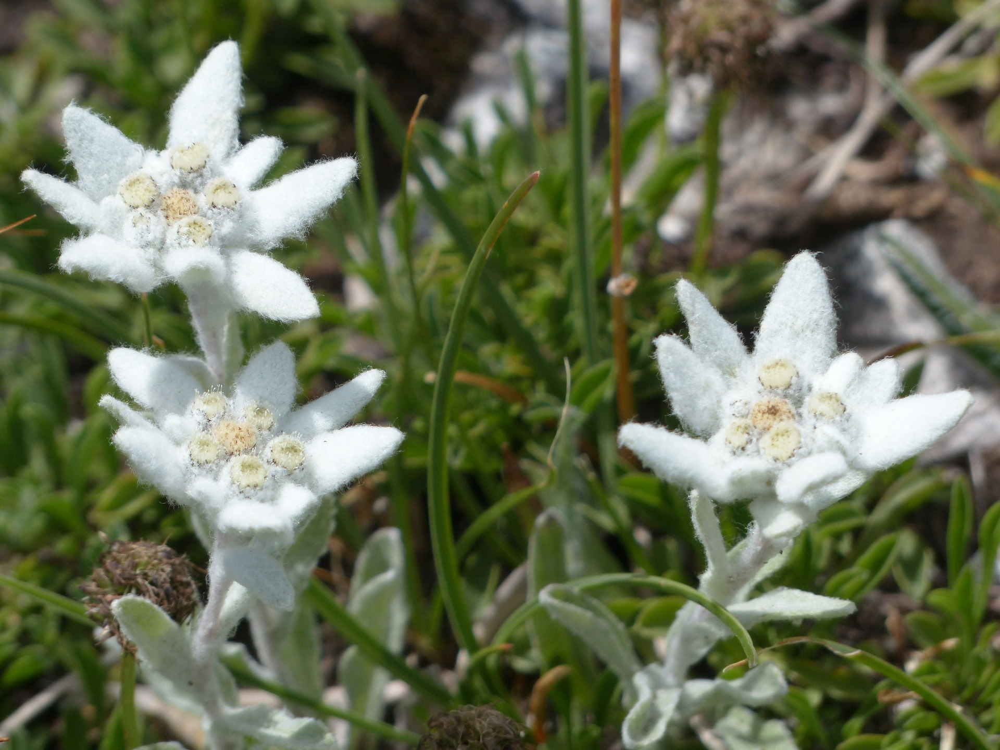
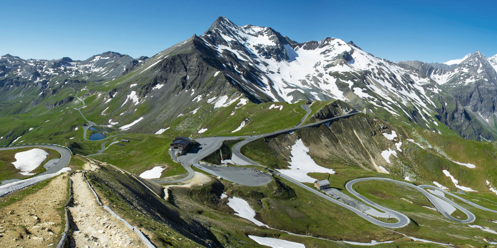

# Nature — Austria

Austria’s dramatic topography—nearly two-thirds hills and mountains—creates a mosaic of habitats from Danube floodplains to high Alpine nival zones. Around 47% of the country is forested, with spruce-dominated montane stands giving way to subalpine larch–stone pine belts and flower-rich alpine pastures above. The collision of the African and European plates lifted the Alps, sculpting limestone karst, crystalline gneiss massifs, and glacier-carved valleys. This varied relief supports iconic flora like edelweiss and gentian, and fauna from ibex to bearded vulture. Travelers encounter swift weather shifts (Föhn winds, afternoon storms), luminous Alpenglühen, and vivid seasonal cycles—golden larch autumns, spring edelweiss blooms, and winter avalanche dynamics.

## Flora

### Alpine Icons and High-Mountain Plants

- **Edelweiss (*Leontopodium nivale*, Edelweiß)**  
  A symbol of the Alps, this perennial forms compact rosettes with woolly, silver-white, star-shaped bracts around tiny yellowish flower heads. The tomentose hairs reflect UV and reduce desiccation, an adaptation to intense radiation and wind. Plants are typically 5–15 cm tall, rooted in calcareous scree and rocky ledges, often between 1,800–3,000 m. Blooming: July–September. Conservation: strictly protected in Austria; locally uncommon due to habitat specificity and historic over-collection. Where/when to see: limestone outcrops in the Northern Calcareous Alps (e.g., Dachstein fringes, Gesäuse) in mid- to late summer. Tip: admire, do not pick; macro lenses capture detail without trampling fragile substrates.  
  

- **Trumpet gentian (*Gentiana acaulis*, Enzian)**  
  Low, mat-forming plant with glossy evergreen leaves and striking deep blue, flared trumpet flowers 3–5 cm across, with greenish spotting in the throat. Height 5–10 cm, occurring on calcareous or acidic alpine turf, often in snowbed margins. Blooming: May–June at lower alpine elevations (1,500–2,000 m), June–July higher. Uses: gentian roots (various Gentiana spp.) are distilled into traditional schnapps (Enzianschnaps)—note that gathering is regulated. Where/when to see: sunny alpine lawns in Salzburg, Tyrol, and Styria after snowmelt. Tip: morning light enhances petal iridescence.  
  

- **Alpenrose (*Rhododendron ferrugineum*, Alpenrose)**  
  An evergreen shrub of acidic subalpine heathlands, 30–120 cm tall, with leathery, rust-scaled undersides to leaves and clusters of magenta-pink bell-shaped flowers. It forms continuous belts above 1,600 m on siliceous substrates. Blooming: June–July, painting hillslopes pink. Ecology: nectar resource for alpine pollinators; forms dense thickets that stabilize slopes. Where/when to see: Zillertal, Ötztal, and the Central Alps on acidic soils; peak bloom early summer. Tip: watch for bumblebees and alpine butterflies feeding among flowers.  
  

- **Alpine pasqueflower (*Pulsatilla alpina*, Alpen-Küchenschelle)**  
  A silky, hair-covered perennial with large, white to pale yellow, open flowers (5–7 cm), followed by feathery seed heads. Height 10–25 cm; thrives in alpine meadows and rocky places between 1,800–2,800 m. Blooming: June–July. Adaptation: dense hairs against cold and wind. Where/when to see: grassy slopes of the Hohe Tauern and Karnische Alpen in early summer.

### Forest Giants and Treeline Specialists

- **Arolla (Swiss stone) pine (*Pinus cembra*, Zirbe/Zirbelkiefer)**  
  Slow-growing, long-lived conifer of the subalpine zone (1,500–2,500 m), reaching 15–25 m height over centuries; some Austrian trees exceed 600 years, with exceptional individuals approaching 1,000+. Needles in bundles of five, soft and bluish-green; cones large (5–8 cm) with wingless seeds (pine nuts) dispersed by nutcrackers. Wood is aromatic, used in traditional alpine carpentry. Ecology: forms treeline woodlands with larch; crucial for biodiversity and slope stabilization. Where/when to see: Hohe Tauern (East Tyrol, Salzburg), Ötztal Alps, High Tauern Zirbenwalds. Tip: listen for Eurasian nutcracker calls—partners in seed dispersal.  
  

- **European larch (*Larix decidua*, Lärche)**  
  The only deciduous conifer in central Europe. Tall (up to 40 m), with soft light-green needles in clusters that turn golden in autumn, creating spectacular color belts around 1,400–2,100 m. Cones small (2–4 cm), oval. Bark fissured, cinnamon brown. Ecology: pioneer on avalanche tracks and pastures; resilient to cold and snow load. Where/when to see: widespread in Tyrol, Salzburg, and Styria; peak golden hues late October–early November. Tip: photograph against dark spruce backgrounds for contrast.  
  

- **Norway spruce (*Picea abies*, Fichte)**  
  Dominant in Austria’s montane forests (500–1,800 m), with conical crowns, drooping branchlets, and cylindrical cones (10–18 cm). Mature trees reach 50 m. Economic importance: principal timber species; extensive plantations exist alongside natural stands. Ecology: susceptible to bark beetles (Ips typographus) and storm blowdowns; favors cool, moist sites. Where/when to see: widespread; see more natural, mixed stands in Kalkalpen National Park. Tip: in summer, look for resin-scented, mossy spruce forests with varied fungi.  
  

- **Silver fir (*Abies alba*, Tanne)**  
  Tall (up to 55 m) with flat, glossy needles bearing two white stripes beneath; upright cones disintegrate on the branch. Shade-tolerant and long-lived, it was historically reduced by logging but is recovering in protected areas. Altitude: 400–1,500 m. Where/when to see: montane mixed forests of Upper Austria (Nationalpark Kalkalpen) and Styria.

- **European beech (*Fagus sylvatica*, Rotbuche)**  
  Smooth gray-barked, dense-canopied deciduous tree dominating colline–montane zones (300–1,200 m). Leaves oval with wavy margins; coppery autumn hues. Old-growth beech forests harbor deadwood specialists. Where/when to see: Wienerwald, Kalkalpen, and Gesäuse valleys. Tip: spring ephemerals (wild garlic) carpet beech woods in April–May.

### Orchids and Meadow Jewels

- **Lady’s slipper orchid (*Cypripedium calceolus*, Frauenschuh)**  
  Austria’s showiest native orchid, with yellow pouch-like labellum and maroon-brown sepals; stems 20–60 cm with several broad leaves. Grows in light pine–beech forests on lime-rich soils, 400–1,300 m. Blooming: May–June. Conservation: regionally rare; strictly protected. Where/when to see: select Tyrol and Carinthia sites; guided walks reduce disturbance.  
  

- **Martagon lily (*Lilium martagon*, Türkenbund-Lilie)**  
  Elegant lily with whorled leaves and downward, reflexed pink-purple flowers speckled maroon; 60–150 cm tall. Habitats: montane forests and edges, 600–1,600 m. Blooming: June–July. Where/when to see: shady forest edges in Salzburg and Styria.

### Mushrooms and Berries (Identification and Safety)

- **Porcini/King bolete (*Boletus edulis*, Steinpilz)**  
  Stocky brown cap (8–25 cm) with pale pores (no gills) and a stout, netted stipe; firm, white flesh that does not blue. Habitats: spruce, beech, and mixed forests (July–October). Culinary prized; collect sustainably and adhere to local limits. Where/when to see: widespread after warm summer rains.  
  

- **Chanterelle (*Cantharellus cibarius*, Eierschwammerl)**  
  Bright egg-yellow, vase-shaped fruiting body with blunt, forked ridges (false gills) running down the stem; apricot aroma. 2–6 cm cap. Habitats: conifer and beech forests; June–October. Where/when to see: common in Styria and Salzburg post-rain.  
  

- **Fly agaric (*Amanita muscaria*, Fliegenpilz)**  
  Iconic red cap with white warts, white gills, and a ring and volva at base. Psychoactive and potentially toxic; do not consume. Habitats: birch and spruce edges; August–October. Where/when to see: ubiquitous in montane zones.  
  

- **Death cap (*Amanita phalloides*, Grüner Knollenblätterpilz)**  
  Pale green to olive cap, white gills, a skirt-like ring, and bulbous base with a white volva; deadly poisonous. Habitats: deciduous woods (beech, oak), often in lowlands; July–October. Tip: never eat any gilled mushroom unless positively identified by an expert.

Mushroom Identification Table (Austria)
| Species (local) | Key features | Edibility | Dangerous lookalikes | How to tell apart |
|---|---|---|---|---|
| Porcini (Steinpilz) | Brown cap, white pores, reticulate stipe, flesh stays white | Edible | Bitter bolete (Tylopilus felleus) | Bitter bolete tastes intensely bitter; darker netting; always test a tiny piece and spit out—never rely solely on taste |
| Chanterelle (Eierschwammerl) | Yellow, forked ridges, apricot smell | Edible | False chanterelle (Hygrophoropsis aurantiaca) | False chanterelle has true gills, softer flesh, deeper orange; smell less fruity |
| Fly agaric (Fliegenpilz) | Red cap with white warts, ring, volva | Toxic | Panther cap (Amanita pantherina) | Panther cap is brown with white warts; both toxic—avoid |
| Death cap (Grüner Knollenblätterpilz) | Greenish cap, white gills, ring, volva | Deadly | Edible green Russulas | Russulas lack a volva and ring; break with chalky snap; when in doubt, do not pick |

- **Bilberry/Blueberry (*Vaccinium myrtillus*, Heidelbeere)**  
  Low shrub 15–60 cm, green angular stems, solitary dark blue berries that stain fingers and tongue purple. Acidic conifer woods and heaths, 600–1,800 m. Season: July–September. Where/when to see: widespread in montane spruce and larch forests.  
  

- **Lingonberry (*Vaccinium vitis-idaea*, Preiselbeere)**  
  Evergreen, leathery leaves with pale undersides; clusters of bright red, tart berries. Acidic soils 800–2,000 m. Season: August–October. Culinary: used in jams with game dishes. Where/when to see: subalpine heaths with Alpenrose.

- **Elderberry (*Sambucus nigra*, Holunder)**  
  Large shrub/tree with creamy umbels (May–June) and black berry clusters (August–September). Edible when cooked; raw berries can cause stomach upset. Lowlands to foothills. Use: syrups (Holundersaft), fritters from blossoms (Hollerküchle). Avoid red elder (S. racemosa) raw berries.

Berries and Lookalikes (Austria)
| Berry (local) | Key features | Edibility | Dangerous lookalikes | Caution |
|---|---|---|---|---|
| Bilberry (Heidelbeere) | Single berries, blue flesh, stains purple | Edible raw/cooked | Herb Paris (Paris quadrifolia) | Do not pick from unfamiliar plants; check leaves (Paris has 4 whorled leaves, one black berry—poisonous) |
| Lingonberry (Preiselbeere) | Red clusters, evergreen leaves | Edible cooked | Bog cranberry vs. bearberry | Confirm leaf shape and habitat; avoid if uncertain |
| Elderberry (Holunder) | Umbels → black drupes | Edible when cooked | Dwarf elder (S. ebulus) | Dwarf elder herbaceous, unpleasant smell; cook thoroughly |

Traveler safety for foraging: follow regional quotas, never pick in protected zones, and consult local mycological clubs; when uncertain, leave it.

## Fauna

### Mountain Mammals

- **Alpine ibex (*Capra ibex*, Steinbock)**  
  A robust wild goat of crags and scree, males 80–100 kg with massive backward-curving horns up to 1 m bearing transverse ridges; females smaller with shorter horns. Coat brown to grayish, thicker in winter. Adapted to steep, rocky terrain between 1,800–3,200 m, making seasonal altitudinal movements (higher in summer, lower sunny slopes in winter). Social structure: males form bachelor groups; females with kids occupy safer slopes. Conservation: reintroduced in 20th century; stable populations in Hohe Tauern, Ötztal, and Kaunertal. Where/when to see: early morning/late afternoon on sunlit ledges near grossglockner High Alpine Road (Kaiser-Franz-Josefs-Höhe). Tip: carry binoculars; keep distance on unstable talus.  
  

- **Chamois (*Rupicapra rupicapra*, Gämse)**  
  Goat-antelope of rugged slopes and subalpine forests. Adults 25–50 kg, with short hooked horns in both sexes, a facial white stripe bordered by dark bands, and a seasonal coat (reddish-brown summer, darker winter). Agile climbers, active dawn/dusk; diet of grasses, herbs, and browse. Altitude: 800–2,800 m. Where/when to see: edges of alpine meadows and rocky gullies in Gesäuse and Karwendel at daybreak. Tip: listen for alarm whistles as they detect hikers.  
  

- **Alpine marmot (*Marmota marmota*, Murmeltier)**  
  Burrow-dwelling rodent (50–60 cm, 3–7 kg) with grizzled brown coat and black-tipped tail. Forms colonies with complex social calls; famous loud whistles warn of eagles or foxes. Hibernates for 6–7 months (October–April) in deep communal burrows. Habitat: alpine meadows 1,800–2,700 m. Where/when to see: Hohe Tauern National Park along trails near Pasterze and Glocknerwiesen from May–September. Tip: sit quietly near burrow complexes; avoid feeding.  
  

- **Red deer (*Cervus elaphus*, Rothirsch)**  
  Austria’s largest wild ungulate (stags 160–240 kg) with impressive branched antlers regrown annually. Habitat: mixed montane forests, subalpine clearings; altitudinal migrations common. Rut: September–October, with resonant roaring. Management: populations are hunted; behaviors more crepuscular in managed forests. Where/when to see: dawn/dusk in Kalkalpen and Gesäuse clearings, especially during the rut; guided hides available.  
  

- **Mountain (Alpine) hare (*Lepus timidus*, Schneehase)**  
  Compact hare of subalpine and alpine zones; seasonal coat shifts from brown/gray (summer) to white (winter) for camouflage; black-tipped ears. Nocturnal to crepuscular; feeds on grasses, dwarf shrubs, and bark. Where/when to see: twilight in dwarf-shrub zones and snowbeds above 1,600 m; winter tracks are diagnostic.

### Birds of Prey and Alpine Specialists

- **Golden eagle (*Aquila chrysaetos*, Steinadler)**  
  A top predator with wingspan 190–230 cm; dark brown plumage with golden nape. Nests on cliffs or large trees; territories of 60–200 km². Diet: marmots, hares, grouse; powerful stoops in updrafts. Austrian population: several hundred breeding pairs concentrated in the Alps; strictly protected. Where/when to see: ridge thermals of Hohe Tauern and Karwendel on sunny midday updraft days. Tip: look for level soaring and splayed primary “fingers.”  
  

- **Bearded vulture (*Gypaetus barbatus*, Bartgeier)**  
  Europe’s largest soaring bird by wingspan (240–290 cm). Pale underparts (often rust-stained from iron-rich dust), dark back, and distinctive beard-like bristles. Diet specialized on bones; drops large bones onto rocks to shatter them. Extirpated historically; reintroduced since the 1980s. Breeds in winter with laying Dec–Feb, fledging in spring/summer. Where/when to see: Hohe Tauern (e.g., Rauris, Kals), Ötztal Alps; watch for high-circling silhouettes and bone-dropping behavior. Tip: visit visitor centers (e.g., Nationalpark Hohe Tauern) for updates on tagged individuals.  
  

- **Alpine chough (*Pyrrhocorax graculus*, Alpendohle)**  
  Glossy black corvid with a slim, downcurved yellow bill and red legs; acrobatic flier riding ridge thermals. Social around huts and summits; omnivorous scavenger. Altitude: 1,800–3,500 m. Where/when to see: summit stations across Austria (Grossglockner viewpoints, Dachstein), year-round near human structures. Tip: do not feed—habituation harms natural foraging.  

- **Wallcreeper (*Tichodroma muraria*, Mauerläufer)**  
  “Butterfly of the cliffs,” a small bird with slate-gray body and striking crimson, black, and white patterned wings, probing rock crevices for insects. Habitats: vertical limestone walls and gorges. Seasonal altitudinal movements: higher in summer, descending to valleys in winter. Where/when to see: Gesäuse and Tirol’s limestone faces; winter on sunlit cliffs.  

- **Western capercaillie (*Tetrao urogallus*, Auerhuhn)**  
  Large forest grouse (males up to 4–5 kg) with fan tail, glossy dark plumage, and white shoulder patches; females smaller, mottled. Occupies old, structurally diverse conifer forests with bilberry understory. Courtship: dramatic “lekking” with popping and wheezing notes at dawn in April–May. Conservation: declining due to fragmentation and disturbance; strictly protected. Where/when to see: remote conifer stands in Styria and Upper Austria—encounters are rare; respect closed areas.  

- **Black grouse (*Lyrurus tetrix*, Birkhuhn)**  
  Males with lyre-shaped tail and white wing bars; red eye combs; display on open moors and alpine pastures at dawn in spring. Females cryptic and ground-nesting. Sensitive to disturbance from winter sports. Where/when to see: quiet alpine meadows and moor edges (e.g., Schladming Tauern) April–May; observe from afar with optics.

### Amphibians and Reptiles

- **Alpine salamander (*Salamandra atra*, Alpensalamander)**  
  Entirely matte black, robust salamander 10–16 cm. Remarkably, it is viviparous—giving birth to 1–3 fully developed young after gestations up to 2–3 years at high altitude, an adaptation to cool mountain climates. Active during rainy days from 700–2,300 m in moist forests, pastures, and alpine niches. Conservation: protected; vulnerable to road mortality and habitat drying. Where/when to see: moist trails in Tyrol and Salzburg during or after summer rains; walk carefully to avoid trampling.  
  

- **Viviparous lizard (*Zootoca vivipara*, Waldeidechse)**  
  Small, brownish lizard 6–8 cm (SVL), bearing live young in cool climates. Habitats: bogs, forest clearings, alpine meadows up to 2,000 m. Basks on sunny edges. Where/when to see: Donau-Auen sunny glades and alpine pastures on warm days.

- **European adder (*Vipera berus*, Kreuzotter)**  
  Stout viper (50–70 cm) with a characteristic dark zigzag dorsal pattern on gray or brown background; some melanistic individuals all-black. Occupies heath, bog, forest edges, and subalpine grassland up to 2,000 m. Venomous but bites are rare with avoidance. Where/when to see: sunning along trails in spring/autumn in Waldviertel bogs, Styrian uplands, and subalpine heath. Safety: wear boots; never handle snakes; seek medical advice if bitten.  
  

## Geology

### Building the Alps: Tectonics and Time

The Alps formed as the Tethys Ocean closed during the convergence of the African and Eurasian plates (starting ~100–65 million years ago), stacking slices of oceanic and continental crust into large thrust nappes. Metamorphism transformed sediments into schists and gneisses in the orogen’s core, while foreland basins filled with flysch and molasse. Ongoing uplift and erosion continue to shape the topography, while isostatic rebound responds to ice loss.

### Central Alps and the Hohe Tauern Window

The Central Eastern Alps expose high-grade metamorphic rocks—gneiss, amphibolite, and mica schist—especially within the Hohe Tauern Window, where erosion has cut through overlying nappes to reveal deeper units. The Grossglockner (3,798 m), Austria’s highest peak, rises in this region. Pleistocene glaciation carved U-shaped valleys and cirques; modern glaciers persist but retreat rapidly.  

- **Pasterze Glacier**  
  Austria’s largest glacier, on the foot of Grossglockner, has shrunk dramatically since the Little Ice Age, retreating by tens of meters per year in recent decades. Its length has decreased by several kilometers since the 19th century; the terminus has thinned and detached into proglacial lakes. Field access via the Kaiser-Franz-Josefs-Höhe viewpoint provides striking evidence of climate change; heed trail closures near unstable ice margins.  
  

### Northern and Southern Calcareous Alps: Karst Landscapes

Limestone and dolomite belts (e.g., Dachstein, Tennengebirge, Karwendel) dominate Austria’s northern and southern Alpine rims. Thick carbonate platforms (Triassic–Jurassic) form cliffs, plateaus, and karren fields, riddled with caves, sinkholes, and underground rivers. Karst hydrology produces intermittent springs and disappearing streams; soils are thin and drought-prone on ridges, supporting specialized flora.  

- **Eisriesenwelt (Tennengebirge)**  
  The world’s largest ice cave system (over 42 km mapped), near Werfen. Its entrance funnels winter cold, preserving spectacular ice formations—frozen cascades, columns, and frozen rivers—that persist through summer in the front sections. The cave continues beyond the ice into dry galleries. Guided tours (May–October) traverse iced passages—warm clothing and sturdy boots necessary; photography restrictions apply.  
  

- **Dachstein Massif**  
  A classic high karst plateau featuring the Dachstein limestone, with caves (Mammoth Cave, Giant Ice Cave) and surface karst (doline fields). Glaciated peaks (Dachstein Glacier) demonstrate strong retreat and thinning, exposing polished limestone and moraines.  
  

### Glacial and Periglacial Processes

Perennial ice and seasonal snow shape cirques, arêtes, and moraines. As glaciers recede, paraglacial hillslopes destabilize, increasing rockfall frequency; tread cautiously under headwalls in warm afternoons. Permafrost occurs in shady, high-elevation debris; rock glaciers creep downslope at centimeters to meters per year, storing water and influencing slope stability. Travelers can identify rock glaciers by their lobate fronts and ridged, boulder-strewn surfaces.

### River Systems and Valleys

Alpine meltwaters feed the Inn, Salzach, Drau, and Enns, carving gorges (Liechtensteinklamm) and transporting gravels to forelands. The Danube cuts a major corridor through northern Austria, meandering across alluvial plains with active deposition and erosion in its floodplain (Donau-Auen).

## Natural Phenomena

- **Föhn Winds (Föhn)**  
  Warm, dry downslope winds occur when moist air rises on the southern Alpine flank, precipitates, then descends adiabatically northward. Effects: rapid temperature rises, snowpack destabilization, and clear skies north of the main ridge; increased fire risk and headaches for some sensitive individuals. Travel tips: secure hut shutters; anticipate avalanche risk spikes in fresh snow layers during/after Föhn.

- **Alpenglühen (Alpenglow)**  
  A striking rosy to fiery orange illumination of mountain faces shortly after sunset or before sunrise when low-angle light scatters through the atmosphere. Best viewed with clear western/eastern horizons and dry air. Locations: Dachstein, Wilder Kaiser, and Großglockner viewpoints. Photographer tip: arrive early, use a tripod, and expose for highlights to preserve color gradients.  
  

- **Summer Thunderstorms and Hail**  
  Convective storms build rapidly on warm afternoons (June–August), producing lightning, localized downpours, and hail. Safety: start hikes early; be off ridges by early afternoon; avoid solitary trees and metal via ferrata cables during lightning. Carry waterproof layers and a headlamp.  
  

- **Temperature Inversions and Valley Fog**  
  In autumn and winter, cold air pools in valleys under clear nights, trapping fog and low stratus, while sunny conditions prevail above. Travelers can “climb above the clouds” to bask in sunlit alpine pastures while valleys remain gray.  
  

- **Avalanches (Lawinen)**  
  Winter and spring bring slab avalanches on leeward slopes, wet snow slides on warm days, and cornice collapses. Observe warning flags, consult the avalanche bulletin (Lawinenwarndienst), carry beacon, shovel, and probe when touring, and know companion rescue. Avoid gullies and steep slopes (>30°) after heavy snowfall or Föhn events.  
  

## Ecosystems

### Altitudinal Zonation: From Valley Forests to Nival Deserts

- **Colline and Montane Forests (200–1,200 m)**  
  Dominated by beech–fir–spruce mixes with maple, ash, and oak at lower elevations. Rich spring flora (wild garlic, anemones). Fauna: roe deer, woodpeckers, fire salamanders. Human influence: forestry, traditional coppice remnants. Travel tip: tick protection (long trousers, repellent) in warm months.

- **Subalpine Belt (1,400–2,000 m)**  
  Larch–stone pine woodlands transition to dwarf-shrub heaths (Alpenrose, bilberry) and krummholz of mountain pine (*Pinus mugo*). Biodiversity peaks at ecotones where clearings and old pastures intersperse with forest. Listen for hazel grouse and observe orchids on edges.  
  

- **Alpine Meadows and Pastures (2,000–2,600 m)**  
  Species-rich “Alm” grasslands with sedges, fescues, gentians, and cushion plants. Managed transhumance (seasonal grazing) maintains open swards and floral diversity; overgrazing or abandonment alters communities. Pollinators: Apollo and small tortoiseshell butterflies; birds: skylark and water pipit. Travel tip: respect grazing animals and electric fences; keep dogs leashed near cattle.  
  

- **Nival Zone (>2,600–2,900 m+)**  
  Sparse vegetation on rock and permanent snowfields: cushion plants (silene, androsace), mosses, and lichens. Harsh conditions: short growing seasons, freeze–thaw cycles. Wildlife: alpine accentor, snowfinch, occasional ibex.

### Wetlands and Floodplains

- **Donau-Auen National Park (Danube Floodplains)**  
  One of the last major intact floodplain forests of the Middle Danube, spanning 9,300 ha between Vienna and Bratislava. Habitats: riparian forests (black poplar, white willow), oxbow lakes, wet meadows, and backwaters. Biodiversity: European beaver, white-tailed eagle, tree frog, kingfisher, and rich odonate/faunal assemblages. Dynamic hydrology: seasonal floods rejuvenate habitats; sediment deposition creates bars and islands. Visitor tips: paddle quiet backwaters with guided canoe tours; expect mosquitoes in summer; stay on trails to protect breeding birds.  
  

- **Peat Bogs and Fens (e.g., Pürgschachen Moor, Waldviertel)**  
  Acidic raised bogs with sphagnum carpets, dwarf shrubs, and insectivorous sundews (*Drosera rotundifolia*). Sensitive carbon stores formed over millennia. Fauna: viviparous lizard, dragonflies, cranes occasionally on migration. Boardwalks allow low-impact visits. Tip: stay on boardwalks—bog surfaces are unstable; dogs on leash.  
  

### Steppe Lake and Eastern Plains

- **Neusiedler See–Seewinkel National Park**  
  A shallow, endorheic steppe lake straddling Austria–Hungary, unique in Central Europe. Features: vast reed belt (Phragmites), saline “Lacken” ponds that fluctuate seasonally, and open alkali meadows. Birdlife: a migration hotspot—avocet, black-winged stilt, glossy ibis, ferruginous duck; adjacent open plains harbor great bustard (*Otis tarda*) and European ground squirrel. Mammals: steppe polecat; reptiles: dice snake in canals. Best time: spring (April–May) and autumn (August–October) migrations; summer for breeding waders. Tips: carry spotting scope; winds can be strong—sun and dust protection helpful; respect bird sanctuary closures.  
  

### Alpine Rivers and Gorges

- **Glacial Torrents and Alluvial Fans**  
  Cold, oxygen-rich streams host brown trout, grayling, and dipper (bird). Channel dynamics build fans at valley mouths; sudden summer melt or storms can trigger debris flows—observe warning signs and avoid narrow ravines during heavy rain. Gorges like Liechtensteinklamm showcase fluvial erosion in hard rock.

### Limestone Screes and Karst Plateaus

- **Calcareous Scree Slopes (Schutthalden)**  
  Mobile stone rivers supporting specialists like edelweiss, saxifrages, and wall-fern. Instability selects for deep-rooted cushions and clonal spread. Fauna: wallcreeper, rock ptarmigan at upper edges. Travel tip: test footing; rockfall hazard increases in thaw.

- **High Karst Plateaus (Dachstein, Tennengebirge)**  
  Thin soils, drought-prone fissures, and high solar radiation create drought-tolerant communities—dwarf juniper, cushion pinks, and endemic limestone flora. Water flows underground; carry adequate water when hiking—surface sources are scarce.

### Cultural Landscapes and Biodiversity

- **Alpine Pastures (Almen)**  
  Centuries of pastoral use have created semi-natural grasslands rich in orchids, gentians, and butterflies. Traditional mowing of steep meadows maintains plant diversity; abandonment leads to shrub encroachment (green alder, mountain pine). Taste local products (Almkäse) at huts; pack out waste to minimize scavenger dependence.

- **Traditional Orchards (Streuobstwiesen)**  
  In foothills and valleys, scattered fruit trees in meadows harbor cavity nesters (wryneck, hoopoe) and pollinators. Spring blooms are scenic; autumn brings apple and pear harvest festivals.

Traveler Practicalities:
- Seasonality: late June–early September for alpine blooms and accessible high trails; May and October shoulder seasons with variable weather; winter for snow phenomena and wildlife tracking.
- Safety: fast-changing mountain weather; map, compass/GPS, layers, water, and sun protection are essential; check avalanche and thunderstorm forecasts.
- Conservation etiquette: stay on marked trails, respect wildlife buffers and breeding closures (especially for grouse and raptors), avoid picking flowers, and adhere to foraging regulations.

*Fonti e Riferimenti: Nationalpark Hohe Tauern visitor materials; Nationalpark Neusiedler See–Seewinkel guides; Nationalpark Donau-Auen field info; Austrian Alpine Club (ÖAV) safety bulletins; Austrian Mycological Society advisories; Geological Survey of Austria (GBA) overviews; peer-reviewed literature on Alpine ecology and geology.*