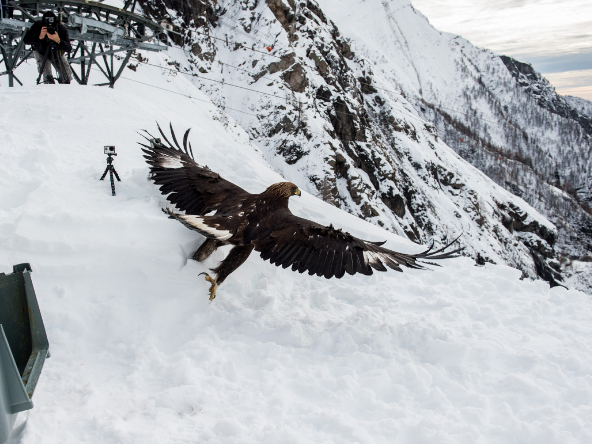

# Natura — Austria
L’Austria è un mosaico alpino dove crinali cristallini, catene calcaree, valli glaciali e piane alluvionali del Danubio creano una biodiversità straordinaria. Oltre il 47% del territorio è coperto da foreste (dominano le conifere, in particolare l’abete rosso), mentre sopra il limite del bosco si aprono praterie d’alta quota che in estate esplodono di fioriture. I ghiacciai dei Tauri, i laghi di steppa del Burgenland e le ultime grandi foreste alluvionali del Danubio ospitano fauna iconica: stambecchi, camosci, marmotte, aquile reali e il rarissimo gipeto. Il viaggiatore attento potrà leggere in cielo il respiro del föhn e la luce dell’Alpenglühen, e a terra le tracce della collisione fra Africa ed Europa che ha creato le Alpi.

## Flora

### Icone alpine e specie protette
- **Stella alpina (*Leontopodium nivale*, Edelweiß)**
  
  - Descrizione: Pianta perenne bassa (3–20 cm) con capolini bianchi-lanato disposti a stella; bratte fogliari tomentose color argento che riflettono la luce UV e riducono la perdita d’acqua. Foglie lineari grigiastre, radice fittonante per ancorarsi a ghiaioni ventosi.
  - Ecologia/Comportamento: Adattata a substrati rocciosi calcarei e silicei poveri di nutrienti, tollera insolazione intensa, gelo e vento. Impollinata da imenotteri e ditteri di alta quota.
  - Conservazione: Simbolo delle Alpi; rigorosamente protetta a livello regionale (non raccogliere). Stato globale IUCN: Least Concern (LC), ma rarefatta localmente.
  - Dove e quando vederla: Giugno–agosto, 1.800–3.000 m su creste e ghiaioni soleggiati; sentieri esposti in Tirolo e Salisburghese (p.es. massiccio del Wilder Kaiser, area Dachstein).
  - Consiglio pratico: Osservala da sentiero o con teleobiettivo; non uscire dai tracciati su ghiaioni instabili.

- **Genziana maggiore e genziane blu (*Gentiana lutea*, Enzian; *G. acaulis/G. clusii*, Schusternagel/Enzian)**
  
  - Descrizione: 
    - G. lutea: robusta (fino a 1,2 m), foglie opposte grandi, infiorescenze verticillate giallo-oro; radice carnosa amarissima.
    - G. acaulis/clusii: rosette basali basse con grandi fiori a tromba blu intenso (4–6 cm), corolla macchiettata internamente.
  - Ecologia/Usi: Radice di G. lutea tradizionalmente usata per distillare schnapps (Enzianschnaps), oggi raccolta regolamentata. Le specie blu prediligono prati alpini magri e rocciosi.
  - Conservazione: Molte specie di Gentiana sono protette in Austria; raccolta vietata salvo permessi.
  - Dove e quando: Fioritura maggio–luglio (quote subalpine–alpine, 1.500–2.400 m). Alpeggi soleggiati nei Tauri e nell’Ötztal.
  - Consiglio: Non estirpare piante; fotografa i fiori e assaggia l’Enzian solo da produzioni certificate.

- **Rododendro ferrugineo (*Rhododendron ferrugineum*, Almrausch)**
  
  - Descrizione: Arbusto sempreverde (30–100 cm), foglie ellittiche con tipiche macchie rugginose sulla pagina inferiore; fiori in corimbi rosa-magenta, nettariferi.
  - Ecologia: Ama suoli acidi e umidi in fascia subalpina, spesso a margine dei nevai. Importante per impollinatori d’alta quota.
  - Conservazione: LC; sensibile al calpestio e all’erosione dei pendii.
  - Dove e quando: Esplosione di fioritura giugno–inizio luglio, 1.500–2.200 m in Tirolo, Salisburghese, Vorarlberg.
  - Consiglio: Evita di attraversare arbusteti in fiore; resta sui sentieri per non danneggiare i cuscinetti.

### Foreste montane e conifere d’altitudine
- **Abete rosso (*Picea abies*, Fichte)**
  
  - Descrizione: Conifera alta 30–50 m, chioma conica, aghi quadrangolari 1,5–2,5 cm, coni penduli 10–15 cm. Corteccia bruno-rossastra squamosa.
  - Ecologia: Specie dominante dal collinare al montano (500–1.600 m). Sensibile al bostrico tipografo dopo tempeste e siccità.
  - Usi: Legno fondamentale per edilizia e strumenti musicali (abete di risonanza).
  - Dove: Catene settentrionali calcaree (Kalkalpen) e Tauri. Tutto l’anno.
  - Consiglio: In autunno evita aree con schianti; segui deviazioni forestali segnalate.

- **Larice europeo (*Larix decidua*, Lärche)**
  
  - Descrizione: Unica conifera europea decidua; aghi morbidi in mazzetti (20–40), chioma ariosa. In autunno doratura spettacolare dei versanti.
  - Ecologia: 1.200–2.200 m, pendii soleggiati, tollera gelo e neve pesante; favorisce biodiversità per luce che raggiunge il sottobosco.
  - Dove/quando: Colori migliori ottobre; celebri i lariceti dell’Ötztal e di Val Venosta confinante.
  - Consiglio: Ideale per fotografia paesaggistica all’alba con rugiada e nebbie di valle.

- **Pino cembro (*Pinus cembra*, Zirbe/Arve)**
  
  - Descrizione: Conifera longeva (fino a 1.000+ anni), 10–25 m, aghi in fascetti di 5, verdi lucenti; coni ovali 6–8 cm con pinoli eduli.
  - Ecologia: 1.500–2.500 m, climi rigidi; imprescindibile l’interazione con la nocciolaia (*Nucifraga caryocatactes*) per la disseminazione.
  - Conservazione: LC, ma lembi di cembreta protetti. Legno profumato usato per artigianato e interni.
  - Dove: Alpi centrali (Tirolo orientale, Tauri). Tutto l’anno.
  - Consiglio: Ascolta il richiamo rauco della nocciolaia vicino alle cembrete nelle mattine estive.

- **Faggio (*Fagus sylvatica*, Buche)**
  - Descrizione: 25–40 m, corteccia liscia grigio-argentea, foglie ellittiche 6–10 cm. Forma foreste ombrose e umide nel collinare e montano inferiore.
  - Ecologia: 300–1.200 m, suoli freschi; sensibile a siccità prolungate.
  - Dove: Parco Nazionale Kalkalpen e zone collinari della Stiria.
  - Consiglio: In primavera, il sottobosco ospita efemere come anemoni e aglio orsino.

### Funghi di bosco: identificazione e sicurezza
- Raccolta: In Austria la raccolta è regolamentata (quantità giornaliere limitate, orari, aree vietate). Se non sei esperto, non consumare funghi selvatici; fotografa e confronta con più fonti o consulta un micologo locale.

- **Porcino/Brisaola (*Boletus edulis*, Steinpilz)**
  
  - Descrizione: Cappello bruno 8–25 cm, cuticola liscia; tubuli bianchi poi verdastri; gambo tozzo con reticolo bianco; carne bianca inalterabile.
  - Habitat: Boschi di abete rosso, faggio e cembro; luglio–ottobre, dopo piogge calde.
  - Note: Eccellente commestibile, ma attenzione ai sosia amari o tossici.
  - Dove: Kalkalpen, Stiria, Salisburghese, bordi di cembrete.

Tabella identificazione — Porcini e sosia
| Specie | Caratteri chiave | Reazione alla pressione | Habitat | Commestibilità | Sosia pericolosi |
|---|---|---|---|---|---|
| Boletus edulis (porcino) | Cappello bruno, pori bianchi→verd., gambo reticolato bianco | Nessuna | Conifere e faggio | Eccellente | — |
| Tylopilus felleus (boleto fiele) | Gambo molto reticolato scuro, pori rosa | Gusto amarissimo | Boschi simili | Non commestibile | — |
| Rubroboletus satanas (boleto di Satana) | Pori rossi, cappello pallido, gambo bulboso rosso/giallo | Viraggio blu al taglio | Calcare, caldo | Tossico | Attenzione ai pori rossi |

- **Finferlo/Gallinaccio (*Cantharellus cibarius*, Eierschwammerl/Reherl)**
  
  - Descrizione: Cappello giallo-oro 3–7 cm, margine lobato, pieghe decorrenti (non vere lamelle), odore fruttato (albicocca).
  - Habitat: Conifere e faggi, suoli ben drenati; giugno–ottobre.
  - Nota sicurezza: Due sosia possono trarre in inganno.

Tabella identificazione — Finferli e sosia
| Specie | Lamelle/pieghe | Colore | Odore | Bioluminescenza | Commestibilità |
|---|---|---|---|---|---|
| Cantharellus cibarius | Pieghe spesse, decorrenti | Giallo uovo | Fruttato | No | Commestibile |
| Hygrophoropsis aurantiaca (falso finferlo) | Lamelle sottili fitte | Arancio vivo | Debole | No | Scadente |
| Omphalotus olearius (oleario) | Lamelle vere, cappello arancio | Arancio brillante | Sgradevole | Sì (debole) | Tossico |

- **Tignosa verdognola/Angelo della morte (*Amanita phalloides*, Grüner Knollenblätterpilz)**
  
  - Descrizione: Cappello 5–15 cm verde-oliva, lamelle bianche, anello sul gambo e volva a sacco alla base; carne bianca.
  - Habitat: Boschi di latifoglie (faggi, querce), fine estate–autunno, anche in Austria centro-orientale.
  - Pericolo: Mortale. Mai raccogliere funghi con volva/anello se non esperti. In dubbio, non consumare.

### Bacche di montagna: riconoscerle con prudenza
- Raccomandazione: Non consumare bacche selvatiche se non perfettamente identificate. Alcune specie tossiche (p.es. daphne, vebena) hanno frutti invitanti.

Tabella identificazione — Mirtilli e “sosia”

| Specie | Frutto | Foglie | Sapore | Habitat/Quota | Note sicurezza |
|---|---|---|---|---|---|
| Vaccinium myrtillus (mirtillo nero, Heidelbeere) | Bacca blu-nera singola, polpa viola | Piccole, verticillate, margine finemente seghettato | Dolce-acidulo | Brughiere e boschi acidi, 800–2.000 m | Edibile; macchia lingua e dita |
| Vaccinium vitis-idaea (mirtillo rosso, Preiselbeere) | Bacca rossa lucida | Sempreverdi, coriacee, margine intero | Acidulo-amaro | Brughiere subalpine, 1.000–2.300 m | Edibile; ottimo in conserve |
| Empetrum nigrum (camemoro nero, Krähenbeere) | Bacca nera, acquosa | Filiformi aghiformi | Blando | Suoli acidi freddi, 1.200–2.400 m | Edibile ma insipida |
| Daphne mezereum (fior di stecco) | Bacche rosse in grappoli | Foglie lanceolate | — | Margini di bosco | Molto tossica; non toccare/inghiottire |
| Actaea spicata (erba corallina) | Bacche nere lucide | Foglie composte | — | Boschi umidi | Tossica; evitare |

Consigli pratici per escursionisti:
- Porta una guida tascabile locale o app autorevole; rispetta limiti di raccolta e aree protette.
- Non raccogliere in parchi nazionali; usa contenitori aerati; mai consumare crudo se non garantito.

## Fauna

### Mammiferi alpini emblematici
- **Stambecco alpino (*Capra ibex*, Steinbock)**
  
  - Descrizione: Maschi 80–100 kg, altezza al garrese 75–90 cm; corna imponenti arcuate fino a 100 cm con nodosità annuali; pelliccia bruno-grigiastra, più scura in inverno.
  - Comportamento: Diurno crepuscolare; eccezionale arrampicatore su pareti e cenge; gruppi sessualmente segregati, bramito e scontri di corna in stagione riproduttiva (dicembre-gennaio).
  - Conservazione: IUCN LC; reintrodotto con successo nelle Alpi centrali austriache (Hohe Tauern).
  - Dove/quando: 1.800–3.000 m, crinali rocciosi del Grossglockner e Valle di Kaprun; miglior avvistamento all’alba in estate.
  - Consiglio: Usa binocolo 10x; evita di avvicinarti su cenge esposte per non spaventarlo.

- **Camoscio (*Rupicapra rupicapra*, Gams)**
  
  - Descrizione: 30–50 kg; corna nere a uncino 20–30 cm in entrambi i sessi; mantello estivo bruno-rossiccio, invernale scuro; maschera facciale bianca con strie nere.
  - Comportamento: Agile saltatore; attivo al mattino e tardo pomeriggio; in inverno scende in boschi radi.
  - Conservazione: LC; popolazioni sane in Austria.
  - Dove/quando: 800–2.500 m, pendii erbosi e rupestri in tutti i massicci; visibile quasi tutto l’anno.
  - Consiglio: Osservalo con vento a favore per non farlo fuggire; rispetta periodi sensibili primaverili.

- **Marmotta alpina (*Marmota marmota*, Murmeltier)**
  
  - Descrizione: 45–60 cm, 3–8 kg (massimo pre-letargo), coda 13–20 cm; pelliccia bruno-grigia; fischio d’allarme acuto e prolungato.
  - Comportamento: Sociale in colonie; iberna 6–7 mesi (ottobre–aprile) in tane profonde; si nutre di erbe e fiori.
  - Conservazione: LC.
  - Dove/quando: 1.500–2.700 m, prati alpini; facili avvistamenti sulla strada alpina del Grossglockner e nelle Alpi di Kitzbühel da giugno a settembre.
  - Consiglio: Non alimentare; mantieni 20–30 m di distanza.

- **Cervo nobile (*Cervus elaphus*, Rothirsch)**
  - Descrizione: Maschi 160–240 kg, palco ramificato rinnovato annualmente; mantello bruno-rossiccio estivo, grigio-bruno invernale.
  - Comportamento: Gregario; bramito impressionante in settembre-ottobre durante il periodo degli amori.
  - Conservazione: LC; gestito venatoriamente.
  - Dove/quando: Crepuscolo in radure forestali della Stiria e Carinzia, altopiani del Salzkammergut.
  - Consiglio: In bramito mantieniti lontano dai maschi; ottimi capanni di osservazione in riserve faunistiche.

### Grandi rapaci e avifauna di quota
- **Aquila reale (*Aquila chrysaetos*, Steinadler)**
  
  - Descrizione: Apertura alare 190–230 cm, femmine più grandi (fino a 6,5 kg); piumaggio bruno-scuro con nuca dorata, giovani con macchie bianche su ali e coda.
  - Comportamento: Predatrice d’altura di marmotte, lepri, giovani ungulati; volteggia sfruttando termiche su dorsali.
  - Conservazione: IUCN LC; in Austria coppie territoriali stabili nei Tauri, Kalkalpen e Gesäuse.
  - Dove/quando: Avvistabile tutto l’anno, massime probabilità in giornate limpide con termiche (tardo mattino-estate).
  - Consiglio: Cerca sagome in controluce sopra crinali; telescopio 20–60x utile per nidi su pareti.

- **Gipeto barbuto (*Gypaetus barbatus*, Bartgeier)**
  
  - Descrizione: Il più grande rapace europeo per apertura alare (260–290 cm); testa chiara con maschera scura e “barba” di setole; piumaggio del ventre spesso arancio-ocra per bagni ferruginosi.
  - Comportamento: Necrofago specializzato (70–90% dieta di ossa); lascia cadere ossa da quota per frantumarle; territoriale, matura tardi.
  - Conservazione: IUCN Near Threatened (NT); reintrodotto nelle Alpi dagli anni ’80; in Austria presenza regolare con alcune coppie nidificanti nei Tauri.
  - Dove/quando: Valli del Parco Nazionale Hohe Tauern (Defereggen, Mallnitz) e Ötztal; massime chance in tarda mattina ed estate.
  - Consiglio: Segnala osservazioni ai centri parco; non diffondere coordinate di nidi.

- **Gallo forcello (*Lyrurus tetrix*, Birkhuhn)**
  - Descrizione: Maschio nero con riflessi blu e sopracciglia rosse, coda forcuta; femmina criptica bruno-marmorizzata.
  - Comportamento: Lek all’alba in aprile-maggio su radure subalpine.
  - Conservazione: In declino locale per disturbo; specie sensibile.
  - Dove/quando: Brughiere e margini di bosco tra 1.200–2.000 m (Kalkalpen, Nockberge).
  - Consiglio: Evita droni e rumori durante la stagione dei lek.

### Anfibi e rettili d’alta quota
- **Salamandra alpina (*Salamandra atra*, Alpensalamander)**
  
  - Descrizione: Interamente nera, lucida; 12–16 cm; cute liscia; occhi grandi.
  - Comportamento: Vivipara (partorisce 1–2 piccoli completamente formati); attiva con pioggia o nebbia; lenta, notturna/crepuscolare.
  - Conservazione: IUCN LC; sensibile alla siccità prolungata e al calpestio.
  - Dove/quando: 1.200–2.500 m, prati umidi e sottoboschi ombrosi dei Tauri e del Bregenzerwald; giorni piovosi da giugno a settembre.
  - Consiglio: Non toccare; fotografa con luce diffusa senza flash.

- **Vipera comune (*Vipera berus*, Kreuzotter)**
  
  - Descrizione: 50–70 cm; disegno dorsale a zig-zag scuro su fondo grigio/bruno; occhi con pupilla verticale.
  - Comportamento: Schiva, morde solo se calpestata o manipolata; termoregolazione su pietre soleggiate.
  - Conservazione: LC.
  - Dove/quando: Brughiere alpine, radure fino a 2.000 m; primavera–estate.
  - Sicurezza: Indossa scarponi alti, guarda dove metti le mani; in caso di morso resta calmo e chiama soccorsi (112).

## Geologia

### La nascita delle Alpi austriache
- Origine: Orogenesi alpina dovuta alla collisione tra placca africana ed europea e alla chiusura dell’oceano della Tetide (da ~100 a ~20 milioni di anni fa). Falde di spinta sovrapposte hanno impilato rocce oceaniche e continentali.
- Prov. geologiche: 
  - Alpi Calcaree Settentrionali e Meridionali (calcari e dolomie mesozoiche) con carsismo esteso.
  - Alpi Centrali Cristalline (gneiss, graniti, scisti) nei Tauri e Ötztal.
  - Zona di finestra tettonica: Hohe Tauern, che espone rocce profonde.
- Consiglio di visita: Musei geologici a Mittersill (Hohe Tauern National Park Worlds).

### Grandi cime e ghiacciai
- **Grossglockner (3.798 m)** e catena dei Tauri
  
  - Icona alpinistica; piramide scura di scisti e gneiss, circondata da valli glaciali a U.
- **Ghiacciaio della Pasterze**
  
  - Dati: Il più grande ghiacciaio austriaco; ha perso oltre 2 km in lunghezza dal 1850. Nel XXI secolo arretramento medio annuo dell’ordine di 10–20 m, con anni estremi >80 m.
  - Accesso: Kaiser-Franz-Josefs-Höhe e sentiero Gamsgrubenweg; pannelli informativi mostrano le linee di ritiro.
  - Sicurezza: Non calpestare il ghiaccio senza guida; crepacci, sassi mobili.

### Karst e grotte di ghiaccio
- **Eisriesenwelt (Werfen)**
  
  - Superlativo: Tra le più grandi grotte di ghiaccio del mondo, sistema carsico di ~42 km totali, tratto glaciale accessibile con spettacolari colate e colonne di ghiaccio.
  - Genesi: Ventilazione stagionale e acqua di fusione che ricongela in profondità.
  - Visita: Solo con guida, da maggio a ottobre; temperatura prossima a 0 °C tutto l’anno.
- Altri siti carsici: Dachstein (Dachstein-Rieseneishöhle, Mammuthöhle), Tennengebirge, massicci calcarei con doline, polje, risorgive.
  

### Dinamiche e rischi geomorfologici
- Processi: Gelivazione, colate detritiche, frane su versanti ripidi, valanghe invernali. Torrenti a regime nivo-glaciale con piene improvvise estive.
- Consigli: Controlla bollettini valanghe (LAWINE.at) in inverno/primavera; dopo temporali evita gole strette per rischio onde di piena.

## Fenomeni Naturali

### Vento di föhn

- Descrizione: Vento caldo-secco discendente dal versante sopravento (sud) che, superato lo spartiacque alpino, si riscalda per compressione adiabatica.
- Effetti: Rialzo termico improvviso (+5–15 °C), aria tersa, nuvole a foehn (föhnmauer) sul crinale, incremento rischio incendi e instabilità.
- Quando/dove: Tipico in autunno e primavera, valle dell’Inn, Salisburghese.
- Consigli: Idratazione, protezione occhi/respiratoria in caso di polveri; attenzione a mal di testa/spossatezza.

### Alpenglühen (Alpenglow)

- Descrizione: Bagliore rosato-ramato su cime e pareti poco dopo il tramonto o prima dell’alba per diffusione di Rayleigh e riflessioni su particelle in aria.
- Dove/quando: Massimi effetti su pareti calcaree del Dachstein, Wilder Kaiser, Hohe Tauern in serate limpide post-föhn.
- Consiglio fotografico: Treppiede, bilanciamento del bianco caldo; posizione opposta al sole, 10–20 minuti “finestra magica”.

### Temporali convettivi estivi

- Descrizione: Nelle ore pomeridiane, con riscaldamento diurno, cumulonembi rapidi con fulminazioni, grandine e colpi di vento.
- Sicurezza: Partenze mattutine in quota; allerta fulmini su creste esposte; pianifica vie di fuga a valle.

### Inversioni termiche e nebbie di valle

- Descrizione: In inverno aria fredda densa ristagna nei fondovalle sotto uno strato più mite, creando mari di nebbia; cime soleggiate sopra uno strato bianco continuo.
- Dove: Altopiani del Salzkammergut, valle dell’Inn.
- Consiglio: Escursioni “sopra le nuvole” per luce e panorama unico.

### Arretramento glaciale visibile
- Osservabile alla Pasterze, Hintertux e Stubaier Gletscher: fronti arretrati, morene scoperte, nuovi laghi proglaciali.
- Consiglio: Partecipa a escursioni guidate dei parchi per comprendere indicatori climatici e sicurezza su terreni instabili.

## Ecosistemi

### Zonazione altitudinale alpina
- Planiziale-collinare (150–600 m): Seminaturali, campi e siepi, querceti/faggete residue; ricca avifauna agricola.
- Montano (600–1.600 m): Foreste miste con abete rosso, abete bianco, faggio; microclimi vallivi umidi.
- Subalpino (1.600–2.000 m): Lariceti e cembrete; arbusteti di rododendro; limite del bosco variabile secondo esposizione.
- Alpino (2.000–2.800 m): Praterie a sesleria e carici, fioriture di genziane e soldanelle; marmotte e camosci.
- Nivale (>2.800 m): Rupi, ghiaccio e nevai; licheni, muschi; rare piante rupicole (saxifraghe).

### Parco Nazionale Hohe Tauern

- Superficie: ~1.856 km² (il più grande dell’arco alpino). Include Grossglockner, Grossvenediger, decine di ghiacciai.
- Habitats: Valli a U glaciali, cascate, torbiere d’alta quota, cembrete relitte.
- Fauna/Flora: Stambecchi, aquile reali, gipeti; genziane, stelle alpine; rari endemismi di invertebrati glaciali.
- Esperienze: Strada alpina del Grossglockner (pedaggiata, punti interpretativi), trekking Gamsgrubenweg, cascate Krimml (altezza complessiva 380 m).
- Quando: Estate per trekking; primavera per piene di fusione; autunno per colori dei larici.
- Sicurezza: Meteo variabile; dotarsi di abbigliamento a strati, mappa e kit di emergenza.

### Parco Nazionale Kalkalpen

- Carattere: Catene calcaree settentrionali intatte con estese faggete e abetine, gole carsiche e torrenti limpidi.
- Specie chiave: Gallo cedrone (Auerhuhn), picchi rari (Picchio tridattilo), salamandra pezzata nei fondovalle freschi.
- Attività: Trekking in gole (p.es. Dr. Vogelgesang-Klamm), birdwatching in primavera.
- Consiglio: Scarponi con buona aderenza per passerelle umide nelle gole.

### Parco Nazionale Gesäuse

- Carattere: Impressionanti forre del fiume Enns tra pareti calcaree verticali; microclimi estremi, pareti d’arrampicata celebri.
- Biodiversità: Rapaci rupicoli, flora pioniera su ghiaioni mobili (piante cuscinetto, saxifraghe).
- Sicurezza: Temporali rapidi; consultare bollettini e percorrere vie ferrate attrezzati.

### Parco Nazionale Donau-Auen (Donau-Auen National Park)

- Unicità: Ultima grande pianura alluvionale del Danubio in Europa centrale; rete di bracci fluviali, laghi di lanche, foreste riparie a pioppo e salice.
- Fauna: Castoro europeo, airone rosso, nitticora, tarabusino; pesci migratori; ricchi insetti acquatici.
- Fenologia: Massime dinamiche in primavera con piene; estate per libellule e uccelli acquatici.
- Esperienze: Canoa guidata nei canali, passerelle interpretative vicino a Vienna.
- Consiglio: Repellenti per insetti in tarda primavera-estate; rispetto delle zone di nidificazione.

### Parco Nazionale Neusiedler See–Seewinkel

- Unicità: Grande lago di steppa poco profondo (profondità media ~1–1,5 m), con vasti canneti e saline effimere (Lacken) nel Burgenland, bioma raro in Europa centrale.
- Avifauna: Oasi per migratori lungo la rotta pannonica; oche selvatiche, gru in migrazione, cavalieri d’Italia, sterna comune, tarabuso, spatola e mignattino.
- Stagionalità: Primavere e autunni esplosivi per migrazione; estate per colonie di sterna; inverno talora con ghiaccio.
- Esperienze: Torri di birdwatching a Podersdorf, Illmitz; escursioni guidate con ranger.
- Consiglio: Binocolo 8–10x e cannocchiale 20–60x; cappello e acqua in giornate di steppa calde.

### Biosfera Nockberge e paesaggi d’alpeggio (Almen)

- Carattere: Dorsali arrotondate (Nocke) con estesi pascoli d’altitudine, mosaico di prati magri, mirtillaie e lariceti.
- Biodiversità: Farfalle diurne, orchidee, genziane; tradizioni casearie d’alpeggio che mantengono la struttura del paesaggio.
- Esperienze: Vie panoramiche, degustazioni in malghe (Preiselbeeren, formaggi tipici).
- Consiglio: Rispetta cancelli e mandrie; cani al guinzaglio vicino ai bovini.

Consigli generali per il viaggiatore naturalista:
- Pianificazione: Meteo alpino variabile; controlla ZAMG (servizio meteo austriaco) e avvisi parchi.
- Attrezzatura: Strati termici, impermeabile, mappa cartacea/GPX, acqua, snack energetici; in quota bastoncini e copricapo UV.
- Etica: Resta sui sentieri, non cogliere fiori, non disturbare fauna; porta via i rifiuti.
- Sicurezza: In caso di temporale allontanati da creste e alberi isolati; in inverno ARTVA, pala e sonda dove necessario.

Fonti e Riferimenti: Parco Nazionale Hohe Tauern; Parco Nazionale Kalkalpen; Parco Nazionale Gesäuse; Parco Nazionale Donau-Auen; Parco Nazionale Neusiedler See–Seewinkel; IUCN Red List; ZAMG (Zentralanstalt für Meteorologie und Geodynamik); Geological Survey of Austria; Eisriesenwelt Werfen; Strada Alpina del Grossglockner (Großglockner Hochalpenstraße).