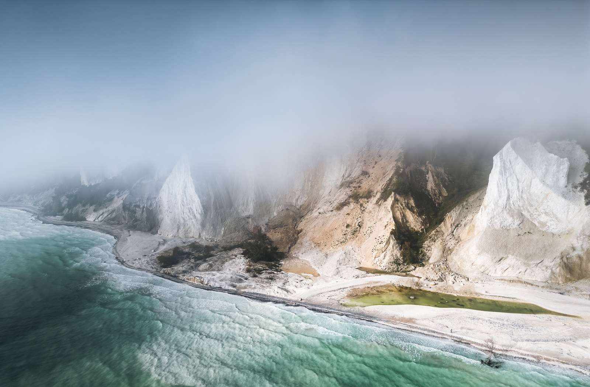
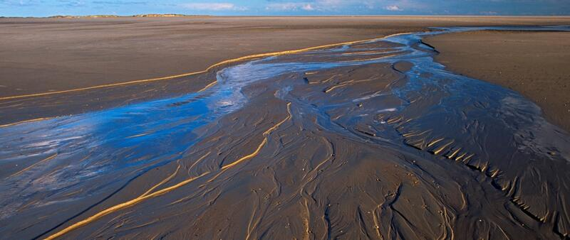

# Nature — Denmark

A low, sea-sculpted kingdom of peninsulas and islands, Denmark is a land of beech-shadowed hills, wind-brushed heaths, and endlessly varied coasts. Glaciers of the last Ice Age planed the terrain into gentle moraines and rolling outwash plains, leaving rich soils, scattered kettle lakes, and erratic boulders. More than 7,400 km of shoreline wraps shallow seas where harbor porpoises turn and seals haul out on sandbanks. In spring wood anemones turn beech forests white; in autumn starling flocks ripple over marshes in the famed Sort Sol. This guide takes you through Denmark’s flora, fauna, geology, natural spectacles, and living ecosystems with field details, where-and-when tips, and safety advice.

## Flora

### Deciduous Forests: Beech and Oak

- **European Beech (*Fagus sylvatica*, “bøg”)**
  The signature tree of Denmark’s temperate deciduous forests, beech forms tall, smooth-barked gray columns up to 40 m. Leaves are oval with entire or slightly wavy margins, emerging tender green in April–May and deepening to glossy dark by midsummer; autumn brings a copper-bronze glow. Shallow roots knit dense leaf litter that suppresses undergrowth, creating a luminous, cathedral-like woodland. Beech reached Denmark about 3,500 years ago and now dominates Eastern Denmark. Mast years (every 5–8 years) carpet the ground with triangular nuts, feeding rodents and birds. Where/when: Gribskov and Jægersborg Dyrehave (North Zealand), Mols Bjerge, and Fyn’s forests; best April–May (spring ephemerals under the leafless canopy) and October (autumn color). Conservation: Widespread; ancient stands in North Zealand are included within the transnational UNESCO “Ancient and Primeval Beech Forests” serial site. Travel tip: Walk Dyrehaven at dawn to see light shafts through beech trunks and grazing deer herds.
  

- **English Oak (*Quercus robur*, “stilk-eg”)**
  A broad-crowned giant with rugged bark and lobed leaves on distinctive long petioles. Acorns with long stalks mature September–October, critical autumn food for jays, wild boar reintroduced in enclosures, and deer. Oaks can exceed 500 years; ancient pollards host rich epiphyte and saproxylic beetle communities. Where/when: Old oaks in Jægerspris Nordskov (home to some of Northern Europe’s oldest oaks), Dyrehaven, and Rold Skov; year-round, with canopy life busiest May–July (caterpillars, nesting birds). Conservation: Protected veteran trees in many reserves. Safety: Respect fencing around ancient trunks; roots are fragile.

- **Small-leaved Lime (*Tilia cordata*, “småbladet lind”)**
  Upright, heart-leaved tree with fragrant June–July blossoms that hum with bees. Produces small nutlets with a papery bract. Often mixed with beech on richer soils. Where/when: East Jutland and Zealand; June flowering for pollinator activity. Tip: Follow the scent to observe a pollinator frenzy—hoverflies, bumblebees, and honeybees.

- **Wood Anemone (*Anemone nemorosa*, “hvid anemone”)**
  Low spring ephemeral carpeting beech floors with white stars in March–April. Leaves are palmately lobed; petals often blush pink in aging flowers. Spreads via rhizomes, vanishing by summer as the beech closes canopy. Where/when: Any mature beech stand in April. Safety: Do not eat; mildly toxic.

- **Wild Garlic/Ramsons (*Allium ursinum*, “ramsløg”)**
  Broad, lanceolate leaves with a strong garlic scent, white star-shaped umbels in April–May. Edible leaves popular in Danish spring cuisine. Where/when: Moist, calcareous woods (Mols Bjerge, East Jutland) in April. Safety: Beware deadly lookalikes—lily-of-the-valley.
  Identification tips (ramsons vs lookalikes):
  | Feature | Ramsons (Allium ursinum) | Lily-of-the-valley (Convallaria majalis) | Autumn crocus (Colchicum autumnale) |
  |---|---|---|---|
  | Smell | Strong garlic when crushed | None | None |
  | Leaves | Single leaf from its own stalk, soft, dull | Two leaves from same stem, shiny | Broad leaves in spring; flowers in autumn |
  | Flowers | White starry umbel in spring | White bell flowers along stalk | Pink-purple crocus-like in autumn |
  | Toxicity | Edible | Highly poisonous | Highly poisonous |

### Heaths and Bogs of Jutland

- **Heather/Common Ling (*Calluna vulgaris*, “hedelyng”)**
  The keystone dwarf shrub of Danish heaths. Tiny opposite leaves form scale-like sprays; pink-purple bells flower July–September, turning whole landscapes mauve. Fire- and grazing-adapted; forms age mosaics essential to heathland birds and reptiles. Where/when: West and Central Jutland (Kongenshus Hede, Randbøl Hede); peak bloom August. Tip: Visit at golden hour for a luminous violet horizon.
  

- **Common Juniper (*Juniperus communis*, “ene”)**
  Spiny evergreen with sharp needle leaves; berry-like cones (green to blue-black over 18 months) flavor gin. Forms low hummocks on dry heaths and coastal dunes. Where/when: Thy National Park, Bornholm; year-round. Conservation: Declining in some sites due to lack of grazing—look for restoration zones with sheep.

- **Bilberry/European Blueberry (*Vaccinium myrtillus*, “blåbær”)**
  Low shrub with green angular stems and pendent pink-green flowers; edible blue berries ripen July–August, staining fingers purple. Grows in acid beech and conifer understorey. Where/when: Rold Skov, Silkeborg forests; July for picking. Safety: Correctly identify—see table below.

  Bilberry identification and lookalikes:
  | Feature | Bilberry (V. myrtillus) | Bog bilberry (V. uliginosum) | Cowberry/Lingonberry (V. vitis-idaea) |
  |---|---|---|---|
  | Leaf | Thin, serrated edge | Thicker, entire margin | Thick, leathery, entire |
  | Stem | Green, angular | Woody brown | Woody brown |
  | Berry flesh | Purple throughout | Pale/greenish inside | White inside, red skin |
  | Habitat | Forest/heath | Bogs, wet heaths | Drier heaths, conifer edges |

### Coastal Dunes and Strandline Plants

- **Marram Grass (*Ammophila arenaria*, “hjelme”)**
  Tall, stiff tussocks with rolled leaves, specializing in sand capture and dune building. Extensive rhizomes stabilize shifting dunes; leaves unroll in moist conditions to photosynthesize efficiently. Where/when: North Sea coasts (Thy, Blåvandshuk, Skagen Grenen); year-round. Tip: Tread only on marked paths—marram is vital to dune integrity.

- **Sea Buckthorn (*Hippophae rhamnoides*, “havtorn”)**
  Silvery-leaved, thorny shrub with dense orange berries from August into winter, lifelines for thrushes and migrating warblers. Berries are intensely tart, vitamin-C rich. Where/when: Dune backlands and coastal scrub (Thy, Samsø, Bornholm’s Dueodde); late summer to winter for fruit. Safety: Thorns are sharp; wear long sleeves if foraging. 

- **Lyme Grass (*Leymus arenarius*, “strand-rug”)**
  Robust blue-green grass in foredunes; long creeping rhizomes. Spikes resemble barley. Where/when: Exposed dunes along Jutland’s west coast; summer for flowering spikes.

### Fungi of the Danish Woods and Heaths

- **Porcini/Penny Bun (*Boletus edulis*, “Karl Johan-svamp”)**
  A prized bolete with a brown bun-like cap (5–25 cm), white pore surface turning olive with age, stout white to brown stipe with fine reticulation, firm white flesh. Mycorrhizal with beech and oak; fruits August–October after rain. Where/when: East Jutland, Zealand beech stands. Culinary: Excellent edible. Lookalikes: Bitter bolete (*Tylopilus felleus*, very bitter, pink pores), gall bolete—always taste a tiny raw piece and spit (bitter = inedible). Safety: Never eat boletes with red pores unless expert.

- **Chanterelle (*Cantharellus cibarius*, “kantarel”)**
  Golden yellow, funnel-shaped, with blunt, forked “false gills”; fruity apricot scent. Caps 2–8 cm; firm, unfolding in clusters July–October. Where/when: Mossy beech-oak forests (Zealand, Funen, East Jutland). Culinary: Choice edible.

  Chanterelle identification and dangerous lookalikes:
  | Feature | True chanterelle (Cantharellus) | False chanterelle (Hygrophoropsis) | Jack-O’-Lantern (Omphalotus) |
  |---|---|---|---|
  | “Gills” | Blunt, forked ridges, decurrent | Thin, crowded gills | True sharp gills, crowded |
  | Flesh | Pale, firm, fibrous | Thin, fragile | Orange, may glow faintly in dark |
  | Smell | Fruity/apricot | Weak to none | Faintly unpleasant |
  | Habitat | Forest floor, mossy | On needle litter | On wood/stumps |
  | Edibility | Edible | Indigestible to some | Poisonous (GI upset) |

- **Fly Agaric (*Amanita muscaria*, “rød fluesvamp”)**
  Iconic red cap with white warts, white gills and ring, white bulbous base with volva remnants. Cap 8–20 cm; associates with birch and pine; August–October. Where/when: Mixed woods throughout. Status: Poisonous (neurotoxic); admire only. 

- **Death Cap (*Amanita phalloides*, “grøn fluesvamp”)**
  Olive-green to yellowish cap, white free gills, skirt-like ring, and a sac-like white volva at bulbous base—always check the base. Odor sweetish in age. Lethal amatoxins. Where/when: Beech-oak woods on calcareous soils; August–October (Zealand, Mols Bjerge). Safety: One cap can kill; never pick white-gilled mushrooms unless expert.

  Death cap identification table:
  | Feature | Death cap (A. phalloides) | Parasol (Macrolepiota procera) | Green russula (Russula virescens) |
  |---|---|---|---|
  | Gills | White, free | White, crowded, attached | White, attached |
  | Base | Bulb with sac-like volva | Slender, snakeskin pattern, no volva | No volva, brittle stem |
  | Cap | Olive/greenish smooth | Brown scales, large | Greenish cracked pattern |
  | Flesh | White, not brittle | White, fibrous | Brittle, chalky |
  | Edibility | Deadly | Edible | Edible but tricky |

## Fauna

### Large and Small Land Mammals

- **Red Deer (*Cervus elaphus*, “kronhjort”)**
  Denmark’s largest wild land mammal. Stags to 200–240 kg with ornate antlers (5–12 tines) cast each spring; hinds smaller (90–120 kg). Coats are russet summer, gray-brown winter; calves dappled. Rutting season late September–October fills forests with roaring challenges and parallel-horning contests. Herds graze forest edges, heaths, and meadows, especially dawn/dusk. Where/when: Jægersborg Dyrehave (semi-wild herds), Klosterheden, Thy; rut views in late September. Population: Tens of thousands nationwide, expanding westward under management. Safety: Keep 50 m distance; stags unpredictable in rut.

- **Roe Deer (*Capreolus capreolus*, “rådyr”)**
  Slender, 15–30 kg; black nasal “moustache,” white rump patch, short antlers (3 tines) on bucks. Solitary or small family groups; crepuscular. Unique delayed implantation: mating in July–August but embryos implant in late winter; fawns born May–June. Where/when: Fields, hedgerows, forest edges nationwide; common year-round. Tip: Scan field margins at dawn from farm tracks. 

- **European Hare (*Lepus europaeus*, “hare”)**
  Long-limbed runner of open farmland; black-tipped ears, amber eyes. Spectacular “boxing” in spring as females fend off eager males. Where/when: Arable landscapes of Jutland and Zealand; March–April for boxing. Conservation: Pressured by intensive agriculture; best in mosaic fields with fallow strips.

### Birds: Raptors, Owls, Sea Ducks, and the Black Sun

- **White-tailed Eagle (*Haliaeetus albicilla*, “havørn”)**
  Massive sea eagle (wingspan 200–240 cm) with broad plank wings, wedge tail (white in adults), and yellow bill. Returned after near-extinction; now a flagship of Danish coasts and lakes. Hunts fish, waterfowl, carrion. Where/when: Smålandshavet islands, Øresund, Lille Vildmose, Lolland–Falster; year-round. Population: 100–200 breeding pairs in recent years. Tip: Scan with scope from hides at Tryggelev Nor (Langeland). Disturbance: Observe from marked viewpoints only.

- **Common Buzzard (*Buteo buteo*, “musvåge”)**
  Stocky, variable brown raptor often mewing overhead; soars over fields using thermals. Preys on voles and frogs. Where/when: Widespread; best on sunny mid-days for soaring. Conservation: Common.

- **Barn Owl (*Tyto alba*, “slørugle”)**
  Pale, heart-faced owl of barns and church lofts; silent flight, eerie screech. Nest boxes have aided a modest recovery. Where/when: West and South Jutland farms; dusk–night. Tip: Join local bird groups (DOF) for ethical viewing opportunities.

- **Common Starling (*Sturnus vulgaris*, “stær”)**
  Glossy black with iridescent green-purple sheen and speckling; brilliant mimics. In spring and autumn, vast flocks (hundreds of thousands) wheel over marshes in Sort Sol (Black Sun), twisting as one to evade falcons. Where/when: Tønder Marsh, Ribe, Tipperne; March–April and September–October, just before sunset. Bring binoculars and arrive 1–2 hours early to position with wind at your back for best formations.
  

- **Eurasian Oystercatcher (*Haematopus ostralegus*, “strandskade”)**
  Striking black-and-white shorebird with long orange-red chisel bill and pinkish legs; loud piping calls. Feeds on mussels and worms on tidal flats. Where/when: Wadden Sea, Limfjorden; spring–autumn; breeding from April. Conservation: Near threatened regionally due to shellfish dynamics.

- **Red Knot (*Calidris canutus*, “islandsk ryle”)**
  Compact sandpiper; brick-red breeding plumage in spring, gray in winter. Globally migrating; uses Wadden Sea to refuel on cockles. Where/when: Peak passages April–May and August–September. Numbers: Tens to hundreds of thousands regionally.

- **Dunlin (*Calidris alpina*, “almindelig ryle”)**
  Slightly decurved bill; black belly patch in breeding. Forms massive flocks flashing silver over mudflats. Where/when: Wadden Sea, especially Mandø and Fanø, on falling tide. Tip: Time your visit 1–2 hours after high tide.

- **Common Eider (*Somateria mollissima*, “ederfugl”)**
  Large sea duck; males black-and-white with green nape, females brown cryptic; soft “ah-oooh” calls. Feeds on blue mussels. Down traditionally collected for duvets. Where/when: Kattegat and Øresund coasts; winter rafts number thousands. Conservation: Some declines; respect no-landing signs on breeding islets.

### Marine Mammals of the Danish Seas

- **Harbour Porpoise (*Phocoena phocoena*, “marsvin”)**
  Denmark’s only year-round resident cetacean. Small (1.4–1.9 m), dark gray with a small triangular dorsal fin; shy, often seen as brief rolling backs and small splashes. Echolocates at high frequencies; feeds on herring, cod, and gobies. Where/when: Little Belt (Middelfart bridges excellent vantage), Storebælt, Kattegat; calm mornings, May–September for higher detection. Population: Tens of thousands in Danish waters across subpopulations. Tip: Choose silent vantage points; avoid drones and speedboats near sightings.

- **Harbour Seal (*Phoca vitulina*, “spættet sæl”)**
  Speckled gray-brown coat, rounded head with V-shaped nostrils; 1.4–1.8 m. Hauls out on sandbanks to rest and pup (June–July). Where/when: Wadden Sea (Langli, Rømø sandbanks), Kattegat islets; best 2–3 hours after low tide. Population: Several thousands along Danish coasts. Safety: Stay 100–300 m away; use hides or boat tours regulated by Nationalpark Vadehavet.

- **Grey Seal (*Halichoerus grypus*, “gråsæl”)**
  Larger (up to 2.4 m), long “Roman-nosed” profile; males dark with pale blotches. Pups born in late autumn–winter on remote sandbanks. Where/when: Increasing in Wadden Sea and Kattegat (Anholt); winter for pups, year-round for adults. Conservation: Recovering; strict no-approach rules apply.
  

## Geology

Denmark’s terrain is the handiwork of Pleistocene ice sheets that advanced and retreated, leaving a quilt of moraines, tunnel valleys, and outwash plains. The nation’s highest point, Møllehøj, rises to just 171 m, but geology here is vivid in its subtleties—from chalk cliffs built of ancient coccolith ooze to migrating dunes that walk across Jutland.

### Chalk Cliffs of the Cretaceous: Møns Klint and Stevns Klint

  

- **Møns Klint**
  A 6-km scalloped wall of white chalk up to ~128 m above the Baltic (most faces 60–100+ m), formed from microscopic coccolith plates that rained onto a warm Cretaceous sea ~70 million years ago. Layers teem with fossils: sea urchins, belemnites, brachiopods. Active erosion and landslides continually reveal new fossils and feed turquoise waters with fine suspended chalk. Where/when: Island of Møn; visit Geocenter Møns Klint for exhibits; come on calm, sunny days to see water glow. Safety: Clifftop paths are safe; do not walk under unstable faces after rain or frost. Fossil code: collect only loose beach finds.
  

- **Stevns Klint (UNESCO World Heritage)**
  A 15-km coastal escarpment famed for a thin, dark “Fish Clay” layer marking the Cretaceous–Paleogene (K–Pg) boundary 66 million years ago—evidence of the asteroid impact that ended the dinosaurs. The iridium-rich clay and shocked quartz grains testify to global catastrophe; above it, limestones record a biotic recovery. Where/when: Højerup church and Stevns Museum; year-round. Tip: Spot the boundary as a dark band between pale limestones; guided tours explain global significance.

### Glacial Landscapes: Moraines, Hill Islands, and Erratics

- **Moraine Ridges and “Bakkeøer”**
  Curving ridges across Zealand, Funen, and East Jutland outline the stationary edges of ice lobes. Older, rounded “hill islands” (bakkeøer) punctuate West Jutland’s outwash plains. Fertile tills support beech and agriculture; sandy outwash favors heath. Where/when: Everywhere—drive Route 15 across Jutland to see transitions from flat heaths to rolling moraines.

- **Glacial Erratics: Damestenen (Hesselagerstenen)**
  Denmark’s largest known erratic on Funen: a boulder ~10 m long, 4–5 m high, brought by ice from Scandinavia. It anchors folk tales and lichens alike. Where/when: Near Hesselager on Fyn; year-round. Tip: Trace the quartz-feldspar crystals with a hand lens. 

- **Tunnel Valleys and Fjords**
  Subglacial rivers carved deep valleys later flooded into fjords such as Roskilde Fjord and Isefjord. These brackish arms create complex salinity gradients and sheltered wetlands. Where/when: Scenic viewpoints at Skuldelev and Jægerspris.

### Sands and Dunes: Råbjerg Mile

- **Råbjerg Mile**
  Northern Europe’s largest migrating dune system: a 1 km², 15–35 m high barchanoid dune moving 10–15 m per year toward the northeast. Formed after forest clearance allowed winds to mobilize sand; now protected. Where/when: Near Skagen; year-round, spectacular in low sun. Safety: Expect soft footing; protect electronics from fine sand. 

### Where Two Seas Meet: Skagen Grenen

- **Grenen Spit**
  The sandy tip of Jutland where the Kattegat meets the Skagerrak; opposing waves visibly collide, forming a line of churning water. Longshore drift builds the spit; seals often loaf on the beach. Where/when: Skagen; best on breezy days with clear wave lines. Safety: Do not swim—treacherous currents; respect seal distances.

## Natural Phenomena

- **Sort Sol (Black Sun)**
  Starling murmurations of breathtaking scale in the marshes of Southwest Jutland. Flocks from tens of thousands to over a million birds twist into organic shapes at dusk to confuse peregrines and hawks, the sound of wings a rushing hush. When: Spring (March–April) and autumn (September–October). Where: Tønder Marsh, Ribe Vesterå, and Tipperne. Tips: Arrive two hours before sunset, position with the wind at your back so birds drift toward you; bring warm layers, tripod, and binoculars. 

- **White Nights and Long Twilights**
  At ~56°N, Denmark enjoys ~17–18 hours of daylight in late June; nautical twilight can linger all night in the north. Photographers’ dream: extended blue and golden hours. Where/when: Nationwide, mid-May to late July. Tip: Use apps for civil/nautical twilight to plan coastal shoots.

- **North Sea Storms**
  Atlantic lows slam Jutland’s west coast with gale-force winds (Beaufort 8–10) in autumn–winter, sculpting dunes and driving storm surges into fjords. After storms, amber washes ashore on the North Sea beaches. Where/when: Thy, Hvide Sande, Blåvand; October–February. Safety: Heed storm warnings and high-tide closures on causeways (e.g., Mandø).

- **Wadden Sea Tides**
  Semidiurnal tides of ~1.5–2 m flood and reveal vast mudflats twice daily, exposing lugworm casts, razor clam holes, and seagrass beds. Migratory shorebirds surge to roost at high tide and spread to feed as waters recede. Where/when: Danish Wadden Sea—Rømø, Fanø, Mandø; year-round. Safety: Only cross tidal flats with guides; fog and fast-rising channels are dangerous.

- **Summer Bioluminescence**
  Warm, calm nights in late summer can bring glowing surf from plankton like Noctiluca scintillans. Disturbing water sets off soft blue flashes along the strand. Where/when: Sheltered Kattegat bays, late July–September, moonless nights. Tip: Let eyes dark-adapt; avoid headlamps.

- **Rime and Hoarfrost**
  On cold, foggy winter mornings, reeds and hedges coat in delicate ice crystals, transforming wetlands into crystalline gardens. Where/when: Inland valleys and lakes, December–February. Photography tip: Shoot backlit for sparkle.

## Ecosystems

### Wadden Sea (UNESCO World Heritage): Tidal Flats, Salt Marsh, and Seagrass

  

A living engine on Denmark’s southwest coast, the Wadden Sea is a tri-national UNESCO site hosting 12–15 million migratory birds annually. Intertidal mud and sand flats, salt marshes, barrier islands, and tidal channels cycle nutrients on a planetary scale.

- Structure and life: Mudflats teem with lugworms (*Arenicola marina*) whose coiled casts stipple the surface, cockles (*Cerastoderma edule*), and Baltic tellins. Eelgrass (*Zostera marina*) meadows shelter juvenile fish and invertebrates; salt marsh zones grade from glasswort (*Salicornia europaea*) in low pannes to sea aster (*Tripolium pannonicum*).
- Keystone fauna: Harbour and grey seals haul out on offshore banks; porpoises feed in channels. Shorebirds—knots, dunlins, bar-tailed godwits, and oystercatchers—refuel on invertebrates timed to tides.
- Visiting: Gateways at Ribe, Esbjerg, and Fanø; the Wadden Sea Centre offers world-class interpretation. Best birding: migration peaks April–May and August–October; choose falling tides for shorebird feeding spectacles, high tides for concentrated roosts. Safety: Never venture onto flats without tide knowledge; channels fill quickly.
  

### Beech Forest (Temperate Deciduous)

A multi-layered system with closed beech canopy, sparse shrub layer, spring ephemerals, and rich fungi.

- Seasonal dynamics: March–April wood anemones and yellow anemones, May wild garlic, June–July shade intensifies, September–November fungi flourish and leaves bronze.
- Wildlife: Collared flycatcher in select old woods, great spotted woodpecker, tawny owl; red and roe deer browse saplings, shaping regeneration. Deadwood harbors beetles like hermit beetle (locally rare) and bracket fungi.
- Key sites: Gribskov (ancient elements, UNESCO serial inclusion), Jægersborg Dyrehave (free-ranging deer and veteran oaks), Mols Bjerge (calcareous slopes).
- Visitor tips: Stick to paths in spring to avoid trampling ephemerals; use quiet footwear for deer encounters at dawn. Ticks are active April–October—wear long trousers, do tick checks (Lyme risk; TBE present locally, e.g., Bornholm).

### Heathland Mosaics

Heaths blanket sandy, nutrient-poor soils of Jutland where grazing and occasional fire maintain a patchwork of age classes.

- Flora: Heather, bell heather (*Erica tetralix*) in wetter spots, cross-leaved heath (*Erica tetralix*), dwarf gorse in places, lichens forming pale “reindeer carpet” on gray dunes.
- Fauna: Nightjar churrs at dusk June–July; woodlark sings from perches; reptiles include common adder (*Vipera berus*) and viviparous lizard (*Zootoca vivipara*). Invertebrates: silver-studded blue butterfly and emperor moth on heather.
- Management: Grazing by sheep and Highland cattle, mechanical cutting, and controlled burns prevent scrub encroachment. Visit Kongenshus Mindepark for classic vistas and heritage displays.
- Safety: Adders are shy; watch where you place hands when sitting. Dogs on leads during ground-nesting bird season (March–July).
  

### Coastal Dune Systems: White, Gray, and Brown Dunes

A continuum from the storm-lashed “white dunes” of new sand, through lichen-rich “gray dunes,” to stabilized “brown dunes” with heather and scrub.

- Processes: Onshore winds pile sand where marram traps grains; over time, organic matter accumulates and acidifies, enabling heather and lichens.
- Biodiversity: Natterjack toad calls from dune slacks on warm May nights; dune gentians and thyme dot gray dunes; sand wasps burrow in warm faces.
- Key areas: Thy National Park (Agger Tange to Bulbjerg), Skagen Odde, Blåvandshuk. Trails and boardwalks protect fragile surfaces. Best light: sunrise over the North Sea fogging low dune slacks.
  

### Fjord and Lagoon Complexes (Limfjorden, Roskilde Fjord, Isefjord)

Shallow, sheltered arms with brackish gradients, eelgrass meadows, and bird-rich islets.

- Limfjorden: A strait-lagoon slicing Jutland; oyster beds (both native European oysters locally and introduced Pacifics), seagrass beds, and porpoise corridors. Birdlife: overwintering scoters and divers, breeding terns on skerries.
- Roskilde–Isefjord: Reedbeds harbor great bittern and bearded reedling; shallow flats feed dabbling ducks. White-tailed eagles and osprey hunt fish-rich waters.
- Visiting: Kayak routes thread calm bays; bird towers at Eskilsø and Selsø offer panoramic viewing. Conservation: Eelgrass restoration and stone reef projects rebuild habitat complexity. Safety: Respect no-landing bird sanctuaries (April–July).

### Lakes, Rivers, and Wetlands

- Lakes: Arresø (Denmark’s largest lake) and Mossø support grebes, marsh harriers, and otters (recovering in Jutland). Dragonfly diversity peaks June–August (e.g., emperor dragonfly, four-spotted chaser).
- Rivers: The Gudenå meanders through riparian meadows where snipe drum at dusk; sea trout run in autumn. Restoration has re-meandered many channels to improve spawning.
- Bogs and mires: Raised bog remnants like Lille Vildmose (also vast rewilding project for moose and cranes). In April, male moor frogs turn startling blue for a few days during mating.
- Visiting tips: Bring mosquito repellent in summer wetlands; stick to boardwalks in bogs. Dawn offers mirror-calm reflections and most wildlife activity.

### Agricultural Mosaic and Hedgerows

- Structure: A patchwork of cereals, rapeseed, pastures, and hedgerows lined with hawthorn, blackthorn, and elder. Winter stubble fields attract flocks of yellowhammers and tree sparrows; skylarks sing over spring fields.
- Biodiversity features: Flower strips and beetle banks increase beneficial insects; ponds (vandhuller) host newts and calling chorus of green frogs in June nights.
- Responsible travel: Use field margins without trampling crops; ask permission before entering private tracks; support farm shops promoting wildlife-friendly practices.

### Islands and Bornholm’s Granite Twist

- Baltic islands: Small isles like Saltholm and Sejerø are bird sanctuaries; strict seasonal access rules protect colonies.
- Bornholm: Unlike the rest of Denmark’s soft tills, Bornholm shows Precambrian granites, rocky coasts, and heaths; the Helligdomsklipperne sea cliffs and rift valleys add geologic contrast. Where/when: Year-round; spring flowers in Almindingen forest and autumn fungi bonanza.
  

Practical Field Tips (general):
- Seasonality: Spring (April–May) for forests and migrants; summer (June–August) for coasts and long days; autumn (September–October) for mushrooms, raptors, and Sort Sol; winter (November–February) for sea ducks and dramatic storms.
- Gear: Binoculars (8x or 10x), scope for coastal birding, windproof layers, waterproof boots for marshes, tick protection April–October.
- Safety: Cliffs and dunes can be unstable after rain; tides in the Wadden Sea are fast—book guided walks; seals and ground-nesting birds require distance (100–300 m for seals, obey signage).
- Ethics: Stick to trails in sensitive dunes and heaths; keep dogs leashed March–July; leave no trace and take only photos (and loose beach fossils where permitted).

Fonti e Riferimenti: Danish Nature Agency (Naturstyrelsen), Nationalpark Vadehavet and Wadden Sea Centre, GEUS (Geological Survey of Denmark and Greenland), UNESCO World Heritage Centre (Stevns Klint; Ancient and Primeval Beech Forests of Europe), DOF BirdLife Denmark, Aarhus University DCE reports on Danish wildlife populations, local site guides (Geocenter Møns Klint, Museum Stevns).