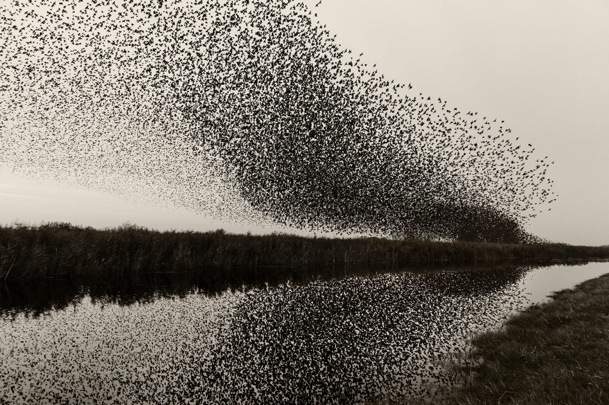

# Naturaleza — Dinamarca

Entre mares interiores y el frente atlántico, Dinamarca despliega un mosaico de hayedos atlánticos, brezales ventosos, marismas intermareales de talla mundial y acantilados cretácicos que guardan la huella de la extinción de los dinosaurios. Su relieve suave fue esculpido por glaciares del Último Máximo Glacial, y su línea de costa, larga y quebrada, multiplica los hábitats: estuarios, fiordos, dunas, playas y zonas de mareas. En este país de luz oblicua y vientos constantes, las migraciones de aves alcanzan cifras astronómicas, los estorninos dibujan “soles negros” primaverales y otoñales, y, bajo el agua, marsopas y focas custodian estrechos cargados de historia natural.

## Flora

### Bosques de haya y robles

- **Haya europea (*Fagus sylvatica*, “bøg”)**  
  Árbol dominante de los bosques daneses, con corteza lisa grisáceo-plateada y copa densa, oval a globosa. Hojas ovales de margen ligeramente ondulado (5–10 cm), verde brillante en primavera, cobrizo en otoño; y semipersistentes como hojarasca “marcescente” en juveniles. Alcanzan 30–40 m y diámetros >1 m en hayedos antiguos (algunos incluidos en el patrimonio mundial de Hayedos primigenios de Europa). Florece abril-mayo; hayucos (nueces triangulares) en otoño, esenciales para aves y roedores. Prefiere suelos francos calcáreos bien drenados.  
  Comportamiento/eco: sombra densa, sotobosque pobre en luz; micorrizas con Boletus y Amanita.  
  Verla: Selandia Norte (Gribskov, Jægersborg Dyrehave), Møn y Lolland. Mejor en mayo (brotes tiernos) y octubre (follaje). Seguridad: senderos resbalan con hojarasca húmeda.

- **Roble pedunculado (*Quercus robur*, “eg”)**  
  Tronco poderoso, ramas extendidas; hojas lobuladas con pecíolo corto; bellotas con pedúnculo largo. Hasta 25–35 m; individuos centenarios en dehesas antiguas (parques de ciervos).  
  Comportamiento: especie clave para biodiversidad; >500 spp. de insectos asociadas.  
  Verla: Jægersborg Dyrehave y Almindingen (Bornholm). Temporada: todo el año; mejor en junio-septiembre para actividad de insectos.

### Brezales y matorrales de Jutlandia

- **Brezo común (*Calluna vulgaris*, “hedelyng”)**  
  Subarbusto de 20–60 cm, hojas minúsculas imbricadas; flores rosadas/púrpuras en espigas densas (julio-septiembre) que tiñen el paisaje. Tolera suelos ácidos pobres.  
  Comportamiento: rebrote tras quemas controladas; atrae abejas (miel de brezo).  
  Verlo: Thy National Park, Rebild Bakker. Mejor en agosto cuando el brezal está en su máximo.

- **Ene común (*Juniperus communis*, “enebær”)**  
  Arbusto/pequeño árbol con hojas aciculares punzantes en verticilos de tres; gálbulos azul-negruzcos aromáticos (2–3 años en madurar).  
  Comportamiento: enebros viejos modelados por el viento (formas “bandera”).  
  Verlo: dunas estabilizadas y brezales de Jutlandia Occidental, todo el año.

### Dunas y costas

- **Ammofila de las dunas (*Ammophila arenaria*, “marehalm”)**  
  Gramínea pionera de 60–120 cm; hojas enrolladas grisáceas; largas rizomas que fijan arena.  
  Comportamiento: “ingeniera” de ecosistemas dunares; tolera sal, soterramiento.  
  Verla: costa del Mar del Norte (Blåvand, Skagen). Todo el año; respetar cordones dunares.

- **Espino amarillo (*Hippophae rhamnoides*, “havtorn”)**  
  Arbusto espinoso de hasta 4 m; hojas estrechas plateadas; bayas anaranjadas ricas en vitamina C (otoño-invierno).  
  Comportamiento: fija nitrógeno; alimento clave para zorzales y silvidos.  
  Verlo: acantilados y dunas costeras (Møn, Bornholm). Recolección: otoño; guantes por espinas.

- **Lyme grass / leymus (*Leymus arenarius*, “strand-rug”)**  
  Gramínea robusta con espigas gruesas azuladas; sujeción de dunas embrionarias.  
  Verla: franjas superiores de playa en Jutlandia y islas del Báltico.

### Humedales y marismas
- **Juncos marinos (*Juncus gerardii* y spp., “tue-tagl”)**  
  Tallos cilíndricos 20–50 cm; tolerantes a sal; floración discreta estival.  
  Verlos: marismas del Mar de Wadden; primavera-verano.

- **Hierba salada (*Triglochin maritima*, “strand-trehage”)**  
  Hojas carnosas lineares; inflorescencias alargadas; suculenta halófita.  
  Verla: praderas salinas; agosto-septiembre.

### Hongos y frutos silvestres (con tablas de identificación)
- **Rebozuelo (*Cantharellus cibarius*, “kantarel”)**  
  Sombrero embudado amarillo dorado (3–10 cm), pliegues decurrentes; olor afrutado (albaricoque).  
  Hábitat: hayedos y robledales, suelos ácidos a neutros. Temporada: julio-octubre.  
  Doble peligroso: falso rebozuelo.

- **Boleto comestible (*Boletus edulis*, “karl johan-svamp”)**  
  Sombrero pardo (7–20 cm), poros blancos a verdosos con la edad, pie robusto reticulado.  
  Hábitat: coníferas y hayedos; agosto-octubre.  
  Doble peligroso: Tylopilus felleus (amargo, no tóxico pero arruina platos).

- **Amanita muscaria (matamoscas, “rød fluesvamp”) — no comestible**  
  Sombrero rojo con verrugas blancas, láminas blancas, volva y anillo.  
  Hábitat: hayedos y pinos; agosto-octubre. Neurotóxica.

- Tabla rápida de identificación de hongos comestibles y “dobles” peligrosos:
  | Característica | Rebozuelo (comestible) | Falso rebozuelo (peligroso) | Boleto edulis (comestible) | Boleto amargo (confusión) |
  |---|---|---|---|---|
  | Láminas/pliegues | Pliegues gruesos y decurrentes | Láminas finas y separables | Poros blancos/verde oliva | Poros rosados a pardos |
  | Olor/sabor | Afrutado (albaricoque) | Terroso débil | Agradable a nuez | Intensamente amargo |
  | Color | Amarillo dorado | Naranja intenso | Sombrero pardo | Pardo más claro, pie sin retículo marcado |
  | Reacción presión | Sin cambio | Láminas frágiles | Poros no azulean | No azulean |
  | Hábitat | Bosque caducifolio | Tocones y acículas | Hayedos/coníferas | Coníferas |
  Seguridad: nunca consumir sin identificación experta; evitar ejemplares viejos o larvados.

- **Arándano europeo (*Vaccinium myrtillus*, “blåbær”)**  
  Mata baja (10–40 cm); bayas azul oscuro que tiñen la pulpa; hojas ovadas serradas.  
  Hábitat: brezales, claros de coníferas; julio-septiembre.  
  Doble: arándano enano (comestible) vs. bayas de dulcamara (tóxicas).

- **Arándano rojo (*Vaccinium vitis-idaea*, “tyttebær”)**  
  Hoja coriácea con puntos glandulares en envés; baya roja ácida.  
  Hábitat: suelos ácidos arenosos; agosto-octubre.

- **Espino amarillo (fruto) — ver arriba**  
  Bayas ricas en vitamina C; recolección sostenible dejando parte para fauna.

- Tabla rápida de bayas y “dobles”:
  | Rasgo | Arándano (comestible) | Dulcamara (*Solanum dulcamara*, tóxica) | Arándano rojo (comestible) | Bonetero europeo (*Euonymus europaeus*, tóxico) |
  |---|---|---|---|---|
  | Color/pulpa | Azul, pulpa azul | Rojo/púrpura, pulpa verde | Rojo, pulpa pálida | Cápsulas rosa con semillas naranjas |
  | Hoja | Pequeña serrada | Lanceolada entera | Córnea oval | Opuesta, fina |
  | Hábitat | Brezales/bosques | Orillas y setos húmedos | Suelos ácidos | Setos y lindes |
  Seguridad: no consumir bayas rojas desconocidas; la dulcamara es tóxica para niños y mascotas.

Consejos al viajero (flora):  
- Temporada óptima: abril-mayo (flores de hayedo), agosto (brezales en flor), septiembre-octubre (setas y follaje).  
- Respete reservas naturales; no recolectar en parques nacionales sin permiso.  
- Garrapatas presentes en bosques y brezales: usar pantalón largo y repelente.

## Fauna

### Mamíferos terrestres

- **Ciervo rojo (*Cervus elaphus*, “kronhjort”)**  
  El mayor mamífero terrestre salvaje de Dinamarca; machos 160–240 kg, hembras 80–120 kg. Cornamenta ramificada (hasta 16–18 puntas en machos viejos). Pelaje pardo rojizo estival, más grisáceo invernal.  
  Comportamiento: brama en septiembre-octubre; harenes; actividad crepuscular.  
  Dónde/cuándo: Jægersborg Dyrehave (manadas visibles en praderas arboladas), Mols Bjerge y Thy. Amaneceres de otoño para la brama. Estado UICN: Preocupación Menor (LC).

- **Corzo (*Capreolus capreolus*, “rådyr”)**  
  15–30 kg; pelaje rojizo estival, gris invernal; escudo anal blanco; cuerna tricorne en machos.  
  Comportamiento: solitario o en pequeños grupos; muy común en bordes de bosque y campos.  
  Dónde/cuándo: en toda Dinamarca; mejor al amanecer/anochecer. UICN: LC.

- **Liebre europea (*Lepus europaeus*, “hare”)**  
  3–6 kg; orejas largas con puntas negras; patas posteriores poderosas.  
  Comportamiento: “boxeo” primaveral de hembras con machos; activa al crepúsculo.  
  Dónde: campos abiertos de Jutlandia; primavera-verano. UICN: NT (tendencia decreciente en partes de Europa).

- **Erizo europeo (*Erinaceus europaeus*, “pindsvin”)**  
  600–1200 g; espinas marrón-ocre; hibernación parcial.  
  Dónde: jardines, setos, parques urbanos; noches templadas de mayo-septiembre. UICN: LC, pero en declive local.

### Fauna marina y costera

- **Marsopa común (*Phocoena phocoena*, “marsvin”)**  
  Cetáceo pequeño (1.4–1.9 m; 50–70 kg); aleta dorsal triangular, cuerpo robusto gris oscuro dorsal, blanco ventral.  
  Comportamiento: tímida; soplo discreto; caza peces pequeños con ecolocalización.  
  Dónde: Kattegat, Belts y Limfjorden; avistamientos desde costa calma (primavera-verano). UICN global: LC; población del Báltico central: CR; en aguas danesas occidentales, sujeta a mitigación de capturas accesorias.

- **Foca común (*Phoca vitulina*, “spættet sæl”)**  
  1.5–1.8 m; 60–100 kg; patrón moteado variable.  
  Comportamiento: colonias en bancos arenosos; paren junio-julio.  
  Dónde: Mar de Wadden (Mandø, Rømø) y Kattegat; excursiones de observación. UICN: LC.

- **Foca gris (*Halichoerus grypus*, “gråsæl”)**  
  Mayor (machos hasta 2.3 m, 200+ kg); perfil “ganchudo”.  
  Dónde: bancos remotos del Wadden y nacientes colonias en Kattegat; otoño-invierno. UICN: LC.

### Aves de humedales y litoral (Mar de Wadden y fiordos)

- **Ostrero euroasiático (*Haematopus ostralegus*, “strandskade”)**  
  Pico rojo largo para abrir bivalvos; plumaje blanco y negro; patas rojas.  
  Dónde: marismas y playas; todo el año (máximos migratorios primavera/otoño). UICN: NT.

  

- **Avoceta común (*Recurvirostra avosetta*, “klyde”)**  
  Pico curvado hacia arriba; blanco y negro; patas azules.  
  Dónde: salinas y lagunas someras del Wadden; abril-julio (cría). UICN: LC.

- **Agujas, correlimos y chorlitos (varias spp.)**  
  En conjunto, 12–15 millones de aves migratorias usan el Wadden cada año; más de 400 especies registradas.  
  Dónde: Ribe Kammerslusen, Tønder Marsk; mareas bajas revelan fangos ricos en invertebrados.

### Rapaces y grandes aves

- **Pigargo europeo (*Haliaeetus albicilla*, “havørn”)**  
  Envergadura 2.0–2.4 m; cola blanca en adultos; pico masivo amarillo.  
  Comportamiento: retornó tras casi extinguirse; cría estable en fiordos y lagos.  
  Dónde: Roskilde Fjord, Sydfynske Øhav, Bornholm; mejor en invierno (carroñeo) y primavera (celo). UICN: LC; estrictamente protegido.

- **Busardo ratonero (*Buteo buteo*, “musvåge”)**  
  105–130 cm de envergadura; plumaje variable; planeo sobre campos.  
  Dónde: común por todo el país; todo el año. UICN: LC.

- **Lechuza común (*Tyto alba*, “slørugle”)**  
  Disco facial en corazón; plumaje pálido; silenciosa.  
  Dónde: graneros y campanarios en campo abierto de Jutlandia y Fionia; noches templadas. UICN: LC, sensible a inviernos severos.

### Fenómenos de comportamiento

- **Estornino pinto (*Sturnus vulgaris*, “stær”) — “Sort Sol”**  
  Bandadas de decenas a cientos de miles forman murmuraciones al atardecer sobre marismas del suroeste de Jutlandia (marzo-abril y septiembre-octubre).  
  Comportamiento: coordinación antipredatoria; patrones fluidos que cambian con halcones presentes.  
  Dónde: Tønder Marsk, Ribe. Llegar 1–2 h antes del ocaso; guías locales actualizan ubicaciones.

Consejos al viajero (fauna):  
- Prismáticos 8× y telescopio 20–60× para aves del Wadden.  
- Mantener 100 m de distancia de focas; usar excursiones autorizadas.  
- Evitar perturbar dormideros de “Sort Sol”; seguir indicaciones de guardas.

## Geología

### Un país labrado por el hielo
Relieve ondulado sin montañas; punto más alto Møllehøj (171 m). Morrenas, colinas drumlinizadas y depresiones kársticas rellenas por lagos posglaciales. Bloques erráticos (“flyttblokke”) de granito y gneis traídos desde Escandinavia salpican campos y playas.

### Acantilados de Møns Klint

- Acantilados de creta blanca de 6 km y hasta ~128 m de altura (pared visible 70–100 m), depositados hace ~70 millones de años (Cretácico superior) como carbonato de calcio de cocolitóforos.  
- Fósiles: erizos de mar (Micraster), belemnites, braquiópodos; nódulos de sílex negros interestratificados.  
- Seguridad/visita: 496 escalones en la escalera principal; rocas y derrumbes frecuentes, no caminar al pie durante tormentas. Centro Geocenter Møns Klint con exposiciones. Mejor luz: mañana con mar en calma.

  

### Stevns Klint — la frontera K–Pg (UNESCO)

- Acantilado de ~17 km; visible la capa de “fiskeler” (arcilla de peces) de 5–10 cm rica en iridio (señal del impacto de Chicxulub, 66 Ma) separando calizas cretácicas y danianas.  
- Fósiles: corales y briozoos; testimonio de la recuperación marina tras la extinción masiva.  
- Visita: Højerup Gamle Kirke y escaleras de acceso. Recolección de fósiles limitada y regulada.

### Donde se encuentran dos mares — Skagen

- Grenen, extremo norte de Jutlandia: choque visible de Kattegat y Skagerrak en frentes de olas que se cruzan; corrientes fuertes modelan una barra de arena móvil.  
- Precaución: no bañarse donde chocan las corrientes; calzado para caminar sobre arena húmeda.

### Materiales y paisajes glaciares
- Till morrénico arcilloso y arenas fluvioglaciales forman suelos agrícolas fértiles en islas y arenosos en Jutlandia Oeste.  
- Eskers y kames locales; cuencas de kettle lakes.  
- Playas con sílex y ámbar ocasional (tras tormentas del oeste).

Consejos al viajero (geología):  
- Calzado antideslizante en acantilados; revisar pronósticos de viento.  
- No situarse bajo cornisas de creta tras lluvias intensas; riesgo de desprendimientos.  
- Respete normativas de recolección fosilífera (sobre todo en sitios UNESCO).

## Fenómenos Naturales

### “Sort Sol” — el Sol Negro de los estorninos
- Temporadas: marzo-abril y septiembre-octubre; picos con buen tiempo y vientos suaves.  
- Números: bandadas locales de 100.000–1.000.000+ individuos.  
- Consejo: vestimenta cálida y cortaviento; trípode para video al crepúsculo.

  

### Mareas del Mar de Wadden

- Amplitud de marea ~1.5–2 m dos veces al día; exposición de vastas planicies fangosas que alimentan millones de limícolas.  
- Riesgos: subida rápida del agua y canales (“Priele”) que se llenan primero. Realizar travesías guiadas.  
- Mejor observación: 1–2 h antes de bajamar para ver aves alimentándose; salinas en pleamar para concentraciones.

### Vientos y temporales del Mar del Norte
- Ráfagas >25 m/s en tormentas invernales; formación de espuma marina, acumulación de algas (o mareas de “fouling”).  
- Seguridad: evitar espigones en temporales; respetar cierres de playas.

### Las “noches blancas” y luz estival
- Latitud ~56–57°N: hasta ~17–18 h de luz en junio; crepúsculos prolongados ideales para fauna crepuscular.  
- Fotografía: filtros polarizadores para cielos y mar; mejor oro de tarde sobre acantilados orientados al este (Møn).

### Floraciones algales y calidad del agua
- Verano tardío: posibles cianobacterias en aguas interiores y fiordos; seguir avisos municipales (banderas rojas).  
- Precaución: no dejar perros beber en aguas verdosas.

## Ecosistemas

### Mar de Wadden (UNESCO)

- Extenso sistema de planicies intermareales, canales, bancos de arena, marismas salobres y praderas de zosteras.  
- Función: uno de los semilleros de biodiversidad más importantes de Europa; parada esencial para la Ruta Migratoria del Atlántico Este.  
- Especies clave: zosteras (hábitat de peces juveniles), bivalvos (corazones, almejas), gusanos poliquetos (alimento de limícolas), focas (predadores tope).  
- Gestión: parques nacionales y reservas; zonas de acceso restringido en época de cría (abril-julio).  
- Visita: centros en Ribe y Esbjerg; excursiones en tractor anfibio a Mandø; observación de focas desde barcos autorizados.

### Bosques templados caducifolios (hayedos y robledales)
- Estructura: dosel dominado por haya y roble; sotobosque con anémonas (Anemone nemorosa), ajos silvestres (Allium ursinum) en primavera.  
- Dinámica: manejo histórico (trasmochos y dehesas) ha creado claros favoreciendo diversidad de aves e insectos saproxílicos.  
- Fauna asociada: pico picapinos, reyezuelos, murciélagos (Myotis spp.), corzos.  
- Visita: Gribskov (UNESCO), Dyrehaven (ciervos semisalvajes entre robles monumentales). Temporada: abril-mayo y octubre.

### Brezales atlánticos y dunas costeras
- Brezales secos dominados por Calluna con tapices de líquenes; encharcamientos con esfagnos y Drosera (plantas carnívoras) en microdepresiones.  
- Dunas embrionarias (Ammophila, Leymus), móviles y grises (musgos y líquenes) hacia el interior; arbustivas con enebro y espino amarillo en estabilizadas.  
- Amenazas: eutrofización aérea y abandono de manejos (pastoreo/quemas) que llevan a la matorralización.  
- Visita: Thy National Park, Blåvandshuk y Skagen Odde. Mejor: agosto (floración del brezo), otoño (paso de rapaces y fringílidos).

### Fiordos y lagunas (Limfjorden, Roskilde Fjord)
- Aguas someras salobres con praderas de zosteras, marismas interiores y islas nidificantes.  
- Aves: eiders, serretas, charranes comunes y árticos; gansos en paso.  
- Mamíferos: marsopas en pasos estrechos; nutrias ocasionales en tramos dulces.  
- Visita: torres de observación en Skjoldungernes Land (Roskilde Fjord); kayak tranquilo (respetando aves en cría).

### Lagos, turberas y cursos fluviales
- Lagos posglaciales someros rodeados de carrizales (Phragmites), con somormujos y zampullines.  
- Turberas altas y bajas en Jutlandia con esfagnos, arándanos y libélulas (Aeshna, Sympetrum).  
- Gestión: restauraciones de turberas para captura de carbono y biodiversidad.  
- Visita: Lille Vildmose (turbera y alces reintroducidos en cercanías), Hammermosen (Bornholm). Temporada: verano para odonatos; otoño para sonidos de grullas en paso.

Consejos generales al viajero (ecosistemas y seguridad):  
- Planifique rutas con el parte de mareas en el Wadden; nunca cruce sin guía.  
- En hayedos y acantilados, atención a vientos fuertes que derriban ramas o provocan desprendimientos.  
- Lleve prismáticos, mapa offline y ropa de capas (viento frecuente incluso en verano).  
- Respete la fauna en cría (abril-julio): mantenga perros atados y evite acercarse a polladas.

Itinerarios sugeridos de naturaleza (3–5 días):  
- Día 1: Stevns Klint (K–Pg) + Roskilde Fjord (pigargos).  
- Día 2: Møns Klint (fósiles, hayedos calcáreos) + dunas con espino amarillo.  
- Día 3: Wadden (focas, limícolas, marismas).  
- Día 4: Thy (brezales, dunas, marsopas desde costa del norte).  
- Día 5: Skagen (dos mares, migración) + atardecer “Sort Sol” en Tønder Marsk (en temporada).

Reglas de oro para observación responsable:  
- Distancia mínima: aves en playa >50 m; focas >100 m.  
- No volar drones en reservas sin permiso.  
- Traiga de vuelta sus residuos; deje solo huellas.

- Fuentes útiles in situ: centros de visitantes (Geocenter Møns Klint; Wadden Sea Centre en Vester Vedsted), carteles de Naturstyrelsen y apps locales de mareas y aves.

*Fonti e Riferimenti: Naturstyrelsen (Agencia Danesa de Naturaleza), UNESCO World Heritage (Stevns Klint, Wadden Sea, Hayedos de Europa), Geocenter Møns Klint, BirdLife International (fichas UICN), VisitDenmark (recursos de senderismo y mareas), literatura de campo nórdica (Moss & Perring; Collins Bird Guide).*