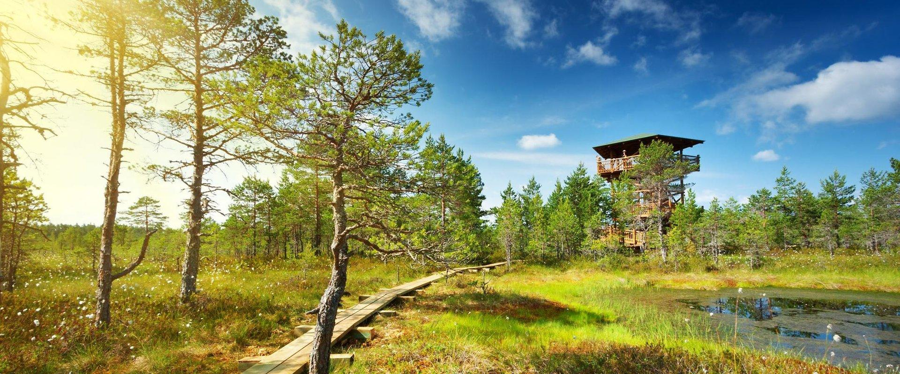
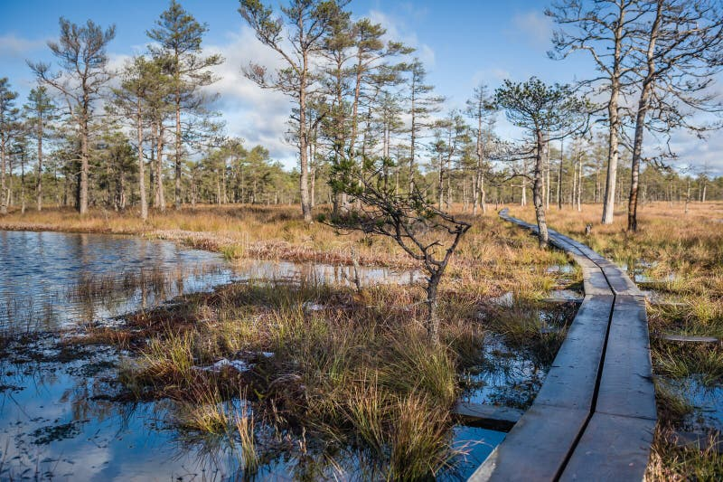
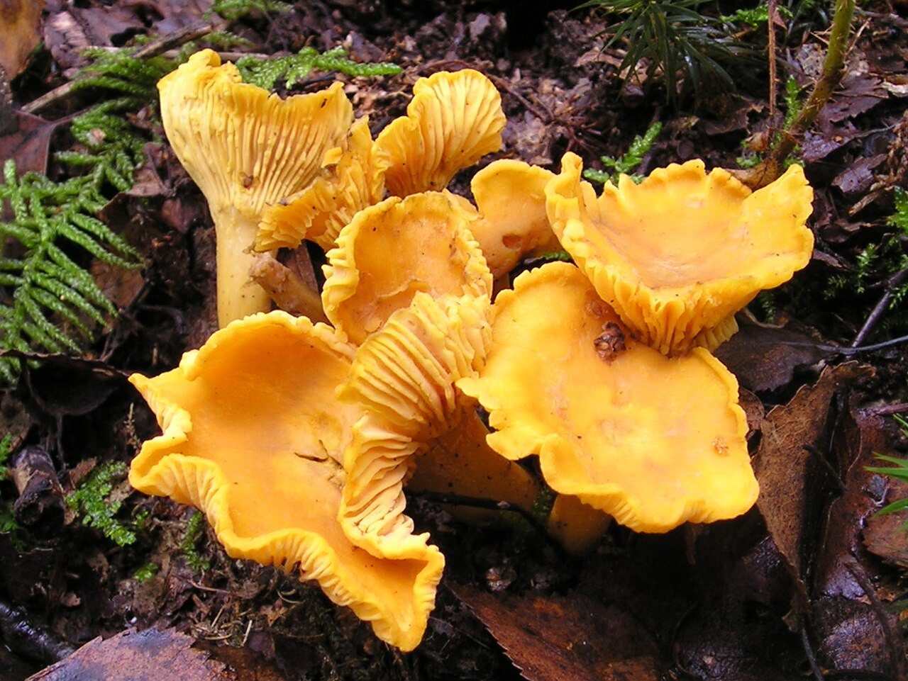

# Nature — Estonia

A low, sea-washed land at the hinge of the Baltic and the boreal north, Estonia is a mosaic of dark conifer forests, pale birch groves, ancient raised bogs, and wind-swept coastal meadows. Nearly half of the country is forest, and more than 2,200 islands fringe its coast. Estonia’s hemiboreal climate blends northern and temperate elements, creating rich habitats where cranes trumpet above reedbeds, lynx pad through old spruce, and cloudberries ignite peat domes with amber fruit. The seasons are vivid—white nights in June, golden mushrooms after August rains, and the “fifth season” of spring floods in Soomaa. For the mindful traveler, Estonia offers quiet grandeur and close-up encounters with resilient northern life.

## Flora

  

### Forest Trees and Shrubs

- **Scots Pine (*Pinus sylvestris*, harilik mänd)**
  - Description: Tall, straight conifer with orange-plated bark on upper trunk and blue-green, paired needles 4–7 cm. Old trees develop open, umbrella-like crowns. Cones ovoid, 3–7 cm, ripening second year.
  - Ecology/Behavior: Pioneer of dry, sandy soils and coastal dunes; tolerates fire and cold. Supports specialized lichens and pine-loving fungi (saffron milkcaps).
  - Where/When: Widespread in north and east Estonia, on heaths and dunes (Nõva, Lahemaa). Photogenic at sunset among coastal juniper stands.
  - Tips: In spring, pollen “storms” dust lakes sulfur-yellow; autumn resin scent strongest after warm days.

- **Norway Spruce (*Picea abies*, harilik kuusk)**
  - Description: Spire-crowned conifer with drooping branchlets; dark green, quadrangular needles 1.5–2.5 cm; long pendulous cones 10–18 cm. Bark scaly, gray-brown.
  - Ecology: Shade-tolerant climax tree in moist, nutrient-rich soils. Old-growth stands develop shaggy moss and abundant deadwood—prime habitat for flying squirrels and owls.
  - Where/When: Old spruce in Alutaguse (NE), Lahemaa interior. Best in calm winter after hoarfrost, when boughs sparkle.
  - Tips: Silence is deep in spruce forests; step softly for a chance at capercaillie and red squirrels.

- **Silver Birch (*Betula pendula*, arukask) and Downy Birch (*Betula pubescens*, sookask)**
  - Description: Silver Birch—white, peeling bark with black diamonds; pendulous twigs. Downy Birch—grayer bark, hairy twigs, more upright crown; favors wet soils.
  - Ecology: Early successional trees; birch litter enriches podzols. Hosts birch boletes and chaga fungus.
  - Where/When: Countrywide; silver birch in dry/light soils, downy birch edging bogs. Peak in May with fresh lime-green leaves; dazzling yellow in October.
  - Tips: In spring, legal sap tapping from private trees (with permission) is a tradition.

- **Pedunculate Oak (*Quercus robur*, harilik tamm)**
  - Description: Massive trunk, broad crown; deeply lobed leaves with ear-like lobes at base; long-stalked acorns. Bark fissured, grey-brown.
  - Ecology: Warmth-loving relic common in western islands and coastal belts; keystone supporting hundreds of insect species, lichens, and cavity-nesting birds.
  - Where/When: Saaremaa, Hiiumaa, and western mainland hedgerows. Visit at dawn to hear spring chorus from oak edges.
  - Tips: Old oaks are protected; do not climb or damage bark.

- **European Ash (*Fraxinus excelsior*, harilik saarepuu)**
  - Description: Tall with opposite, pinnate leaves (7–13 leaflets), black winter buds, winged samaras in clusters.
  - Ecology: Rich riverine and calcareous soils; threatened by ash dieback fungus. Host for uncommon mollusks and saproxylic beetles.
  - Where/When: River valleys (Keila, Pirita) and limestone uplands. Best in June with airy, full canopies.
  - Tips: Fallen branches after storms—watch footing on floodplains.

- **Common Juniper (*Juniperus communis*, harilik kadakas)**
  - Description: Spiny shrub/small tree with sharp, needle-like leaves in whorls; blue-black berry-like cones ripening in two years.
  - Ecology: Icon of alvars and coastal pastures; berries used in local cuisine. Provides shelter for small birds in winter.
  - Where/When: West Estonian archipelago (Saaremaa’s Loode tammik juniper savannas).
  - Tips: Do not break branches; juniper is slow-growing.

### Bog and Mire Specialists

  

  

- **Sphagnum Mosses (*Sphagnum* spp., turbasamblad)**
  - Description: Spongy, water-saturated mats; heads with starry capitula; colors range lime to red. Can absorb 20× their dry mass.
  - Ecology: Engineer of raised bogs—acidifies water, sequesters carbon, forms peat at ~1 mm/year.
  - Where/When: Raised bogs (Viru Bog, Endla, Soomaa). Year-round emerald carpets; best after rain.
  - Tips: Stay on boardwalks; trampling damages centuries of growth.

- **Round-leaved Sundew (*Drosera rotundifolia*, ümaralehine huulhein)**
  - Description: Tiny rosette with round leaves on reddish stalks, margined by glandular hairs tipped with glistening “dew.”
  - Ecology/Behavior: Carnivorous; supplements nitrogen by trapping midges. White flowers on wiry scapes in summer.
  - Where/When: Sphagnum hummocks and bog pools June–August.
  - Tips: Macro photography gold—kneel on boards for stable shots.

- **Labrador Tea/Bog Rosemary group (*Rhododendron tomentosum*, sookail)**
  - Description: Evergreen shrub with narrow, rolled, aromatic leaves, undersides rust-felted; clusters of white flowers in spring.
  - Ecology: Aromatic foliage deters herbivory; nectar source for insects.
  - Where/When: Acid bog edges; May bloom.
  - Caution: Leaves are mildly toxic if brewed too strong—do not self-medicate.

### Wild Berries

- **Cloudberry (*Rubus chamaemorus*, rabamurakas/murakas)**
  - Description: Low, single-stem plant; round, lobed leaves; amber aggregate fruits that turn from red to honey-gold when ripe.
  - Ecology: Thrives on nutrient-poor raised bogs; patchy, prized, and sensitive to trampling.
  - Where/When: North/west bogs (Viru, Laukasoo). Ripens late July–early August after warm summers.
  - Tips: Only pick orange-soft fruits; red are unripe. Tread lightly—peat domes are fragile.

- **Bilberry (*Vaccinium myrtillus*, mustikas)**
  - Description: Shrub 10–40 cm; green angular stems; blue-black berries with deep-purple flesh.
  - Ecology: Dominant forest understorey, food for bears, capercaillie, and humans.
  - Where/When: Countrywide conifer/birch forests; July–August.
  - Tips: Stain-test: bilberries stain fingers purple; edible bog bilberry (sinikas) is paler-fleshed.

- **Lingonberry (*Vaccinium vitis-idaea*, pohl)**
  - Description: Evergreen, leathery leaves with pale undersides; bright red berries tart and firm.
  - Ecology: Likes dry, acidic pine heaths; survives winter under snow.
  - Where/When: Pine forests and dunes; August–October.
  - Tips: Great for jam; avoid roadside picking due to dust/heavy metals.

- **Cranberry (*Vaccinium oxycoccos* and *V. microcarpum*, jõhvikas)**
  - Description: Thread-like trailing vines; small glossy leaves; deep red berries on peat mats.
  - Ecology: Bog specialist, tolerates frost; peak sugar after first cold nights.
  - Where/When: Open bogs; September–November (even under first snows).
  - Tips: Use plank or boardwalk edges; hidden pools can be thigh-deep.

- **Sea Buckthorn (*Hippophae rhamnoides*, astelpaju)**
  - Description: Spiny shrub with silvered, narrow leaves; dense clusters of bright orange vitamin-rich berries along branches.
  - Ecology: Sand-binder on coasts and dunes; berries persist into winter.
  - Where/When: Coastal dunes (Pärnu Bay, Harilaid); September–January.
  - Tips: Thorns are sharp—wear gloves; many stands are protected.

### Edible Mushrooms and Key Identification

- **Chanterelle (*Cantharellus cibarius*, kukeseen)**
  - Description: Golden to egg-yolk yellow, vase-shaped; blunt, forked ridges (not true gills); apricot aroma; firm, crisp flesh.
  - Ecology: Mycorrhizal with birch and pine; fruits after warm summer rains.
  - Where/When: Light pine-birch woods July–September.
  - Tips: Never confuse with thin-gilled lookalikes; leaves forest floor clean—cut or pinch, don’t rake.

- **Porcini/King Bolete (*Boletus edulis*, harilik kivipuravik)**
  - Description: Bulbous to stout; chestnut-brown cap with matte bloom; white pores turning greenish-yellow with age; thick white stipe with fine reticulation; nutty smell.
  - Ecology: With spruce, pine, birch, and oak; prefers older stands.
  - Where/When: August–October after rains.
  - Tips: Avoid bitter boletes—taste a crumb (spit out); never swallow raw wild mushrooms.

- **Bay Bolete (*Imleria badia*, pruunpuravik)**
  - Description: Dark bay cap; yellow pores bruise bluish; slender stipe without reticulation.
  - Ecology: Acidic conifer forests, often in moss.
  - Where/When: July–October.
  - Tips: Excellent dried; check for worm holes.

- **Birch Bolete (*Leccinum scabrum*, kasepuravik)**
  - Description: Grey-brown cap; white pores; stipe with dark scabers; associates strictly with birch.
  - Ecology: Edge-loving; abundant where birch saplings thrive.
  - Where/When: July–October.
  - Tips: Flesh may grey; thoroughly cook.

- **Saffron Milkcap (*Lactarius deliciosus*, männiriisikas)**
  - Description: Orange to carrot cap with concentric zones; brittle flesh exuding orange milk that stains green; hollow stipe.
  - Ecology: Pine symbiont on sandy soils.
  - Where/When: August–October.
  - Tips: Distinctive carrot-orange latex; peppery species require parboiling.

- **Slippery Jack (*Suillus luteus*, harilik võiseene)**
  - Description: Sticky brown cap with separable gelatinous cuticle; yellow pores; often with ring from partial veil.
  - Ecology: Young pine plantations, dunes.
  - Where/When: August–October.
  - Tips: Peel cap skin to avoid slime in pan.

- **Funnel Chanterelle (*Craterellus tubaeformis*, lehter-kukeseen)**
  - Description: Brownish cap with depressed center; yellow hollow stipe; blunt, vein-like ridges beneath; fragrant.
  - Ecology: Mossy conifer forest, late-season fruiter.
  - Where/When: September–November.
  - Tips: Excellent dried; grows in troops on moss.

- **Hedgehog Mushroom (*Hydnum repandum*, kollane siilikk)**
  - Description: Pale apricot to cream cap; underside covered in soft “spines” (teeth) instead of gills; firm, nutty flesh.
  - Ecology: Mixed woods, often near birch and spruce.
  - Where/When: August–October.
  - Tips: Easy to ID—spines are decisive; trim spines to reduce debris.

 

Mushroom Identification and Lookalikes (carry a local field guide; never eat uncertain finds)
- Table:
  | Edible target | Key traits | Dangerous/lookalike | How to tell apart | Season/habitat |
  |---|---|---|---|---|
  | Chanterelle (kukeseen) | Forked ridges; apricot smell; solid flesh | False chanterelle (Hygrophoropsis aurantiaca) | True gills, thinner flesh, deeper orange; weaker smell | Summer–autumn in conifer-birch litter |
  | Porcini (kivipuravik) | White to olive pores; reticulate stipe; no staining | Bitter bolete (Tylopilus felleus) | Pinkish pores with age; intensely bitter taste | Spruce/pine forest late summer |
  | Saffron milkcap (männiriisikas) | Orange latex stains green; concentric cap zones | Woolly milkcap (Lactarius torminosus) | Hairy pink cap; white latex; can upset stomach raw | Sandy pinewoods Aug–Oct |
  | Funnel chanterelle (lehter-kukeseen) | Vein-like ridges; yellow hollow stipe | Ivory funnel (Clitocybe dealbata) | Small, white, true gills, mealy smell; toxic | Late autumn, mossy conifers |
  | Hedgehog mushroom (kollane siilikk) | Spines/teeth under cap | None close; some tooth fungi are bitter | Spines reset the ID; avoid very dark, woody tooth fungi | Mixed forests Aug–Oct |
  | Any white-gilled “parasol” | — | Death cap (Amanita phalloides, roheline kärbseseen); Destroying angel (A. virosa, valge kärbseseen) | Amanitas have a volva (sac) at base, free white gills, ring; carry a knife, check base | Lawns/edges; never pick white gilled with volva |

Foraging ethics and safety (Igaüheõigus—Everyman’s Right applies):
- Take modest amounts for personal use, respect private property, avoid nature reserves’ restricted zones.
- Use a breathable basket, cut or gently twist the stem; never rake the duff.
- Learn at least 5 lethal species and their traits; seek local expertise.

Berry Identification and Cautions
- Table:
  | Berry | Local name | Habitat | Key ID | Possible confusion | Safety tip |
  |---|---|---|---|---|---|
  | Cloudberry | rabamurakas | Open raised bogs | Single amber drupe; leaves round-lobed | Unripe red cloudberries | Eat only orange-soft fruits |
  | Bilberry | mustikas | Conifer/birch forest | Blue-black, purple flesh, solitary | Garden blueberry (cultivar), bittersweet nightshade (red berries; different leaves) | Purple-staining flesh is a good sign |
  | Lingonberry | pohl | Dry pine heaths | Evergreen leaves, red clusters | Mezereon (Daphne mezereum; bright red on leafless twigs in spring) | Harvest in late summer; avoid spring red berries on bare twigs |
  | Cranberry | jõhvikas | Bog peat mats | Low vines, dark red berries | Coralberry/snowberry (white-pink berries in thickets) | True cranberries are bog-dwelling, not shrub-thicket |
  | Sea buckthorn | astelpaju | Coastal dunes | Orange clusters on thorny twigs | Buckthorn (Rhamnus cathartica; black berries) | Stick to orange, silvery-leaved shrubs on dunes |

## Fauna

### Large Mammals

- **Brown Bear (*Ursus arctos*, pruun karu)**
  - Description: Powerful, shaggy mammal; shoulder height 90–120 cm; adults 100–250 kg. Coat chocolate to blond; dish-shaped face, small rounded ears.
  - Behavior: Mostly crepuscular; omnivorous, feeding on berries, ants, carrion; hibernates Nov–Mar in dens. Cubs (1–3) in winter den.
  - Status: Stable/increasing regionally; Estonia hosts several hundred bears.
  - Where/When: Alutaguse and eastern forests; best seen from hides May–September.
  - Safety: Keep 100+ m distance; never approach cubs; use guided hides.

- **Gray Wolf (*Canis lupus*, hunt)**
  - Description: 25–45 kg; long-legged, bushy tail held low; mottled grey coat with saddle; narrow chest.
  - Behavior: Territorial packs; howling peaks in winter; diet includes roe deer, wild boar, beaver.
  - Status: 200–300 nationwide; protected management.
  - Where/When: Quiet forest mosaics countrywide; track in snow Jan–Mar.
  - Tips: Listen for howls on still autumn nights; sightings rare.

- **Eurasian Lynx (*Lynx lynx*, ilves)**
  - Description: Medium cat with tufted ears, ruff beard, short black-tipped tail; spotted to plain tawny coat. Males 18–30 kg.
  - Behavior: Solitary, crepuscular; ambush predator of roe deer and hares; purrs and yowls at night.
  - Status: High density for Europe—roughly 800 individuals; Estonia is a stronghold.
  - Where/When: Forest edges near fields; winter tracking on fresh snow.
  - Tips: Look for round, cat-like prints without claw marks near game trails.

- **Moose/Elk (*Alces alces*, põder)**
  - Description: Largest deer; bulls 300–500 kg; long legs, bulbous nose, dewlap; palmate antlers in mature males.
  - Behavior: Solitary; feeds on willows, aquatic plants; active at dawn/dusk; calves (1–2) in late spring.
  - Where/When: Bogs, forest clearings, road edges at dusk, especially west/north bog belts.
  - Tips: Drive cautiously at night—moose collisions are serious.

- **Wild Boar (*Sus scrofa*, metssiga)** (population fluctuating)
  - Description: Stocky, dark bristled; males with tusks; striped piglets in spring.
  - Behavior: Nocturnal rooting; forms sounders; population impacted by African swine fever.
  - Where/When: Mixed forests, fields; best seen at dusk.
  - Tips: Do not approach piglets; sows defend vigorously.

- **Eurasian Beaver (*Castor fiber*, kobras)**
  - Description: Large rodent up to 25–30 kg; flat tail, webbed feet; chestnut fur.
  - Behavior: Dams and lodges reshape streams; fells small trees; nocturnal.
  - Where/When: Slow rivers and ponds nationwide; dusk canoe trips in Soomaa and Emajõgi valleys.
  - Tips: Look for gnawed stumps and mud slides; keep quiet and drift.

- **Siberian Flying Squirrel (*Pteromys volans*, lendav orav)**
  - Description: Small, silvery-grey squirrel with large black eyes; patagium membrane between limbs for gliding; tail flat and fluffy.
  - Behavior: Nocturnal; nests in old aspens; feeds on catkins and lichens; glides tree-to-tree silently.
  - Status: Extremely rare in EU; stronghold in Alutaguse’s mature aspen-spruce.
  - Where/When: NE Estonia; best chance with licensed guides April–June at dusk.
  - Tips: Strictly protected—no disturbance; red-light torches only.

### Marine Mammals and Coastal Life

- **Grey Seal (*Halichoerus grypus*, hallhüljes)**
  - Description: Large seal 2–2.3 m, 150–250 kg; long “Roman-nosed” head; spotted grey coat (males darker).
  - Behavior: Breeds on ice or remote islets; pups white-furred. Haul-out in groups on skerries.
  - Status: 10,000+ in Estonian waters; recovering.
  - Where/When: West Estonian Archipelago and Gulf of Riga; boat trips from Saaremaa/Hiiumaa May–September.
  - Tips: Use binoculars; maintain legal distance; disturbance causes stampedes.

- **Ringed Seal (*Pusa hispida botnica*, viigerhüljes)**
  - Description: Smaller (1.5 m), dark coat with pale rings; shy.
  - Behavior: Ice-associated; uses breathing holes; pups on pack ice.
  - Where/When: Northern Gulf of Finland; seen rarely from shore in winter.
  - Tips: Best with specialized winter expeditions; safety on sea ice paramount.

### Birds of Forests, Wetlands, and Coasts

- **White Stork (*Ciconia ciconia*, valge-toonekurg)**
  - Description: Tall (1 m), white with black wings; red bill and legs; clattering calls.
  - Behavior: Nests on chimneys and poles; feeds on frogs, voles in meadows. Post-breeding flocks wheel in thermals.
  - Status: High density in Estonia; cultural emblem.
  - Where/When: Rural landscapes May–August; migration late August–September.
  - Tips: Observe nest platforms in villages; do not fly drones near nests.

- **Black Stork (*Ciconia nigra*, must-toonekurg)**
  - Description: Sleeker, black with green-purple sheen; white belly; red bill/legs.
  - Behavior: Secretive; nests in old forests near rivers; fishes in quiet creeks.
  - Status: Scarce; strictly protected.
  - Where/When: Old-growth near water (Soomaa, Alam-Pedja); May–July.
  - Tips: Use hides; avoid revealing nest locations.

- **Common Crane (*Grus grus*, sookurg)**
  - Description: Tall gray; black face, white stripe, red crown patch.
  - Behavior: Bugling calls; dances in spring; autumn staging in tens of thousands on stubble fields and Matsalu meadows.
  - Where/When: Matsalu NP and western fields August–September (peak); breeding in bogs April–June.
  - Tips: Dawn/ dusk count points in Matsalu; bring scope.

- **White-tailed Eagle (*Haliaeetus albicilla*, merikotkas)**
  - Description: Huge sea eagle, 2–2.45 m wingspan; wedge tail (white in adults), massive yellow bill.
  - Behavior: Soars over coasts; kleptoparasitic; nests in old pines near water.
  - Where/When: West coast and larger lakes year-round.
  - Tips: Scan skies over Matsalu Bay and Saaremaa cliffs on windy days.

- **Eurasian Eagle-owl (*Bubo bubo*, kassikakk)**
  - Description: Massive owl with orange eyes and ear tufts; mottled brown plumage; low booming calls.
  - Behavior: Nocturnal predator; nests on cliffs and old quarries along Baltic Klint.
  - Where/When: Northern limestone escarpment and coastal quarries; dusk–night March–April.
  - Tips: Night listening walks led by local guides minimize disturbance.

### Fish and Freshwater Life

- **Northern Pike (*Esox lucius*, haug)**
  - Description: Long, torpedo-shaped body; duck-bill snout; olive with pale spots.
  - Behavior: Ambush predator lurking in reeds; spawns in flooded meadows.
  - Where/When: Lakes and brackish bays (Matsalu, Haapsalu); spring and autumn angling.
  - Tips: Barbless hooks for catch-and-release; watch for spring bird protection zones.

- **European Perch (*Perca fluviatilis*, ahven)**
  - Description: Dark vertical bars; red-orange fins; spiny dorsal fin.
  - Behavior: Schooling; feeds at dawn/dusk; excellent ice-fishing quarry.
  - Where/When: Most waters; winter through ice on Lake Peipus (Peipsi).
  - Tips: Check ice thickness with locals; carry spikes.

- **Pikeperch/Zander (*Sander lucioperca*, koha)**
  - Description: Silvery, fanged predator; faint bars; glassy eyes.
  - Behavior: Low-light hunter; prefers turbid waters.
  - Where/When: Larger rivers/bays; evening bites in summer.
  - Tips: Respect size/bag limits.

- **Atlantic Salmon (*Salmo salar*, lõhe)**
  - Description: Streamlined silver; black x-shaped spots; kype in males.
  - Behavior: Anadromous; spawns in clear gravel streams (NE rivers).
  - Where/When: Autumn runs; catch-and-release in designated rivers.
  - Tips: Permits required; wade softly to protect redds.

- **European Eel (*Anguilla anguilla*, angerjas)**
  - Description: Snake-like; catadromous to Sargasso Sea; endangered.
  - Behavior: Nocturnal; hides in mud.
  - Where/When: Coastal lagoons and lakes; strictly regulated.
  - Tips: Avoid consumption—support recovery.

- **Baltic Herring and Sprat (*Clupea harengus membras*, räim; *Sprattus sprattus*, kilu)**
  - Description: Small schooling fish; silver sides, forked tail.
  - Behavior: Coastal shoals, basis of famed open-sandwiches (kiluvõileib).
  - Where/When: Coastal waters; spring–autumn.
  - Tips: Taste local smoked fish in harbor towns.

## Geology

- **The Baltic Klint (Balti klint)**
  - Description: A 1,100–1,200 km limestone-dolostone escarpment from Sweden to Russia; in North Estonia it forms dramatic sea cliffs. Composed largely of Ordovician limestone (ca. 470–460 Ma).
  - Highlights: Ontika–Toila coastal cliffs rise up to 56 m—the highest in the Baltic region—stacked with fossil-rich ledges, waterfalls (Valaste), and wave-cut notches.
  - Where/When: Along the Northern coast (Lahemaa to Sillamäe). Best viewed spring and after storms when waterfalls are full.
  - Tips: Stay behind cliff-edge fences; rocks are friable. Binoculars for seabirds and eagle-owls.

- **Glacial Legacy**
  - Description: Last glaciation sculpted low relief; left drumlins, eskers, and an archipelago of 2,222 islands with shallow, rocky coasts. Vast erratic boulders dot fields.
  - Star Erratic: Ehalkivi (“Sunset Glow Rock”)—the largest in Northern Europe—stands ~7 m high with a circumference of 48.2 m, a granite monolith stranded by ice.
  - Where/When: Ehalkivi near Letipea; best in golden hour with calm seas.
  - Tips: Slick lichen on boulders—grippy footwear.

- **Meteorite Impact—Kaali Crater**
  - Description: Cluster of nine craters on Saaremaa; main crater ~110 m in diameter, 22 m deep; formed about 3,500 years ago by iron meteorite impacts.
  - Significance: Rare young terrestrial impact visible in Europe; folklore-rich.
  - Where/When: Central Saaremaa; interpretive trails year-round.
  - Tips: Respect fences; no rock collecting.

- **Karst and Springs**
  - Description: Limestone uplands (Pandivere) host sinkholes, disappearing streams, and powerful springs (e.g., Saula Siniallikad, the “Blue Springs”).
  - Where/When: Central-north Estonia; springs vivid blue-green in all seasons.
  - Tips: Keep to paths; karst edges can collapse.

- **Peat and Low Relief**
  - Description: Estonia’s highest point, Suur Munamägi, is only 318 m; yet peat domes can reach 5–7 m thickness, recording 9,000–10,000 years of mire history at ~1 mm/year accumulation.
  - Where/When: Haanja uplands for rolling hills; Endla and Soomaa for peatland geomorphology.
  - Tips: Boardwalks protect floating mats and soft peat.

## Natural Phenomena

- **White Nights**
  - Description: At 59°N, late May to mid-July brings luminous twilights—near-continuous light with ~19 hours of daylight at solstice. Sunset near 23:00; sunrise around 04:00.
  - Where/When: Countrywide; coastal horizons amplify glow.
  - Tips: Eye mask for sleep; dawn birdsong is spectacular in June.

- **Short Winter Days and Winter Light**
  - Description: In December, daylight can shrink to ~6 hours; low sun crafts long shadows; hoarfrost and rime ice gild forests after foggy nights.
  - Tips: Midday is prime for photography; dress for wind chill near coasts.

- **Aurora Borealis (Occasional)**
  - Description: On geomagnetically active nights, green and purple curtains may pulse low on the northern horizon.
  - Where/When: Clear, moonless nights, autumn–spring; best in north coast (Lahemaa, Käsmu).
  - Tips: Track solar forecasts; use tripod and wide-angle lens.

- **Soomaa’s “Fifth Season”**
  - Description: Spring snowmelt floods inundate meadows, forests, and roads, transforming the landscape into a quiet inland sea.
  - Where/When: March–April in Soomaa National Park.
  - Tips: Guided dugout (haabjas) tours; respect currents and submerged hazards.

- **Bird Migrations**
  - Description: Millions funnel along the East Atlantic Flyway; April-May and August-October bring geese skeins, cranes, shorebirds.
  - Where/When: Matsalu Bay, Silma and Haapsalu wetlands; dawn and late afternoon peaks.
  - Tips: Wind from north concentrates migrants along coasts in autumn.

- **Mushroom Flushes After Rains**
  - Description: Warm August–September rains trigger mass fruiting—chanterelle carpets, porcini “fairy banks.”
  - Tips: Go 2–5 days after steady rain; early morning beats the crowds.

## Ecosystems

### Hemiboreal Forest Mosaics

- Description: A transitional zone blending boreal conifers with temperate broadleaves. Structural diversity ranges from sunlit pine heaths to dark spruce cathedrals and oak-ash ravines. Deadwood volumes in old stands exceed 100 m³/ha, nurturing fungi, mosses, and cavity fauna.
- Key Species: Spruce, pine, birch, oak; lynx, flying squirrel; owls; woodpeckers (black, three-toed).
- Where/When: Lahemaa NP, Alutaguse, Haanja; spring chorus April–June; autumn fungi August–October.
- Traveler Tips: Ticks are active May–October—use repellent, do tick checks. Silence increases wildlife sighting odds.

### Raised Bogs, Fens, and Transitional Mires

- Succession: Lake → rich fen (minerotrophic) → transitional mire → raised bog (ombrotrophic) over 9,000–10,000 years. Peat 5–7 m thick, dome-fed only by rain.
- Structure: Open peat domes, dwarf pines, patterned pool-lawn complexes, Sphagnum carpets, cranberry and sundew mats.
- Where/When: Soomaa, Endla, Lahemaa’s Viru Bog. Boardwalks year-round; autumn colors and mirrored pools in September.
- Fauna: Cranes and golden plovers breed; moose feed; adders bask.
- Traveler Tips: Stick to duckboards; peat mats can be floating. Winter ski tours are magical on hard frost.

### Floodplain Meadows and Rivers

- Description: Seasonal inundations deposit silts, nourish hay meadows, and power fish spawning (pike). Traditional mowing maintains high plant diversity, including orchids.
- Where/When: Matsalu NP, Alam-Pedja and the Emajõgi floodplains; late May–June wildflower peak; September crane gatherings.
- Tips: Respect no-entry zones during breeding season; vantage towers provide sweeping views.

### Coastal Meadows, Reeds, and Shallow Bays

- Description: Saline-tolerant swards grazed by cattle and sheep; interlaced with reedbeds and shallow lagoons rich in invertebrates.
- Value: Critical for waders and geese on migration; white-tailed eagles patrol.
- Where/When: Matsalu, Silma, Saaremaa west coast; best April–May and August–October.
- Tips: Low hides reduce disturbance; rubber boots for muddy edges.

### Alvars—Limestone Grasslands

- Description: Thin-soiled grasslands on flat Ordovician limestone with drought-flood cycles; stony pavements studded with juniper, orchids, and sedums.
- Rarity: A Baltic specialty; globally scarce habitat.
- Where/When: Saaremaa and Muhu (Tagamõisa, Viidumäe). June–July for wildflower bloom.
- Tips: Stay on paths to avoid crushing rare plants; bring knee pads for macro flora photography.

### West Estonian Archipelago and Islets

- Description: A labyrinth of islets, skerries, and shallow seas buffered by eelgrass beds and stony reefs. Wind, salt, and ice sculpt juniper-savannas and coastal pine.
- Fauna: Grey seals haul out; Arctic migrants rest; terns and eiders breed.
- Where/When: Vilsandi, Hiiumaa, Saaremaa; May–September by kayak or boat.
- Tips: Mind bird sanctuaries (seasonal landings forbidden); carry charts and heed weather.

### Lakes and Great Peipus

- Description: Lake Peipus (Peipsi) is one of Europe’s largest transboundary lakes; broad, sandy shallows, dunes, and fishing villages. Winter turns it into a white plain of ice.
- Fauna: Perch, pike, zander; whitefish; winter smelt runs.
- Where/When: Year-round; ice fishing Jan–March when safe.
- Tips: Local guidance essential for ice safety; watch for pressure ridges.

### Human–Nature Interaction and Access

- Everyman’s Right (Igaüheõigus): You may walk, ski, pick mushrooms/berries on uncultivated land; avoid damage, keep distance from homes (150 m), close gates, leave no trace.
- Safety: Ticks (May–Oct), bog pools, unstable cliffs; dress in layers, carry maps, and respect seasonal restrictions in protected areas.
- Best Times: May–June for birds and flowers; July–August for white nights and berries; September–October for cranes, raptors, and mushrooms; March–April for Soomaa floods and early migrants.

  

Fonti e Riferimenti: Estonian Environment Agency (Keskkonnaagentuur); Estonian Environmental Board; Matsalu, Soomaa, Lahemaa, and Vilsandi National Park materials; Geological Survey of Estonia; published field guides to Baltic mushrooms and flora; HELCOM Baltic Sea assessments; local conservation NGOs and visitor center briefings.