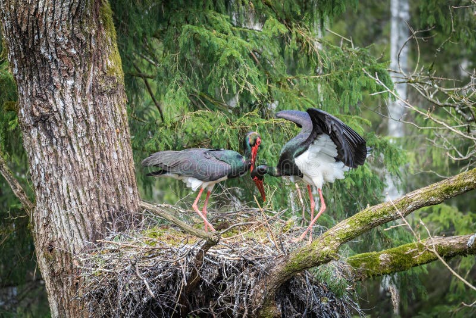
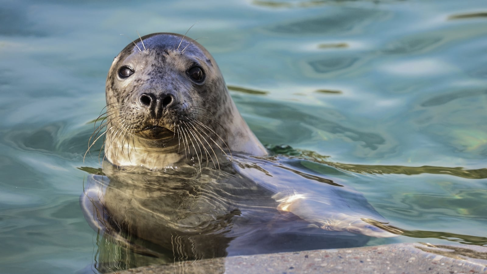
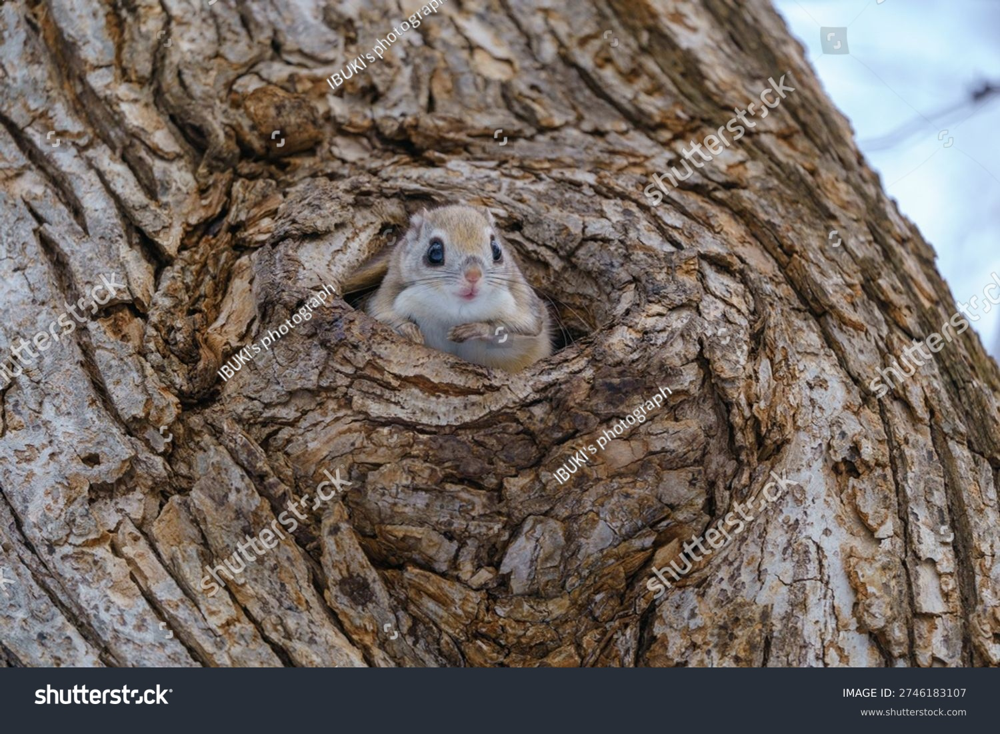
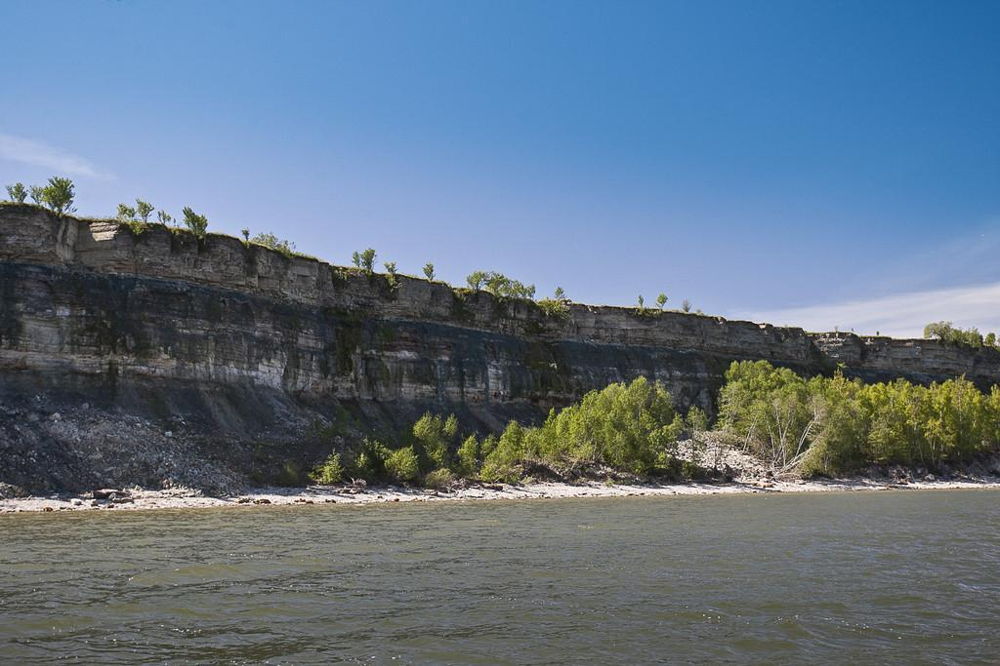
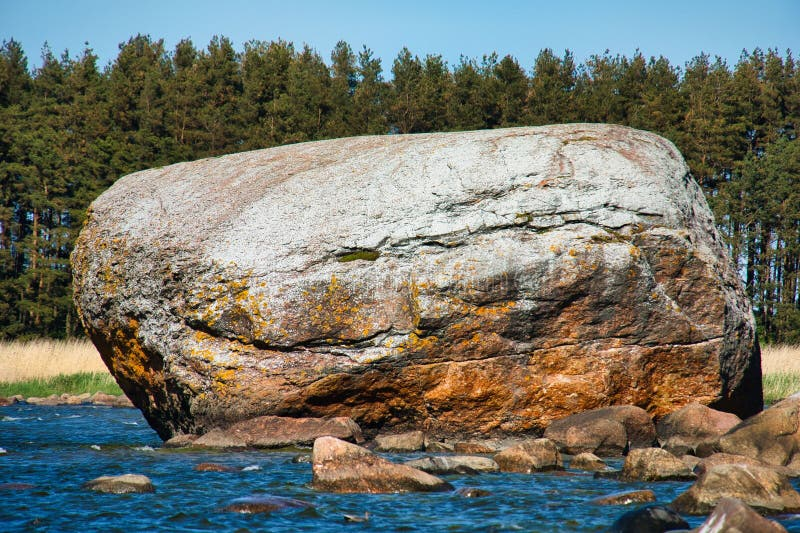

# Natura — Estonia

Distesa fra il Mar Baltico e vaste pianure glaciali, l’Estonia è un mosaico emiboreale dove il 50% del territorio è coperto da foreste, punteggiate da torbiere antichissime, alvari calcarei e meandri fluviali. Questo piccolo Paese baltico, con più di 2.200 isole, custodisce un patrimonio naturale sorprendentemente intatto: colonie di foche grigie, migrazioni di gru e oche a milioni, scarpate calcaree ordoviciane ricche di fossili, e stagioni “extra” di piene primaverili che ridisegnano i paesaggi. L’“Igaüheõigus” (diritto di ognuno) permette di camminare e raccogliere frutti e funghi in natura, nel rispetto delle regole e della fragilità degli ecosistemi. Dalle Notti Bianche alle nebbie di torbiera all’alba, l’Estonia offre natura spettacolare in formato concentrato e facilmente accessibile.

## Flora

  

### Foreste emiboreali e alberi caratteristici

- **Pino silvestre (Pinus sylvestris, harilik mänd)**
  Albero sempreverde dominante su suoli sabbiosi e poveri, alto 20–35 m (fino a 40 m), con tronco dritto, corteccia grigio-rossiccia che desquama in alto, chioma aperta e aghi rigidi verde-azzurro lunghi 4–7 cm a coppie. Coni ovoidali 3–7 cm.
  Ecologia e comportamento: specie pioniera, tollera siccità e freddo, colonizza le “sponde” asciutte delle torbiere (foreste di pinete su sfagno). Longevità fino a 300 anni.
  Dove e quando vederlo: ovunque, in particolare in Lahemaa, Kõrvemaa, Alutaguse; riconoscibile tutto l’anno.

- **Abete rosso (Picea abies, harilik kuusk)**
  Conifera densa 25–35 m con rami penduli e aghi quadrangolari verde scuro lunghi 1,5–2,5 cm. Coni cilindrici 10–16 cm che pendono dai rami.
  Ecologia: predilige suoli freschi e profondi; sensibile a tempeste e siccità; crea ombra profonda e microclimi umidi che favoriscono muschi e funghi.
  Dove e quando: comuni nelle foreste del nord e del centro; visibili facilmente nei parchi nazionali di Lahemaa e Alutaguse.

- **Betulla bianca e betulla pubescente (Betula pendula “arukask” e Betula pubescens “sookask”)**
  Betulle dal portamento elegante, corteccia bianca con lenticelle nere (arukask) o più opaca e grigiastra (sookask); foglie romboidali (pendula) vs. più tonde (pubescens). Altezza 15–25 m.
  Ecologia: pioniere della ricolonizzazione post-glaciale e post-incendio; la sookask domina i margini umidi di torbiere e paludi.
  Dove: diffuse ovunque; spettacolari in autunno nelle campagne di Lääne e nel Kõrvemaa.

- **Quercia farnia (Quercus robur, harilik tamm)**
  Gigante a crescita lenta (fino a 30 m), tronco massiccio, chioma ampia e foglie lobate; ghiande su lunghi peduncoli. Relitto di climi più miti, comune su isole e coste occidentali.
  Ecologia: specie chiave per biodiversità del legno morto e cavità; ospita licheni, insetti saproxilici, picchi e passeriformi cavernicoli.
  Dove: praterie a ginepro e alvari di Saaremaa, Muhu e Hiiumaa; notevoli querce monumentali lungo strade rurali.

- **Frassino maggiore (Fraxinus excelsior, harilik saar)**
  Albero alto 20–30 m, foglie composte 7–13 foglioline, semi alati (sàmare). Colpito dal “dieback” (Chalara fraxinea), in declino in molte aree.
  Dove: fondovalle e suoli ricchi; meglio individuabile in primavera per le grandi gemme nere e in autunno per le samare pendule.

- **Ginepro comune (Juniperus communis, harilik kadakas)**
  Arbusto/ piccolo albero aghiforme (1–5 m), bacche blu-nerastre aromatiche (in realtà coni femminili) maturano in 2–3 anni. Icona dei paesaggi a ginepro di Saaremaa e Muhu.
  Uso e ecologia: fondamentale per habitat di praterie semiaride; bacche usate in cucina e distillati.
  Dove: pascoli costieri, alvari e prati a mosaico, tutto l’anno.

- **Cannuccia di palude (Phragmites australis, harilik pilliroog)**
  Graminacea alta 2–3 m, pannocchie piumose bruno-violacee. Forma canneti estesi in baie e lagune.
  Ecologia: filtra nutrienti, fornisce rifugio a uccelli canori e ittiofauna giovanile.
  Dove: Matsalu NP, lagune del Väinameri, delta e baie costiere; massima visibilità in tarda estate-autunno.

### Piante delle torbiere e sottobosco

- **Sphagnum (Sphagnum spp., turbasammal)**
  Muschi ingegneri dell’ecosistema: tappeti spugnosi che assorbono fino a 20 volte il loro peso, acidificano e intrappolano carbonio trasformandosi in torba a ~1 mm/anno.
  Morfologia: steli con capitula a rosetta; colori dal verde al rosso porpora.
  Dove: torbiere alte (raised bogs) come Viru raba, Soomaa, Endla. Attenzione: camminare solo su passerelle.

- **Rosmarino di palude (Rhododendron tomentosum, sookail)**
  Arbusto sempreverde 30–120 cm, foglie lineari aromatiche (odore resinoso), pagine inferiori tomentose ruggine; fiori bianchi in ombrelle.
  Nota: leggermente tossico, non usare in tisane. Insetti impollinatori specializzati.
  Dove: dossi asciutti delle torbiere; fioritura maggio–giugno.

- **Drosera rotondifolia (Drosera rotundifolia, ümaralehine huulhein)**
  Pianta carnivora bassa (2–5 cm), foglie rotonde con ciglia vischiose rosse che intrappolano insetti, piccoli fiori bianchi.
  Ecologia: integra l’azoto catturando artropodi in habitat poverissimi.
  Dove: margini umidi delle pozze di torbiera; migliore osservazione giugno–agosto.
  

- **Mirtillo nero (Vaccinium myrtillus, mustikas)**
  Suffrutice 15–40 cm, fusticini angolosi verdi, bacche blu-nero cerose che tingono la polpa di viola.
  Ecologia: base trofica per uccelli e orsi; indicatore di suoli acidi.
  Dove e quando: boschi di conifere; raccolta da luglio a settembre (regole di Igaüheõigus: raccogli con parsimonia).

- **Mirtillo rosso/lingonberry (Vaccinium vitis-idaea, pohl)**
  Fogliame sempreverde lucido, bacche rosse acidule in tappeti sotto pino e abete.
  Stagione: agosto–ottobre; ottimo in conserve tradizionali.

- **Mirtillo di palude/cranberry (Vaccinium oxycoccos, jõhvikas)**
  Tralci striscianti su sfagno, foglioline piccole grigiastre, bacche rosso scuro; preferisce torbiere alte.
  Raccolta: settembre–novembre; attenzione ai terreni instabili.

- **Lampone artico (Rubus chamaemorus, murakas)**
  Erbacea bassa dioica, foglie palmato-lobate; frutto ambra composto, prezioso e raro.
  Habitat: dossi di torbiera in regioni occidentali e settentrionali; maturazione variabile (luglio–agosto).
  

### Funghi: icone del “seenelkäik” e sicurezza

- **Finferlo/Gallinaccio (Cantharellus cibarius, kukeseen)**
  Cappello giallo uovo 3–8 cm imbutiforme, pieghe anastomizzate al posto di lamelle, odore fruttato; carne soda bianca-gialla.
  Habitat e stagione: boschi misti e conifere, giugno–ottobre. Ottimo commestibile, abbondante in anni piovosi.

- **Porcino/Boletus edulis (Boletus edulis, kivipuravik)**
  Cappello bruno nocciola 7–25 cm, tubuli bianchi poi verdastri, gambo tozzo reticolato, carne bianca inalterabile.
  Habitat: conifere e betulle, agosto–ottobre. Delizia locale.

- **Palloncino di betulla/Leccinum scabrum (Leccinum scabrum, kasepuravik)**
  Cappello bruno-grigiastro, gambo slanciato punteggiato di scaglie scure, associazione con betulla.
  Stagione: luglio–ottobre. Commestibile, richiede cottura prolungata.

- **Lattario del pino (Lactarius deterrimus/deliciosus, männiriisikas)**
  Cappello arancio con zonature, latte arancio che vira al verdastro, lamelle fitte aranciate.
  Habitat: pinete; stagione: agosto–ottobre. Ottimo in salamoia secondo tradizione.

- **Amanita mortale/Tignosa verdognola (Amanita phalloides, roheline kärbseseen) – PERICOLOSA**
  Cappello verdastro, lamelle bianche, volva a sacco e anello; tossine amatossine letali.
  Habitat: boschi ricchi, spesso con quercia. Mai raccoglierla.

- **Amanita distruggitrice (Amanita virosa, valge kärbseseen) – PERICOLOSA**
  Totalmente bianca, volva e anello evidenti; odore dolciastro sgradevole.
  Habitat: abetine umide; letale.

Tabella di identificazione funghi (selezione, con sosia pericolosi):
| Specie (locale) | Caratteri chiave | Habitat e stagione | Sosia e differenze | Commestibilità |
|---|---|---|---|---|
| Cantharellus cibarius (kukeseen) | Pieghe decorrenti, odore di albicocca, cappello giallo imbutiforme | Boschi misti/conifere; giu–ott | Hygrophoropsis aurantiaca (falso finferlo): lamelle vere, cappello più arancione, carne fragile | Ottimo |
| Boletus edulis (kivipuravik) | Tubuli bianchi→verd, gambo reticolato, carne bianca inalterata | Conifere/betulle; ago–ott | Tylopilus felleus (boleto amaro): reticolo scuro, gusto molto amaro | Ottimo |
| Leccinum scabrum (kasepuravik) | Gambo con scaglie scure, cappello bruno, con betulla | Betulle; lug–ott | Amanita spp.: lamelle e volva presenti (leccinum ha tubuli, NO volva) | Buono (ben cotto) |
| Lactarius deliciosus/deterrimus (männiriisikas) | Latte arancio→verde, cappello zonato | Pinete; ago–ott | Lactarius torminosus (urticante): cappello tomentoso rosa, latte bianco caustico | Ottimo |
| Amanita phalloides (roheline kärbseseen) | Volva a sacco, anello, lamelle bianche, cappello verdastro | Boschi ricchi; ago–ott | Giovani Agaricus: lamelle rosa→marroni, odore di anice, nessuna volva | Mortale |

Consigli pratici funghi:
- Raccogli solo specie certe; conserva gli esemplari interi (cappello + base) per verifica.
- Evita esemplari troppo giovani o vecchi; usa coltellino e cestino aerato.
- Rispetta l’Igaüheõigus: non danneggiare il micelio né la vegetazione; richiudi il muschio.

### Bacche di bosco: riconoscimento rapido e sicurezza

Tabella di identificazione bacche (selezione):
| Specie (locale) | Foglie e portamento | Frutto e gusto | Habitat | Sosia/Avvertenze |
|---|---|---|---|---|
| Vaccinium myrtillus (mustikas) | Fusti verdi angolosi, foglie ovate seghettate | Bacca blu-nera, polpa viola dolce | Boschi acidi | Vaccinium uliginosum (edule, più glauco); evitare bacche rosse lucide sconosciute |
| Vaccinium vitis-idaea (pohl) | Sempreverde, foglie coriacee con puntini inferiori | Bacche rosse acidule | Pinete asciutte | Convallaria majalis (bacche rosse velenose su stelo erbaceo senza foglie arbustive) |
| Vaccinium oxycoccos (jõhvikas) | Tralci su sfagno, foglie piccole arrotolate | Bacche rosso scuro acidule | Torbiere alte | Terreni instabili: usare passerelle |
| Rubus chamaemorus (murakas) | Foglie palmato-lobate basali | Drupe ambra dolce | Dossi di torbiera | Raccolta limitata: rispetta aree protette |

## Fauna

### Mammiferi di grande taglia

- **Orso bruno (Ursus arctos, pruunkaru)**
  Massiccio plantigrado 100–300 kg, pelliccia bruna, profilo dorsale convesso, impronta con 5 dita e unghie marcate. Onnivoro opportunista (bacche, formicai, carcasse).
  Stato e numeri: popolazione stabile/ in lieve crescita; distribuito soprattutto in Estonia orientale e nord-orientale. Avvistamenti discreti grazie alle vaste foreste.
  Dove e quando: tracce su tronchi scortecciati e impronte fangose in Alutaguse e Soomaa; attività crepuscolare da aprile a ottobre. Sicurezza: mantenere distanza, non lasciare rifiuti, niente avvicinamenti.

- **Lupo (Canis lupus, hunt)**
  30–50 kg, manto grigio-bruno, coda pendente, andatura elastica; branchi di 4–8 individui con territori ampi.
  Stato: 200–300 individui (fluttuazioni annuali). Preda caprioli e cinghiali; essenziale regolatore trofico.
  Dove: zone boscose scarsamente antropizzate in tutto il Paese; ululati udibili nelle notti d’autunno.

- **Lince eurasiatica (Lynx lynx, ilves)**
  Felino medio 18–30 kg, ciuffi auricolari neri, coda corta con punta nera, manto maculato variabile.
  Stato: straordinariamente abbondante per un Paese piccolo, circa 800 individui; specie ombrello per le foreste.
  Dove e quando: tracce sulla neve in inverno; avvistamenti rari ma possibili in Alutaguse, Kõrvemaa, sud-est.

- **Ghiottone (Gulo gulo, ahm)**
  Mustelide robusto 8–18 kg, maschera facciale scura, banda laterale chiara. Rarissimo, transfrontaliero; segnalazioni sporadiche dal nord-est.
  Dove: Alutaguse e aree remote al confine con la Russia; avvistamento improbabile.

- **Alce (Alces alces, põder)**
  Il più grande cervide europeo; maschi 350–500 kg, palchi palmati, profilo nasale convesso. Ama paludi e margini di torbiere, si nutre di salici e betulle.
  Fenologia: bramito e combattimenti in settembre–ottobre; frequenti attraversamenti stradali all’alba e al tramonto.
  Dove: in tutto il Paese; alta probabilità nelle pinete umide e in Soomaa. Guidare con prudenza.

- **Cinghiale (Sus scrofa, metssiga)**
  Corporatura tozza, setole scure, cinghialetti striati; onnivoro. Popolazioni ridotte dall’epidemia di peste suina africana, in ripresa in alcune aree.
  Dove: mosaici agricoli-forestali; attività serale/notturna.

- **Capriolo (Capreolus capreolus, metskits)**
  20–30 kg, manto rossastro estivo/ grigio invernale, specchio anale bianco. Comune.
  Dove: margini bosco-campo in tutto il Paese; visibile all’alba.

- **Castoro europeo (Castor fiber, kobras)**
  Roditore ingegnere con coda spatolata, costruisce dighe e tane a capanna. Segni: alberi rosicchiati a “matita”, dighe su torrenti.
  Dove: Emajõgi, Soomaa, Endla; attivo al crepuscolo/notte.

### Mammiferi rari e simbolici

- **Scoiattolo volante siberiano (Pteromys volans, lendorav)**
  Piccolo roditore notturno (100–150 g) con patagio per planare fino a 50 m, grandi occhi neri, dorso grigio-argenteo. Estremamente raro nell’UE.
  Habitat: foreste vetuste di abete con betulla e pioppo tremulo; nidi in cavità o cassette nido.
  Dove e quando: Alutaguse (NE Estonia); osservazioni notturne di inizio primavera. Protezione rigorosa: non disturbare.

### Uccelli

  

- **Cicogna bianca (Ciconia ciconia, valge toonekurg)**
  Grande trampoliere bianco e nero, becco e zampe rossi. Nidifica su tralicci, pali e tetti; simbolo rurale.
  Numeri: migliaia di coppie; pascoli e campi come aree di foraggiamento.
  Dove: ovunque in zone agricole; massime osservazioni da aprile a agosto.

- **Cicogna nera (Ciconia nigra, must-toonekurg)**
  Più rara, piumaggio scuro con riflessi verdi, ventre bianco, schiva e forestale.
  Stato: decine di coppie; richiede boschi maturi e corsi d’acqua indisturbati.
  Dove: bacini interni remoti (Alutaguse, Endla); appostamenti con guida.

- **Gru cenerina (Grus grus, sookurg)**
  Grande gru grigio-argentea con corona nera e macchia rossa; trombetto potente.
  Fenomeno: concentrazioni autunnali di 20–30.000 individui nelle praterie di Matsalu e dintorni.
  Dove e quando: Matsalu NP, Haeska e Keemu torni d’osservazione; settembre–ottobre.
  

- **Gufo reale (Bubo bubo, kassikakk)**
  Rapace notturno imponente (ali 160–188 cm), occhi arancio, ciuffi auricolari; caccia lagomorfi e uccelli acquatici.
  Dove: scarpate del Baltic Klint, cave, foreste mature; ascolto del canto invernale.

- **Aquila di mare codabianca (Haliaeetus albicilla, merikotkas)**
  Rapace “marino” con apertura alare fino a 240 cm, coda bianca negli adulti, becco giallo. In ripresa.
  Dove: coste e grandi laghi (Peipsi, Matsalu); osservazioni tutto l’anno, cortei nuziali in tarda inverno.

- Specie di passo a Matsalu NP: oche lombardelle e granaiola, alzavole, pettazzurri, pittime, pantane; milioni di migratori lungo la East Atlantic Flyway. Appostamenti dai capanni ufficiali.

### Mammiferi marini

  

- **Foca grigia del Baltico (Halichoerus grypus, hallhüljes)**
  Maschi robusti dal muso “a cavallo”, femmine più snelle; colonia estone >10.000 individui nelle acque nazionali.
  Biologia: parto su banchi di ghiaccio a fine inverno; mute primaverile; si alimenta di aringhe, spratti, merluzzi.
  Dove: Vilsandi NP, isole del Väinameri, scogliere di Hiiumaa e Vormsi; uscite in barca per avvistamento dal tardo inverno all’autunno.
  

- **Foca dagli anelli del Baltico (Pusa hispida botnica, viigerhüljes)**
  Più piccola, macchie ad anello; meno comune, legata a ghiacci stabili del Golfo di Finlandia e di Riga.
  Dove: avvistamenti sporadici nelle baie settentrionali in inverni freddi.

### Pesci d’acqua dolce e costiera

- **Luccio (Esox lucius, haug)**
  Predatore con muso allungato e dentatura fitta; mimetismo barrato. Spawning in acque allagate primaverili.
  Dove: lagune, canali di canneto (Matsalu), laghi e fiumi lenti.

- **Persico reale (Perca fluviatilis, ahven)**
  Barre scure verticali, pinne pelviche e anali aranciate; predatore eurivalente.
  Dove: comune in acque dolci e salmastre.

- **Lucioperca (Sander lucioperca, koha)**
  Corpo allungato, occhi grandi per caccia in acque torbide; importante specie commerciale.
  Dove: estuari e foci, specialmente Golfo di Riga.

- **Anguilla europea (Anguilla anguilla, angerjas)**
  Corpo serpentiforme; catadroma, migra per riprodursi nel Mar dei Sargassi. Stato CR (Critically Endangered).
  Dove: laghi e fiumi con sbocco al mare; pesca rigidamente regolata.

- **Salmone atlantico (Salmo salar, lõhe)**
  Anadromo, risale torrenti puliti e freddi in autunno; giovanili sensibili all’inquinamento.
  Dove: fiumi del nord e isole con accesso al mare; progetti di ripristino passaggi.

- **Aringa baltica e spratto (Clupea harengus membras, räim; Sprattus sprattus balticus, kilu)**
  Piccoli clupeidi base della cucina (kiluvõileib, panino allo spratto affumicato).
  Dove: mari costieri; stagionalità delle catture in primavera e autunno.

Consigli pratici fauna:
- Birdwatching: portare binocolo 8–10x e cannocchiale nei capanni di Matsalu (Keemu, Haeska, Penijõe).
- Zecche: diffusi Ixodes ricinus in primavera-estate; usare repellente e controlli post-escursione.
- Rispetto della fauna: distanza minima 100 m da nidi/colonie; niente droni in aree protette senza permesso.

## Geologia

  

### Il Baltic Klint: la scarpata ordoviciana

Imponente “muro” calcareo lungo 1.100–1.200 km, il Baltic Klint affiora magistralmente lungo la costa nord-est dell’Estonia. È composto da calcari e marne ordoviciane (470–460 milioni di anni), ricchi di fossili marini (trilobiti, brachiopodi, crinoidi), testimonianza di antichi mari tropicali.
- Punti salienti: Ontika–Toila, scarpate fino a ~56 m; cascata di Valaste (circa 30 m), spettacolare in primavera e durante il disgelo.
- Stato: inserito nella Tentative List UNESCO per il valore geologico e paesaggistico.
- Sicurezza e visita: sentieri attrezzati e piattaforme panoramiche; evitare i bordi non protetti, rischio crolli.

### Massi erratici glaciali

  

- **Ehalkivi (“Sunset Glow Rock”)**
  Il più grande masso erratico dell’Europa settentrionale: circa 7 m d’altezza, circonferenza 48,2 m; blocco di granito trasportato dal ghiacciaio.
  Dove: vicino a Letipea, Lahemaa NP. Suggestivo al tramonto, accesso facile.
  

- Altri erratici notevoli: Majakivi (Lahemaa), Kullamägi; spesso circondati da leggende popolari.

### Crateri da impatto: il complesso di Kaali

- **Kaali (Saaremaa)**
  Complesso di 9 crateri; il principale ~110 m di diametro, 16–22 m di profondità, laghetto circolare. Impatto meteoritico di circa 3.500 anni fa, energia paragonabile a piccoli ordigni; probabile significato cultuale per comunità dell’Età del Bronzo.
  Visita: sentiero perimetrale, pannelli esplicativi, museo locale. Migliore luce al mattino.
  

### Pianure glaciali, carsismo e acque blu

- Rilievi smussati e modesti (massima elevazione Suur Munamägi, 318 m), campi drumlinizzati, kame ed eskers testimoni dell’ultimo glaciazione.
- Aree carsiche (Pandivere): scomparsa dei corsi d’acqua in doline e risorgive; fenomeni di perdite e “fiumi sotterranei”.
- Sorgenti azzurre di Saula (Siniallikad): acque ricche di minerali con colori turchesi, ribollii da sabbie mobili; luogo sacro della tradizione.

## Fenomeni Naturali

- **Notti Bianche (59°N)**
  Attorno al solstizio d’estate (giugno), fino a ~19 ore di luce: il sole tramonta verso le 23:00 e sorge attorno alle 4:00; non diventa mai completamente buio (crepuscolo nautico). Ideali per escursioni fotografiche in boschi e torbiere con luce radente.
  Consigli: mascherina per dormire, pianificare attività all’alba/tardo pomeriggio per fauna attiva.

- **La “quinta stagione” di Soomaa**
  In primavera (marzo–aprile), lo scioglimento nevoso provoca piene diffuse che trasformano foreste e prati in un labirinto d’acqua navigabile in canoa.
  Sicurezza: no wading fuori sentiero, corrente e ipotermia; affidarsi a guide locali e indossare giubbotto salvagente.
  

- **Migrazioni autunnali a Matsalu**
  Settembre–ottobre: ondate di oche, anatre e gru; cieli sonori e praterie animate. Nebbie all’alba e controluce al tramonto regalano scenari unici.
  Punti d’osservazione: torri di Keemu, Haeska; capanni lungo Penijõe.
  

- **Nebbie di torbiera e brina/galaverna**
  Mattine fredde d’autunno e inverno: banchi di nebbia bassi sospesi sulle pozze (laukad) e cristalli di brina che ricamano pini e eriche; fenomeni effimeri perfetti per fotografia.

- **Aurore boreali (sporadiche)**
  Con tempeste geomagnetiche (Kp>5), drappi verdi-porpora visibili dalle coste settentrionali e isole; cieli limpidi d’inverno offrono le migliori chance.
  Luoghi: Lahemaa (Käsmu), Paldiski, spiagge di Hiiumaa e Saaremaa lontano da luci artificiali.
  

- **Ghiaccio costiero e “muri” di ghiaccio**
  Inverni freddi formano banchise fragili e cumuli spinti dal vento (ice shove) lungo il Mar Baltico; paesaggi artici temporanei e scricchiolii impressionanti.
  Sicurezza: non calpestare ghiacci incerti; seguire segnalazioni locali.
  

- **Contrasti stagionali**
  Dicembre: giornate brevi (~6 h di luce), ideale per fotografia crepuscolare; primavera: esplosione di canti (tetro bosco che si rianima); estate: orchidee e ricchezza d’insetti; autunno: foliage di betulle e pinete dorate.

## Ecosistemi

### Foreste emiboreali

Mosaico dinamico di conifere (pino, abete) e latifoglie boreali (betulla, pioppo tremulo, frassino, quercia), con ricco sottobosco di mirtilli e muschi. Elevata necromassa (tronchi morti) sostiene coleotteri saproxilici, funghi lignicoli e picchi (Dendrocopos major, Dryocopus martius).
- Gestione: aree protette conservano nuclei di foreste vetuste; interventi di rinaturalizzazione con rimozione di drenaggi obsoleti.
- Consigli: percorsi didattici a Lahemaa (Oandu), Kõrvemaa; silenzio e passi lenti per avvistare tetraonidi e ungulati.

### Torbiere a cupola (raised bogs)

  

  

Ecosistemi tra i più antichi del Paese (9.000–10.000 anni), con torba spessa 5–7 m. Successione classica: lago → palude di carici (fen) → torbiera di transizione → torbiera alta. Microrelief con “dossi” (più asciutti) e “pozze” (laukad) acide e oligotrofe.
- Flora chiave: sfagni, drosera, andromeda (Andromeda polifolia), mirtillo di palude, pino contorto.
- Fauna chiave: libellule (Libellula quadrimaculata), gru, limicoli; alci e orsi ai margini.
- Siti: Viru raba (Lahemaa, passerella iconica), Soomaa (varie torbiere collegate), Endla (torbiere e sorgenti).
- Consigli: camminare solo su passerelle; portare repellente insetti e acqua; migliori colori all’alba/ tramonto.

### Paludi calcaree (fens) e sorgenti

Fens con acque ricche di carbonati ospitano carici, muschi brunnescenti e orchidee specializzate; presenza di sorgenti blu (Saula) e risorgive che mantengono microclimi stabili.
- Biodiversità: piante calcifile rare, chiara stratificazione di carici e muschi.
- Pressioni: drenaggi storici, eutrofizzazione; progetti di ripristino in corso.
- Visita: passerelle e sentieri educativi a Endla e Saula; attenzione ai margini fangosi.

### Praterie costiere e alvari

- Alvari: sottilissimo strato di suolo su calcare ordoviciano, drenaggio estremo, escursioni termiche, fioriture di piante xerofile e calcicole; ginepri scultorei e tappeti di licheni.
- Prati costieri: pascoli salmastri periodicamente allagati, habitat di limicoli e oche; mantengono la biodiversità grazie al pascolo tradizionale (bovini, ovini).
- Siti: Saaremaa (Tagamõisa), Muhu, Hiiumaa, costa del Väinameri.
- Consigli: camminare su tracce consolidate per non danneggiare croste biologiche; rispettare recinzioni e bestiame.

### Zone umide costiere e delta: Matsalu National Park

Matsalu (≈486 km², incluse acque costiere) è una delle più importanti zone umide d’Europa lungo la East Atlantic Flyway. Canali tortuosi, canneti immensi, prati sfalciati e isolotti offrono siti di sosta e nidificazione a migliaia di specie e milioni di individui nel corso dell’anno.
- Punti di osservazione: torri di Keemu, Haeska, Kloostri; centro visitatori a Penijõe.
- Stagioni: primavera (apr–mag) ondate d’anatre e oche; autunno (set–ott) picco di gru e masse di limicoli.
- Sicurezza: seguire i sentieri; divieti temporanei in periodo riproduttivo.

### Arcipelago dell’Ovest estone

Oltre 2.222 isole e isolotti (Saaremaa, Hiiumaa, Muhu, Vormsi): un mosaico marittimo di scogliere basse, praterie, boschi costieri e colonie di foche e uccelli marini.
- Vilsandi NP: paradiso di isolotti e banchi affioranti; escursioni in barca o kayak.
- Consigli: meteo variabile e venti forti; portare strati antivento/antipioggia, proteggere l’attrezzatura fotografica dalla salsedine.

### Fiumi e grandi laghi

- Fiumi: Emajõgi (asse idrico della contea di Tartu), Pärnu e Narva; corridoi ecologici per pesci migratori e lontre.
- Lago Peipus (Peipsi järv): tra i più grandi d’Europa, coste sabbiose e canneti; inverni freddi consentono pesca nel ghiaccio (sicurezza: spessori certificati).
- Consigli: noleggio canoe sicuro in estate; informarsi su portate e correnti.

Consigli generali per il viaggiatore naturalista:
- Stagioni top: maggio–giugno (canti e fioriture), settembre–ottobre (migrazioni, foliage), febbraio–marzo (ghiaccio, aquile e foche).
- Attrezzatura: scarponi impermeabili, bastoncini per passerelle umide, repellente insetti, binocolo, strati termici/antivento.
- Etica: Igaüheõigus implica responsabilità—non lasciare tracce, richiudere cancelli, niente fuochi se non autorizzati, cani al guinzaglio in aree di nidificazione.
- Sicurezza sanitaria: zecche attive da aprile a ottobre; valutare vaccinazione TBE; acqua potabile: usare borracce/filtri nelle escursioni.

*Fonti e Riferimenti: Keskkonnaamet (Environmental Board of Estonia); Parco Nazionale di Matsalu; Parco Nazionale di Soomaa; Parco Nazionale di Lahemaa; Geological Survey of Estonia; University of Tartu Natural History Museum; IUCN Red List; HELCOM Baltic Sea; Visit Estonia Nature; dati climatici e fotoperiodo per 59°N.*