# Nature in Finland: Encyclopaedic Guide

Finland hosts one of the purest, most intact, and complex ecosystems in Europe. This comprehensive nature guide explores the country’s biological, geological, and atmospheric richness, with a particular focus on the Lake District (Järvi-Suomi) and the Saimaa UNESCO Global Geopark, key areas of the itinerary.
## 🌲 Flora: The Taiga, the Understory and the Lake Network

Finland is the most forested country in Europe: about 75% of its territory (22.8 million hectares) is covered by boreal forest, or taiga. This biome is dominated by a few extremely resilient tree species, but supports an understory of extraordinary biodiversity.

### The Dominant Tree Species
The Finnish forest consists of 31 tree species, but three of them make up over 95% of the biomass:

- **Scots pine (*Pinus sylvestris*, in Finnish: *mänty*)**
  
  It is the national tree and represents 41% of the forests. It dominates sandy and dry soils, including eskers. It is recognised by the upper bark’s characteristic orange-golden or reddish colour, which flakes off in thin scales, while the lower part of the trunk is grey-brown and fissured. The needles are short (3-7 cm), stiff and paired, with a bluish-green colour. It is a pioneer species that quickly colonises areas after forest fires.

- **Norway spruce (*Picea abies*, *kuusi*)**
  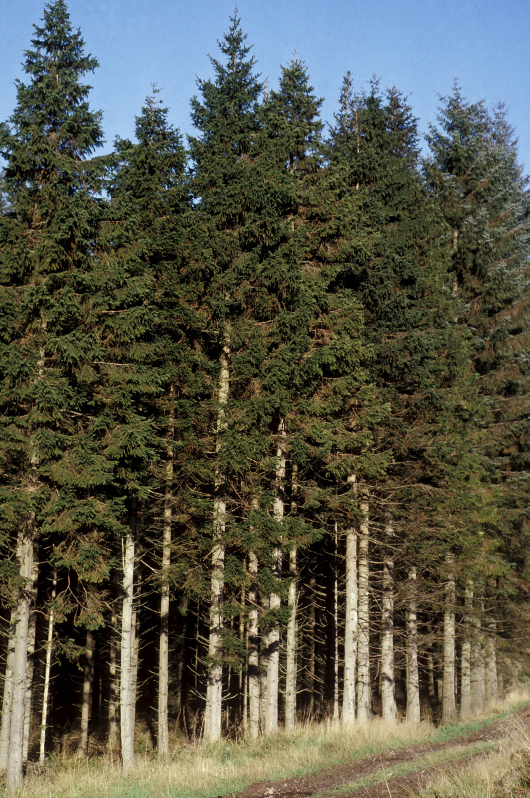
  It accounts for 38% of the forest stock. It is the “climax” species on fertile and moist soils: in the absence of fires, Norway spruce eventually outcompetes other species. It has a conical and pointed crown, with primary horizontal branches from which flexible secondary branches hang, an adaptation to shed winter snow without breaking. The needles are quadrangular, short and sharp. It creates a dark understory and a deep layer of acidic humus.

- **Silver birch (*Betula pendula*, *rauduskoivu*)**
  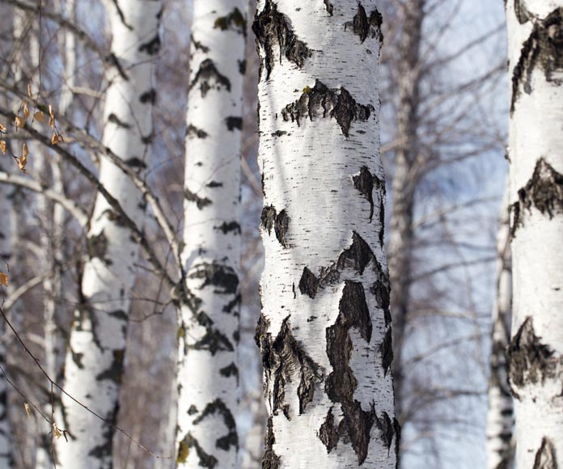
  The main broadleaf species in the country. Its triangular leaves with doubly serrated edges and the white bark that peels off in papery strips are iconic. Birch sap (*koivunmahla*) is traditionally collected in spring by drilling a hole in the trunk; it is a sweet drink rich in minerals. The leafy summer branches are tied together to make the *vihta* (or *vasta*), the whisk used in the sauna to stimulate blood circulation.

### The Understory Treasure: Berries
The “Everyman’s Right” (*Jokamiehenoikeus*) allows anyone to freely gather forest fruits.

- **Bilberry (*Vaccinium myrtillus*, *mustikka*)**
  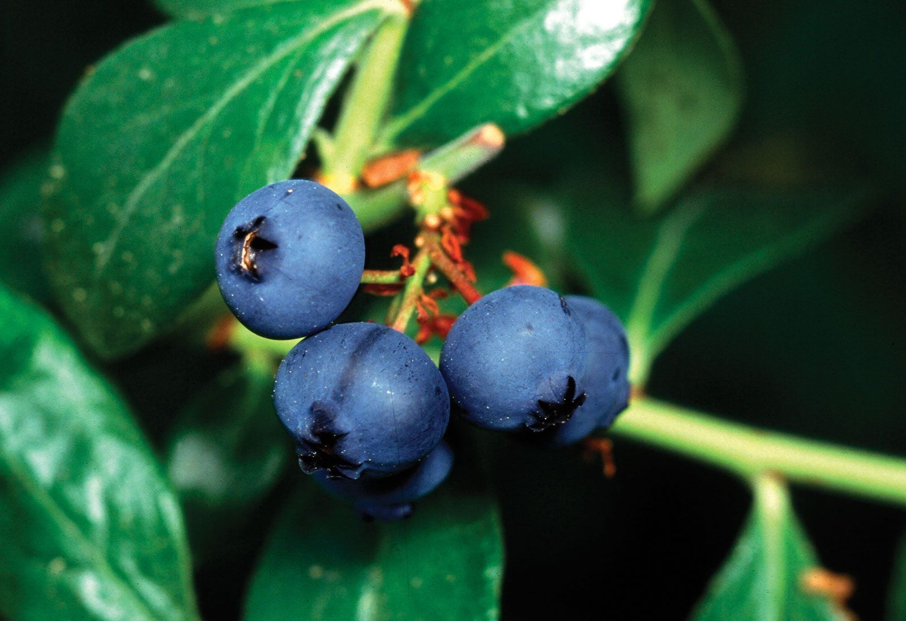
  Ripening: July-August. Unlike the cultivated American blueberry (larger and with light flesh), the Finnish bilberry is smaller, grows on low shrubs (15-40 cm) in shady coniferous forests, and has dark red/purplish flesh that stains fingers and tongue. It is immensely richer in anthocyanins and antioxidants. It is the main ingredient of *mustikkapiirakka* (bilberry pie). In autumn, its leaves turn fiery red, contributing to the *ruska* phenomenon (Lapland foliage).

- **Lingonberry (*Vaccinium vitis-idaea*, *puolukka*)**
  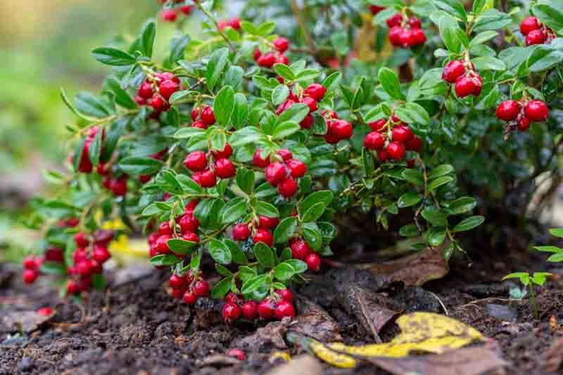
  Ripening: late August-September. A round, red and firm berry that grows on creeping evergreen shrubs. It favours dry and bright pine forests. The taste is decidedly sour and acidic when raw; for this reason, it is consumed as jam or sweetened puree to accompany savoury dishes, especially reindeer meat, liver or meatballs. It contains natural benzoic acid, which acts as a preservative allowing the jam to last for months without sterilisation.

- **Cloudberry (*Rubus chamaemorus*, *lakka/hilla*)**
  
  Ripening: July-August. Known as “the gold of the bogs”, it is the most precious and expensive berry. It grows exclusively in wet and swampy peatlands (rubber boots are required for picking). The plant produces a single white flower and one fruit per stem. The fruit resembles a raspberry but starts off hard and red, and as it ripens becomes soft, juicy and bright amber-orange. It has a unique sweet-tart flavour with notes of honey and apricot. Very rich in vitamin C, it is traditionally served as warm jam on *leipäjuusto* (the Finnish “bread cheese”).

### Edible Mushrooms and Identification
Of the 5,000 fungal species in Finland, about 200 are edible. Gathering requires caution to avoid confusion with toxic species. The Finnish golden rule is: “Do not pick white mushrooms.” The Destroying Angel (*Amanita virosa*), completely white and deadly, is present in Finnish forests.

| Edible Species | Identification | Look-alike Species / Risk |
| :--- | :--- | :--- |
| **Chanterelle** (*Cantharellus cibarius*, *kantarelli*)  | Pale yolk-yellow or orange colour. Cap shaped like an irregular funnel (2-10 cm). Under the cap it **does not have true gills**, but **thick, branched folds/ridges** that run down the stem and do not detach easily. The stem is firm and the flesh inside is white. When broken, the stem tears into layers like mozzarella cheese. It emits a distinct **apricot scent**. Grows on the ground, never on dead wood. Ripening: late August-September. | **False chanterelle** (*Hygrophoropsis aurantiaca*). The cap is brighter orange and **velvety/hairy** to the touch (true chanterelle is smooth). Underneath it has **true gills** that are thin, dense, and detach easily when touched or scraped. The stem breaks cleanly. Smells like generic earthy mushroom, no apricot. Often grows on decaying wood (stumps, chips). Causes gastrointestinal upset. |
| **Porcini / Penny Bun** (*Boletus edulis*, *herkkutatti*)  | Convex cap from brown to dark brown, smooth and slightly sticky when wet. Under the cap it has **pores** (not gills) that are small and dense, turning from white to yellowish-greenish with age. The stem is robust, bulbous, from white to light brown, with a **white net-like pattern** visible especially near the top under the cap. The flesh is white, firm, does not change colour when cut and has a hazelnut flavour. | **Bitter bolete** (*Tylopilus felleus*, *sappitatti*). The cap is uniformly light brown. The pores, initially white, turn **pinkish** with age (key difference). The stem has a **dark net-like pattern** (like black fishnet stockings). The flesh may turn slightly pink when cut. Not poisonous but **extremely bitter** (even raw): one piece can ruin a whole pot. |
| **Winter chanterelle** (*Craterellus tubaeformis*, *suppilovahvero*) | Brownish-grey cap shaped like a deep funnel, small. The stem is hollow, thin and of a distinct **yellow colour**. Under the cap it has widely spaced grey-yellowish ridges running down. Grows in large colonies hidden in deep moss of spruce forests. Late ripening: September-November. Being thin and fleshy, it is perfect for drying at home. | *Craterellus lutescens* (Yellow winter chanterelle). Very similar but with a more orange cap and almost smooth underside without true ridges. Equally excellent and edible. |
| **Hedgehog mushroom** (*Hydnum repandum*, *vaaleaorakas*) | The most foolproof mushroom in Finland. Pale yellow cap, often irregular and asymmetrical in shape. The unmistakable feature is the underside: instead of gills or pores, it has dense white fragile **spines** (like brush teeth). The stem is white and firm. No poisonous look-alikes in the Hydnaceae family in Finland. | No poisonous look-alikes. Only risk: accumulates more radioactive isotopes (Cesium-137 from Chernobyl) than other mushrooms; it is recommended to blanch it before consumption. |

### Wild Flowers and Carnivorous Plants
The nutrient-poor soil of Finnish bogs has driven some plants to fascinating evolution:

- **Round-leaved sundew (*Drosera rotundifolia*, *pyöreälehtikihokki*)**
  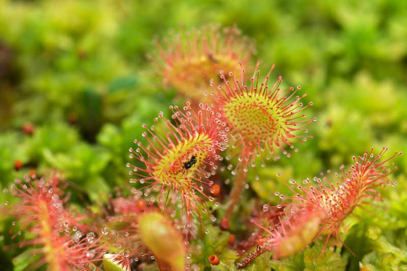
  A tiny carnivorous plant common in peat bogs (where sphagnum moss grows). Its small round leaves are covered with red tentacles that secrete drops of a sticky substance like dew. This glue shines in the sun attracting small insects (mosquitoes, gnats). When an insect gets trapped, the leaf slowly curls to digest it and absorb the precious nitrogen lacking in the peat soil. It can digest up to 5 insects per month.

- **Lady’s slipper orchid (*Cypripedium calceolus*, *tikankontti*)**
  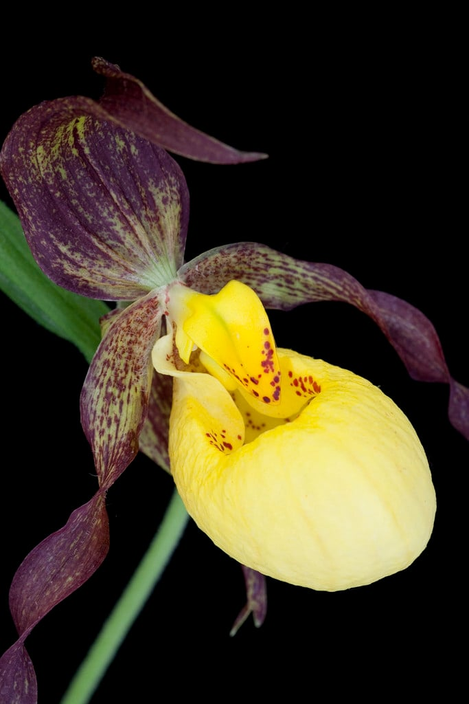
  The largest and most spectacular wild orchid in Finland (up to 10 cm in diameter). It blooms in June in moist calcareous forests. It is a strictly **protected** species throughout Finland and cannot be picked. It has a complex trap pollination mechanism: the yellow pouch-shaped labellum emits pheromones that attract small bees; once inside, the bees cannot climb the smooth walls and are forced to exit through a narrow rear corridor, brushing against the stamens and picking up pollen.

- **Lily of the valley (*Convallaria majalis*, *kielo*)**
  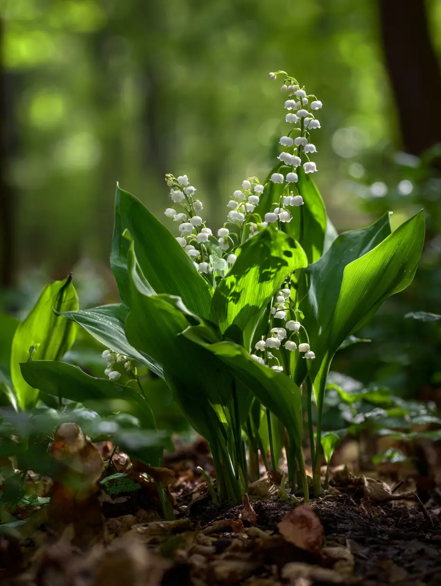
  It is Finland’s national flower. It blooms in late May/early June, flooding shady forests with its intoxicating scent. The small white bells hang from a single curved stem, flanked by two large lance-shaped leaves. *Warning*: the entire plant, especially the red berries it produces in late summer, is highly toxic if ingested, containing cardioactive glycosides.
## 🦌 Fauna: Predators, Cervids and the Endemic Seal

Finnish fauna includes species adapted to extreme climates and vast uninhabited areas. The dense forests provide shelter to elusive predators that rarely reveal themselves to humans.

### The "Big Four" Carnivores

- **Brown bear (*Ursus arctos*, *karhu*)**
  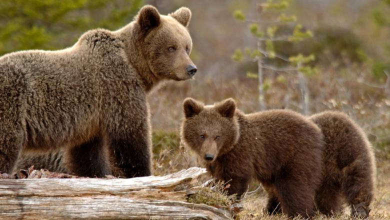
  It is the national animal. About 2,000 individuals live in Finland, mainly concentrated in the eastern forests (Kainuu and North Karelia) near the Russian border. Adult males can exceed 300 kg in weight and stand up to 2.5 metres tall. They are opportunistic omnivores: in summer they spend hours gorging on berries (bilberries) to accumulate the fat needed for hibernation (from October to April). The bear was considered so sacred by the ancient Finns that dozens of alternative names (such as *mesikämmen*, "honey paw", or *otso*) existed to avoid pronouncing its real name and awakening its wrath. It is possible to observe them safely from dedicated photographic hides.

- **Grey wolf (*Canis lupus*, *susi*)**
  Extremely elusive, with a population of about 300 individuals divided into packs, mostly in the east of the country. They actively avoid human contact. They have vast territories (up to 1,000 km²) which they constantly patrol.

- **Eurasian lynx (*Lynx lynx*, *ilves*)**
  The only wild feline in Finland (~2,500 individuals). Recognisable by the black tufts of hair on its ears, long hind legs, and short tail with a black tip. Its wide paws act as natural snowshoes. Although widespread everywhere, it is almost impossible to see due to its keen senses, spotted camouflage coat, and furtive, crepuscular habits.

- **Wolverine (*Gulo gulo*, *ahma*)**
  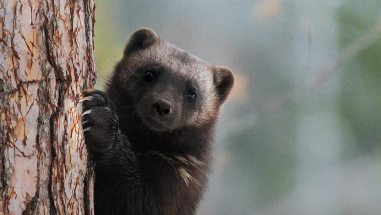
  The largest terrestrial mustelid (related to badgers and martens). Despite weighing only 15-25 kg and resembling a small stocky bear, it possesses enormous strength and jaws capable of crushing frozen bones. It is a formidable predator and scavenger, able to take down prey much larger than itself (such as reindeer trapped in deep snow). Its broad feet allow it to run agilely on fresh snow. The Lieksa region (North Karelia) is one of the best places in the world to observe it in its natural habitat.

### The Cervids

- **Moose (*Alces alces*, *hirvi*)**
  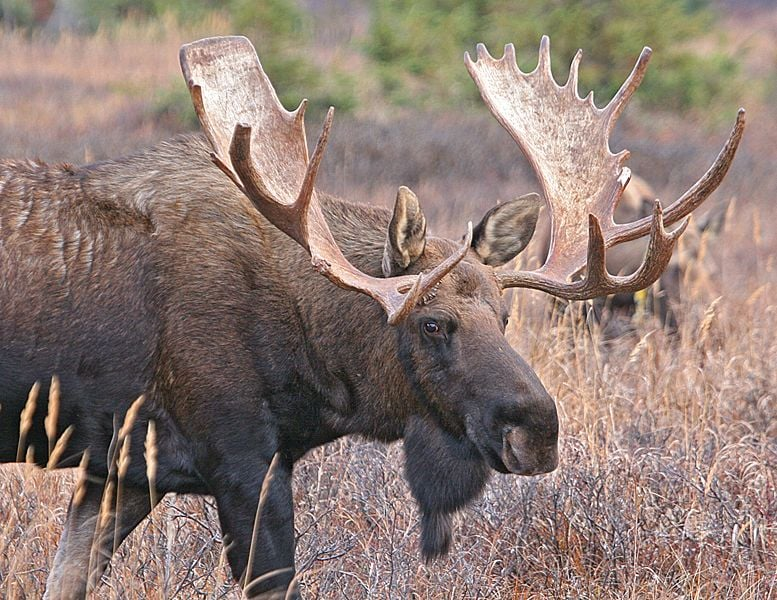
  The giant of the forests. It can reach 700 kg in weight and 2 metres at the shoulder. Males develop impressive palmate antlers that fall off in winter and regrow in spring. It is widespread throughout Finland, preferring wet areas and feeding on shoots, willow leaves, and aquatic plants. It is very active at dawn and dusk. *Caution when driving*: collisions with moose, due to their long legs causing the massive body to hit the windshield directly, are one of the greatest dangers on rural roads.

- **Reindeer (*Rangifer tarandus*, *poro*)**
  Beyond 65° north latitude (Lapland), reindeer (about 200,000) outnumber human inhabitants. They are semi-domesticated and managed by Sámi and Finnish herders. They are adapted to extreme cold: the hairs of their coat are hollow to trap air and provide thermal insulation. Their hooves widen in summer to walk on marshy tundra and narrow in winter, exposing sharp edges to dig through ice. They are the only known mammals able to see ultraviolet light, which helps them spot white lichen (their winter food) and predator urine on the snow’s glare.

### The Emblem of Saimaa: The Ringed Seal
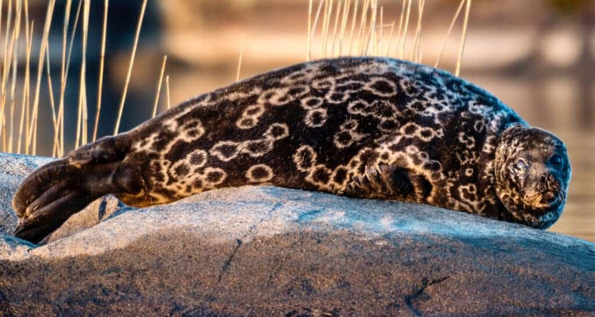  
The **Saimaa ringed seal (*Pusa hispida saimensis*, *saimaannorppa*)** is one of the rarest and most endangered animals on the planet.  
- **Biology**: About 8,000 years ago, post-glacial land uplift separated Lake Saimaa from the Baltic Sea, trapping a group of seals. Over millennia, they adapted to freshwater, developing larger eyes and a bigger brain than their marine cousins to navigate the murky and complex labyrinth of the lake. Today, this freshwater seal numbers barely **~530 individuals** (2025 data). It was recognised as a distinct species in 2025.  
- **Behaviour and Reproduction**: Between late February and early March, females dig dens (*pesä*) in snowdrifts that form on the frozen lake edges. These dens maintain a temperature of about 0°C (versus -20°C outside) and protect the pups from predators (foxes) during nursing.  
- **Conservation**: Climate change (mild winters without snow) is the main threat: without snowdrifts, pups are born on exposed ice and die from cold or predation. WWF volunteers build artificial snow banks to aid reproduction. Additionally, from 15 April to 30 June, gillnet fishing is prohibited in breeding areas to prevent pups from becoming entangled and drowning.  
- **Sightings**: In May and June, during moulting, seals lie on the lake’s exposed rocks to sunbathe and dry their fur. They can be spotted (maintaining at least 50 metres distance) during silent eco-cruises from Puumala or Savonlinna.

### Birdlife
- **Whooper swan (*Cygnus cygnus*, *laulujoutsen*)**
  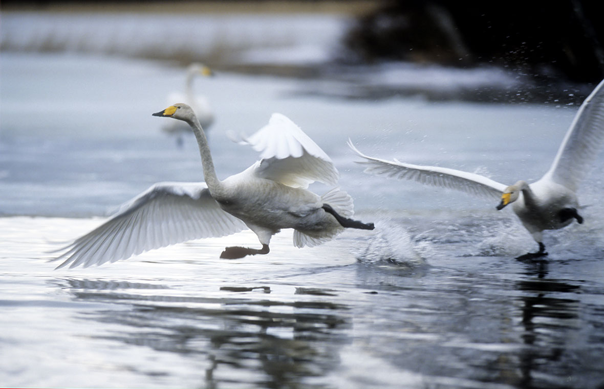
  The national bird. Its return from wintering grounds in March/April marks the awaited end of winter. It has a wingspan of 2.4 metres and a yellow and black bill (unlike the mute swan which has an orange one). It emits a powerful, trumpet-like call audible kilometres away.
- **Red-throated diver (*Gavia arctica*, *kuikka*)**
  A water bird with elegant black and white checkered plumage on its back. It is a formidable diver but clumsy on land, as its legs are set far back on its body. Its prehistoric, melancholy call—a trembling howl—resonates over lakes on summer nights, creating the typical "soundtrack" of Finnish cottages.
- **White-tailed eagle (*Haliaeetus albicilla*, *merikotka*)**
  The largest bird in Europe (wingspan 2.5 m). Saved from extinction caused by DDT in the 1970s, it now nests along the Baltic coast and on the major islands of the large lakes.

### Fish Fauna  
The cold, oligotrophic waters (nutrient-poor but crystal clear) host prized fish:  
- **Perch (*Perca fluviatilis*, *ahven*)**: The national fish. Present everywhere, recognisable by its red fins and dark vertical stripes.  
- **Pike (*Esox lucius*, *hauki*)**: The apex predator of the lakes. It ambushes among reeds and can exceed one metre in length.  
- **Zander (*Sander lucioperca*, *kuha*)**: A fish with white, delicate flesh, highly sought after in restaurants. Prefers the large lakes of the south and centre.  
- **Whitefish (*Coregonus lavaretus*, *siika*)**: A much-appreciated salmonid, caught by fly fishing or consumed smoked.  
- **Crayfish (*Astacus astacus*, *rapu*)**: In August the tradition of *rapujuhlat* (crayfish parties) is celebrated: crayfish are boiled with dill and eaten at joyful outdoor tables, accompanied by songs and shots of Koskenkorva (vodka).
## 🪨 Geology: The Legacy of the Great Glaciation

Finland rests on very ancient foundations, but its current appearance has literally been planed and carved by ice in geologically recent times.

### The Substrate: The Fennoscandian Shield and Rapakivi Granite
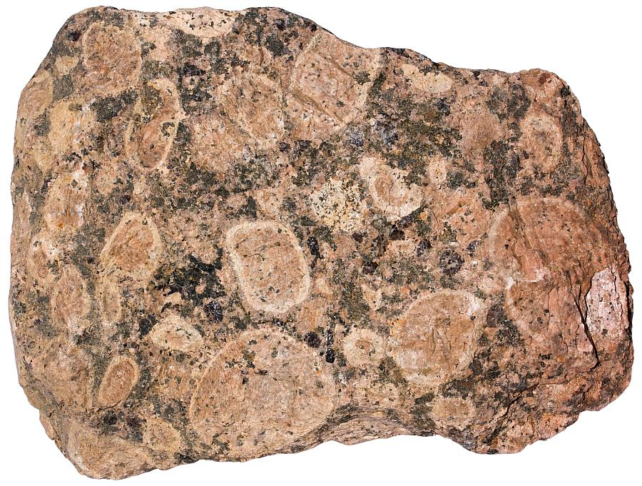
The Finnish bedrock belongs to the Fennoscandian Shield, with rocks aged from 1.6 to over 3 billion years. The national rock is granite.  
In the south-eastern region (the Saimaa Geopark and Vyborg area) there is a rock unique in the world: **rapakivi granite** (1.6 billion years old). The Finnish name literally means "crumbly stone" or "stone that crumbles" (*rapautua* = to crumble, *kivi* = stone). It is characterised by large rounded orthoclase crystals in red/pink surrounded by a ring of green/grey oligoclase. Due to the different thermal expansion coefficients of these minerals, the rock easily fractures with temperature changes and disintegrates into a reddish gravel (called *moro*). It is widely used in architecture and paving (commercially known as "Baltic Brown").

### The Weichselian Glaciation and Glacial Formations
About 25,000 years ago, during the last glacial maximum, the whole of Finland was buried under a **2-kilometre-thick ice sheet**. The immense pressure removed on average 7–25 metres of solid rock, planing the hills (creating roches moutonnées, smooth on the upstream side and rough on the downstream side) and carving pre-existing fractures.  
When the climate warmed, the ice began to melt and retreat northwestwards, leaving behind unmistakable formations:

- **Esker (*harju*)**  
  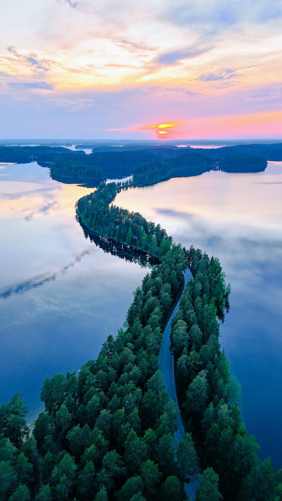  
  Long, sinuous ridges of sand and gravel. They formed from debris deposited by meltwater rivers flowing in tunnels *inside* or *beneath* the glacier. The **Punkaharju Ridge** (7 km long) is the most famous esker: a narrow strip of sandy land covered with pines that separates two lakes. Eskers are the best natural filters for Finnish groundwater, making it among the purest in the world.
- **The Salpausselkä**  
  During a sudden return of cold about 12,000 years ago (the Younger Dryas), the glacier’s retreat halted for centuries. Debris pushed by the ice accumulated at the front, creating two massive terminal moraine systems (Salpausselkä I and II) that cross all southern Finland from east to west. They form natural embankments that hold back the Saimaa lake system to the north.
- **Drumlin**  
  Elongated, teardrop-shaped moraine hills (up to a kilometre long but only a few metres high), shaped by ice flow over rocky obstacles. They indicate precisely the direction of glacial movement.

### The 188,000 Lakes and Post-Glacial Uplift
The melting ice filled depressions carved in the granite and valleys dammed by moraines, creating Finland’s immense blue labyrinth. Lake Saimaa (the 4th largest in Europe) is a maze of 4,400 km² with over 14,000 islands.  
Even today, freed from the immense weight of 2 km of ice, the Finnish earth’s crust is rising due to isostatic rebound. The **post-glacial uplift** raises the ground by up to 1 centimetre per year in the Gulf of Bothnia (about 3 mm/year in the lake region). This phenomenon outpaces the global sea-level rise: in Finland, new land literally continuously emerges from the waters, joining islands and transforming bays into closed lakes.
## 🌌 Natural Phenomena: The Realm of Summer Light

Finland's northern location (between the 60th and 70th parallels north) disrupts the cycles of light and darkness we are accustomed to at mid-latitudes.

### The Midnight Sun and White Nights
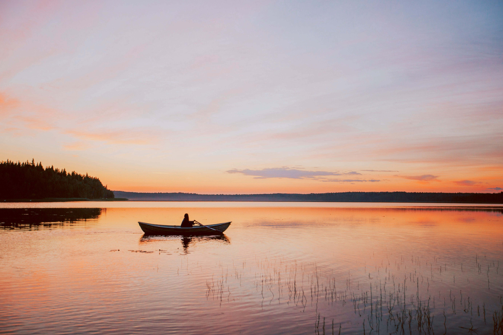
Due to the tilt of the Earth's axis (23.5°), in summer the northern hemisphere is tilted towards the sun.
- **Midnight Sun (*Yötön yö* - The night without night)**: Occurs only north of the Arctic Circle (66° 33' N). At the northernmost point of Lapland (Utsjoki), the sun never sets for 73 consecutive days (from 17 May to 27 July). The sun dips towards the horizon, grazes it at midnight, and then begins to rise again.
- **White Nights (*Valoisat yöt*)**: In the rest of Finland, including the Lake District (Saimaa/Punkaharju, ~61.8° N) and Helsinki (60.2° N), the sun physically sets, but it dips less than 6 degrees below the horizon, so astronomical or nautical darkness is never reached. At the summer solstice (21 June), there are about 20 hours of direct sunlight. During the 4 hours when the sun is hidden, the sky maintains a civil twilight brightness: you can read a book outdoors at midnight without artificial light. The light takes on a perpetual reddish-golden hue, like an endlessly long sunset that seamlessly blends into dawn.

**Biological effects**: The excess light drastically reduces melatonin production (Finns sleep less and are hyperactive in summer), birdsong continues 24 hours a day, and vegetation grows at a frantic pace to compensate for the short warm season. Arctic vegetables and berries, exposed to continuous light, develop exceptional concentrations of sugars and antioxidants.

### Noctilucent Clouds (NLC)
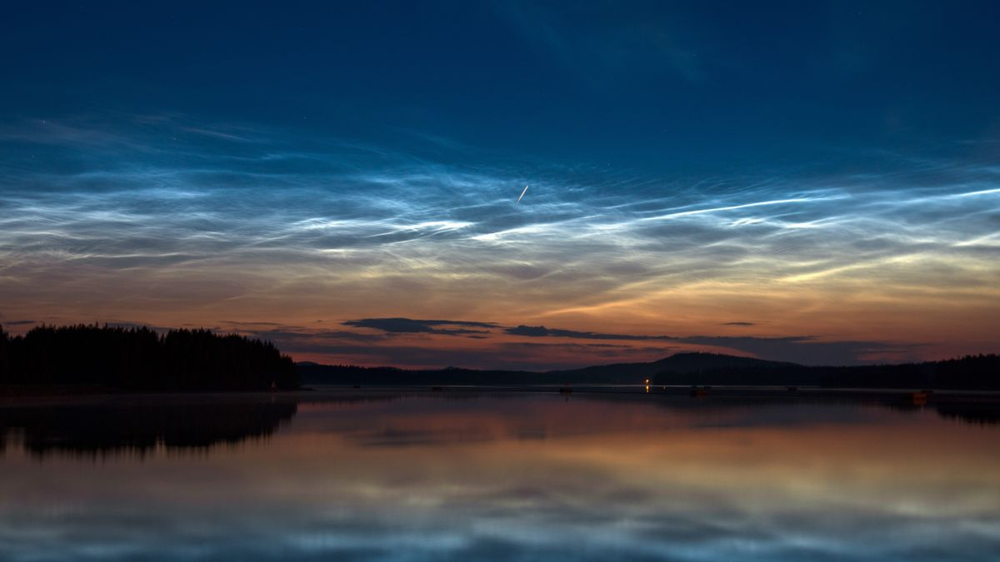
Due to the absence of darkness, the northern lights are not visible in summer. However, between June and July, a very rare atmospheric phenomenon can be observed: noctilucent clouds. Located in the mesosphere at about 80-85 km altitude (the highest clouds on Earth, at the edge of space), they are formed by tiny ice crystals aggregated with meteor dust. When the sun dips just below the horizon, the lower atmosphere is in shadow, but the sun’s rays still illuminate these very high clouds from below, making them glow with an electric blue or silvery colour against the dark twilight sky.
## 🌳 Ecosystems: A Delicate Balance of Water and Peat

The Finnish environment is not just forest, but an interconnected mosaic of three major ecosystems.

### 1. The Boreal Forest (Taiga)
It is a resilient but slow-growing biome, adapted to harsh winters (down to -40°C) and short summers (15-25°C). The trees have narrow needles to avoid breaking under snow and thick bark to withstand the cold. Historically, the natural cycle of the taiga depended on forest fires (every 50-100 years), which cleared the undergrowth of excess acidic humus, released alkaline nutrients into the soil, and allowed the regeneration of pioneer species (birches and pines). Today, fire suppression by humans favours the absolute dominance of the Norway spruce.

### 2. The Peatlands (*Suo*)
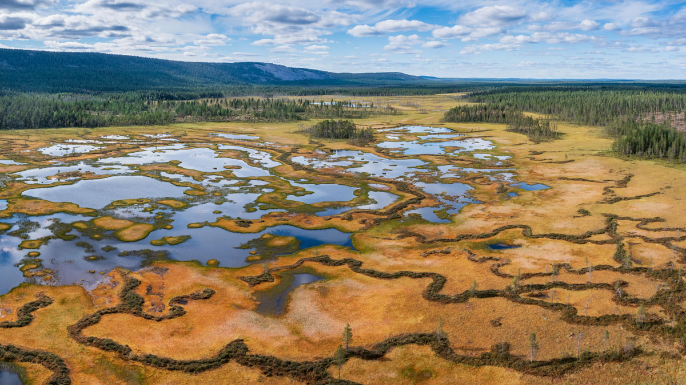
About 30% of Finland’s land area (10 million hectares) consists of peatlands, marshes, and swamps. They form because the cold climate, flat terrain, and abundant water drastically slow down the decomposition of dead organic matter.
- **The role of sphagnum**: Mosses of the genus *Sphagnum* are the engineers of the ecosystem. They absorb water up to 20 times their own weight and secrete acids, lowering the water’s pH to inhibit decomposing bacteria. When they die, the lower part of the moss does not rot but compacts, forming peat (at a rate of just 1 mm per year).
- **Global importance**: Finnish peatlands are among Europe’s largest carbon reservoirs (storing about 5.7 billion tonnes of CO2, far more than forests). They are the exclusive habitat of the cloudberry, carnivorous plants, and safe nesting grounds for cranes and capercaillies. In July, the stagnant waters of the peatlands become the undisputed realm of mosquitoes.

### 3. The Lacustrine Ecosystem (*Järvi-Suomi*)
Finnish lakes cover 10% of the territory. They are **oligotrophic** ecosystems: the waters are extremely poor in nutrients (nitrogen and phosphorus). This prevents excessive algal growth, keeping the water exceptionally clear, crystalline, and often drinkable straight from the source. The summer thermal stratification features warm surface waters (18-22°C) where perch swim, and cold deep waters (4-8°C) that serve as a refuge for whitefish.
In winter, ice (often 30-60 cm thick) seals the lakes from December to April. This frozen period is vital not only for the reproduction of the Saimaa ringed seal but also for the life cycle of Arctic fish that require cold, oxygen-rich waters. The spring thaw causes vertical mixing of the waters, bringing nutrients deposited on the lakebed to the surface and triggering the summer explosion of life.

---
*Sources and Naturalistic References: Data on flora, fauna, and geology taken from Metsähallitus (Finnish Forest Administration), Saimaa UNESCO Global Geopark, and Suomen Luonnonsuojeluliitto (Finnish Association for Nature Conservation).*