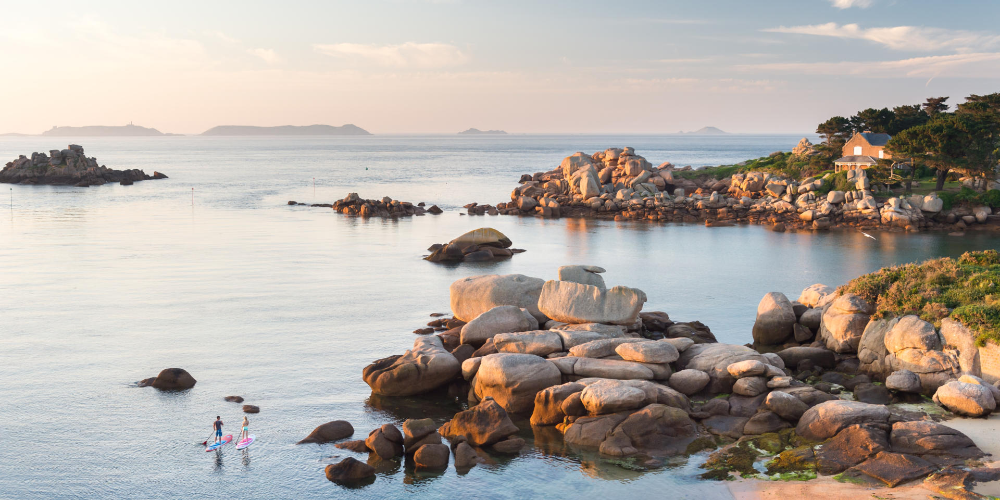
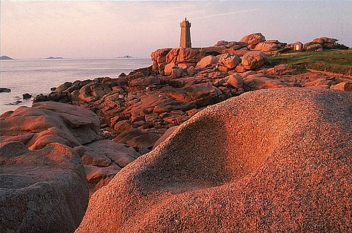

# Nature — France

France’s Atlantic façade from Normandy to Brittany and south to the Bay of Biscay is a living laboratory of tides, winds, ancient rocks, temperate forests, kelp-thick seas, and bird-rich cliffs; here the Armorican Massif meets the Channel and the open Atlantic, creating intertidal zones among the richest in Europe, storm-shaped dunes that hold rare plants, hedgerow bocage that shelters songbirds and pollinators, and offshore upwellings that feed whales, dolphins, and vast seabird colonies.

## Flora

### Coastal Woodlands and Dunes

- **Maritime Pine (*Pinus pinaster*, pin maritime)**: Tall evergreen (20–35 m, up to 1 m diameter) with thick, reddish fissured bark and long paired needles (15–25 cm) in bristling bundles; elongated cones (10–20 cm) persist for years and open after heat; forms extensive forests in the Landes and sandy Brittany headlands; resinous scent, crowns wind-shorn on seaward edges. Behavior: pioneer on dunes, stabilizes sand, withstands salt-laden gales; cones serotinous tendency aids post-storm regeneration. Where/When: Landes de Gascogne, Quiberon dunes, spring for pollen sheens, year-round silhouettes; safety: beware falling cones in wind, resin is sticky; conservation: planted widely, supports dune stabilization and forestry.

- **Scots Pine (*Pinus sylvestris*, pin sylvestre)**: 15–30 m conifer with distinctive orange-peeling bark on upper trunk, bluish-green short needles (4–7 cm) in pairs; smaller oval cones (3–7 cm). Behavior: tolerant of poor acidic soils; valuable for woodland birds. Where/When: inland Brittany heath-edges, Forêt de Paimpont; best seen in winter when bark color glows; LC (IUCN).

- **European Sea Holly (*Eryngium maritimum*, panicaut de mer)**: Spiny, steel-blue rosette with waxy lobed leaves and thistle-like umbels; 20–60 cm; rhizomatous dune stabilizer. Behavior: flowers June–September, attracts pollinators even in high winds. Where/When: foredunes of Finistère and Vendée; do not trample—fragile foredune species; protected in several coastal reserves.

- **Marram Grass (*Ammophila arenaria*, oyat)**: Stout dune grass (up to 1.2 m) with rolled, waxy leaves; dense root mats trap sand to build dunes. Behavior: rhizomes extend meters per year; seedheads July–October; keystone of dune succession. Where/When: all foredunes from Normandy to Biscay; respect rope fences guarding restoration zones.

- **Gorse (*Ulex europaeus*, ajonc d’Europe)**: Dense, spiny evergreen shrub (1–2.5 m) with coconut-scented golden pea-flowers most profuse Feb–May, sporadically year-round; nitrogen-fixer in coastal heaths. Behavior: provides nesting for warblers, highly flammable in summer drought. Where/When: Cap Fréhel, Crozon heaths; maintain distance during fire bans; invasive beyond native range but iconic in Brittany.

- **Heather (*Calluna vulgaris*, bruyère commune)**: Low woody shrub (10–50 cm) carpeting moors with pink-purple blooms July–October; scale-like leaves in opposite pairs; turns coppery in winter. Behavior: thrives on acidic, nutrient-poor soils; nectar source for prized heather honey. Where/When: Landes de Lanvaux, Paimpont edges, Cap d’Erquy cliffs; best mid-August bloom.

### Bocage, Orchards, and Deciduous Forests

- **European Beech (*Fagus sylvatica*, hêtre)**: Dominant canopy tree (30–40 m) with smooth gray bark, dense oval crown; leaves elliptic, wavy-margined, glossy green turning copper in autumn; beech mast feeds wildlife. Behavior: creates shady, species-poor understory; ancient stands host fungi. Where/When: Forêt d’Eawy (Normandy), Huelgoat (Brittany); autumn for foliage; LC.

- **Pedunculate Oak (*Quercus robur*, chêne pédonculé)**: Massive, long-lived tree (up to 40 m) with lobed leaves and acorns on long stalks (‘peduncles’); deeply fissured bark. Behavior: keystone for lichens, insects, birds; supports hundreds of species. Where/When: Normandy hedgerows, Loire floodplain edges; spring leaf burst, autumn acorns; LC.

- **Cider Apple (*Malus domestica*, pommier à cidre)**: Gnarled orchard trees (3–8 m) with spur-bearing branches; spring blossom clouds (April–May) of white-pink; autumn heavy with tannic, bittersweet fruit sorted into doux, doux-amers, amers, acidulés for cider. Behavior: traditional high-stem orchards undergrazed by sheep/cows; hedgerows shelter pollinators boosting fruit set. Where/When: Pays d’Auge (Normandy), Cornouaille (Brittany); cider routes May–October during blossom and pressing; cultivate with heritage cultivars (e.g., Kermerrien, Bedan).

- **Hedgerow Hazel (*Corylus avellana*, noisetier)**: Multi-stem shrub (3–6 m) with round leaves; yellow catkins in late winter; nuts late summer. Behavior: coppiced hedges shape bocage, corridors for dormice and birds. Where/When: across Normandy/Brittany lanes; winter catkin displays.

### Marine Flora: Seagrass and Seaweeds

- **Eelgrass/Seagrass (*Zostera marina*, zostère marine)**: Subtidal flowering plant forming dense meadows to 5–10 m depth in sheltered bays; flat ribbon leaves 0.5–1.5 cm wide up to 1 m long. Behavior: oxygenates sediments, baffles waves, nursery for juvenile fish and cuttlefish; seasonal dieback in winter. Where/When: Morbihan Gulf, Bay of Brest mud-sand flats; snorkel on neap tides July–September; LC but locally threatened by eutrophication/boating scars; abide by no-anchoring zones.

- **Oarweed Kelp (*Laminaria digitata*, laminaire digitée)**: Brown alga with hand-like blade divided into ‘digits’; sturdy stipe; grows 1–2 m; forms subtidal forests. Behavior: peak growth winter–spring; canopy engineers light and habitat complexity; harvested sustainably in Brittany. Where/When: Iroise Sea, Ouessant channels; best seen on spring-low tides in clear swell; use reef-walking caution.

- **Sugar Kelp (*Saccharina latissima*, kombu royal/laminaire saccharine)**: Long undivided ruffled blade, sweetish due to mannitol; prefers calmer waters. Where/When: sheltered coves of northern Brittany; culinary harvesting by permit only.

- **Knotted Wrack (*Ascophyllum nodosum*, goémon noir d’Islande)**: Olive-brown straps with egg-shaped air bladders at intervals; mid-shore dominant. Behavior: withstands desiccation; supports periwinkles and amphipods. Where/When: rock pools along Côte des Abers; best seen on mid-ebb; watch slippery rocks.

- **Toothed Wrack (*Fucus serratus*, fucus dentelé)**: Saw-toothed margins, distinct midrib; lower shore species; receptacles ripen late summer. Where/When: exposed Brittany shores; tidepool exploration with non-slip footwear.

### Fungi (Mushrooms) — Identification and Foraging Safety

- **Porcini/King Bolete (*Boletus edulis*, cèpe de Bordeaux)**: Robust cap (8–25 cm) chestnut-brown with pale bloom, white to olive pores (never gills), stout white stipe with fine pale netting near apex, firm white flesh unchanging on cut; aroma nutty. Habitat: mycorrhizal with beech/oak, sandy beechwoods and bocage edges; Season: late August–November after rains. Travel tip: dawn after wet warm nights; avoid overharvesting (cut cleanly, carry breathable basket). Culinary star; never eat raw.

- Identification table — Porcini and Lookalikes:
| Feature | Boletus edulis (edible) | Bitter Bolete Tylopilus felleus (bitter, inedible) | Devil’s Bolete Rubroboletus satanas (toxic) |
|---|---|---|---|
| Cap | Chestnut-brown, greasy when moist | Tan to brown | Pale buff with red flush |
| Pores | White→olive, do not bruise blue | Pinkish pores | Yellow pores bruise blue rapidly |
| Stipe | Fat, white with pale reticulation near top | Pronounced dark reticulation | Often bulbous, red/orange tones |
| Flesh | White, no color change | White, very bitter taste | Whitish→blues when cut |
Safety: spit taste test for bitterness only for T. felleus by experts; never rely solely on bruising; if uncertain, do not consume.

- **Chanterelle (*Cantharellus cibarius*, girolle)**: Vase-shaped, egg-yolk yellow, thick forked ridges (false gills) decurrent on stipe; fruity apricot scent; cap 3–8 cm. Habitat: mossy oak-beech groves, light pine heaths; Season: June–October. Where: Brittany wood edges after storms. Lookalikes: False chanterelle (Hygrophoropsis aurantiaca, inedible) with true thin gills and deeper orange center; Jack-o’-lantern (Omphalotus illudens, toxic; rare N, more S) with sharp blade-like gills and clustered on wood.

- Identification table — Chanterelle and Lookalikes:
| Feature | Chanterelle (edible) | False Chanterelle H. aurantiaca (inedible) | Jack-o’-lantern O. illudens (toxic) |
|---|---|---|---|
| Gills | Blunt, forked ridges | True thin gills | True sharp gills, often bioluminescent faintly |
| Smell | Fruity/apricot | Weak to none | Unpleasant, fungal |
| Growth | Scattered | Scattered in litter | Dense clusters on wood |
Safety: collect singly formed, blunt-ridged fruitbodies; never eat raw; consult local mycology clubs.

- **Fly Agaric (*Amanita muscaria*, amanite tue-mouches; toxic)**: Iconic scarlet cap with white warts, white free gills, ring and volva at base; cap 8–20 cm. Habitat: birch/pine edges; Season: late summer–autumn. Danger: psychoactive/toxic; do not consume; excellent photo subject only.

- **Death Cap (*Amanita phalloides*, amanite phalloïde; deadly)**: Greenish-olive cap, white gills, white ring, prominent sac-like volva; sweetish smell; even small amounts lethal. Habitat: oak/beech; Season: August–October. Safety: avoid any gilled mushroom with white gills, ring, and volva; when in doubt—leave it.

### Wild Berries — Identification and Caution

- **Sea Buckthorn (*Hippophae rhamnoides*, argousier)**: Thorny shrub on coastal dunes/cliffs; silvery narrow leaves; vivid orange berries tightly clustered along branches, autumn–winter; vitamin-C rich; extremely sour/astringent. Where: Picardy/Normandy and northern Brittany dunes. Use: syrups and jams; harvest with gloves; protected in some dunes—respect local rules.

- **Bilberry (*Vaccinium myrtillus*, myrtille sauvage)**: Low shrub in acidic heaths/woods; solitary dark blue berries with purple flesh, July–September; stains fingers/lips. Where: inland Brittany heaths (Monts d’Arrée). Note: distinct from American blueberry (cultivated).

- Identification table — Berries and Lookalikes:
| Feature | Bilberry (edible) | Black Crowberry Empetrum nigrum (edible but bland) | Deadly Nightshade Atropa belladonna (toxic) |
|---|---|---|---|
| Habitat | Acidic heath/wood | Coastal heath/bogs | Disturbed woodland edges (scarce NW France) |
| Fruit flesh | Purple throughout | Pale/greenish | Juicy, pale, large shiny berries |
| Leaves | Small, toothed | Tiny needle-like | Large, soft, entire |
Safety: never consume if unsure; avoid solitary large black berries on tall soft-leaved plants (possible nightshade); stick to known shrubs.

## Fauna

### Marine Mammals and Large Fish

- **Common Bottlenose Dolphin (*Tursiops truncatus*, grand dauphin)**: Robust cetacean 2.5–3.8 m; short beak, falcate dorsal fin; gray above, pale below; social in pods 5–20, coastal residents in Iroise Sea and around Molène–Ouessant. Behavior: bow-riding boats, cooperative hunting on sand eels and mullet; calves year-round with peak spring. Where/When: Iroise Marine Park, summer calm mornings; boat responsibly (slow, parallel course, 100 m distance). Status: LC globally but some NE Atlantic subpopulations are threatened; French coastal group monitored by Parc naturel marin d’Iroise.

- **Short-beaked Common Dolphin (*Delphinus delphis*, dauphin commun)**: Sleeker 1.8–2.5 m; hourglass flank pattern (tan/gray); large groups (dozens–hundreds). Where: outer Bay of Biscay, shelf edge off Brittany in winter–spring following sardines/mackerel. Status: LC; bycatch concern—support dolphin-safe fisheries.

- **Long-finned Pilot Whale (*Globicephala melas*, globicéphale noir)**: 4–6.5 m; bulbous forehead, long pectoral fins; matrilineal pods; deep divers for squid. Where: Bay of Biscay slope waters, especially summer; pelagic whale-watching from La Rochelle/Capbreton canyons on calm days. Status: LC.

- **Fin Whale (*Balaenoptera physalus*, rorqual commun)**: Second-longest animal (18–22 m in NE Atlantic); asymmetrical jaw coloration (right lower jaw white); high, sickle dorsal fin; 2–3 blows per minute when traveling. Where: Bay of Biscay spring–autumn; sometimes off Brittany in late summer; watch from high capes (Pointe du Raz) after storms clearing. Status: VU; keep 300 m distance.

- **Grey Seal (*Halichoerus grypus*, phoque gris)**: Large seal (males 2.3–3.3 m, 170–300+ kg) with long horse-like head; males dark with pale patches, females silver-gray mottled; colony at Sept-Îles and Molène Archipelago; French population in Brittany ~800 and increasing. Behavior: pups born Oct–Dec on remote islets; haul-out at low tide on rocks. Where/When: Sept-Îles (boat tours from Perros-Guirec), Molène; use binoculars; never land on protected islets. Status: LC, protected in France.

- **Basking Shark (*Cetorhinus maximus*, requin pèlerin)**: Planktivorous giant (6–10 m) with cavernous mouth and gill rakers; dorsal fin sometimes visible slicing surface in summer; tail crescentic. Behavior: filters copepods along tidal fronts; non-aggressive. Where/When: Iroise Sea May–August on calm, sunny days near headlands like Ouessant; maintain 100 m distance, no swimming with individuals. Status: EN (IUCN); report sightings to local observatories.

### Seabirds and Coastal Raptors

- **Northern Gannet (*Morus bassanus*, fou de Bassan)**: Imposing seabird (wingspan 165–180 cm), white with black-tipped wings and pale golden head; dagger bill; spectacular plunge-diving from 10–30 m. Colony: Île Rouzic (Sept-Îles) hosts 20,000+ breeding pairs (late Feb–Oct). Behavior: loud, dense colonies with sky-filling “gannet rain.” Where/When: boat trips from Perros-Guirec; best March–July chick-rearing; avian influenza has impacted some colonies—respect closures. Status: LC.

- **Atlantic Puffin (*Fratercula arctica*, macareux moine)**: Compact auk (26–29 cm) with colorful triangular bill in breeding plumage, orange legs; only French breeding colony at Sept-Îles (Rouzic and neighboring islets), historically several hundred pairs; numbers fluctuate and are vulnerable to food shifts and predation. Behavior: burrow nester; brings sand eels in bill “combs.” Where/When: April–July via regulated boat viewing; high optical zoom recommended; Status: VU; strict protection.

- **European Shag (*Gulosus aristotelis*, cormoran huppé)**: Slender cormorant (68–78 cm), dark green sheen, thin bill, breeding crest; cliff-ledge nester. Where/When: Brittany headlands; best seen on mid-ebb when feeding in kelp gullies. Status: LC but susceptible to oil pollution.

- **Peregrine Falcon (*Falco peregrinus*, faucon pèlerin)**: Medium raptor (wingspan 95–115 cm), slate upperparts, barred underparts, bold mustache; nests on chalk and granite cliffs of Normandy and Brittany. Behavior: stoops on pigeons and waders at 300+ km/h. Where/When: Étretat arches, Cap Fréhel; dawn/late afternoon hunting; Status: LC, recovering after past DDT declines.

- **Eurasian Oystercatcher (*Haematopus ostralegus*, huîtrier pie)**: Black-and-white shorebird (40–45 cm) with long orange bill; loud “kleep” calls; pries mussels and cockles. Where/When: estuaries (Rance, Vilaine), winter flocks; Status: NT (global) in some assessments due to habitat loss; avoid disturbing roosts on high tides.

### Estuary and Inshore Fish, Invertebrates

- **European Seabass (*Dicentrarchus labrax*, bar/ loup de mer)**: Sleek silver predator (40–70 cm typical) patrolling reefs and estuary mouths; juveniles use seagrass nurseries. Where/When: coasts year-round; observe in clear shallows July–September; angling strictly regulated—check size/season limits.

- **Atlantic Salmon (*Salmo salar*, saumon atlantique)**: Anadromous fish; adults silver torpedoes return to rivers (Brittany headwaters) spring and autumn; juveniles (parr) rear in gravel riffles. Where/When: Elorn, Scorff; view at fish passes in spring–autumn; Status: LC globally but many river stocks are threatened; support barrier removal projects.

- **European Blue Lobster (*Homarus gammarus*, homard européen)**: Dark blue-black crustacean to 60 cm; hides in rock crevices; nocturnal forager. Where/When: rocky Brittany coasts; easiest seen in fish markets (May–September fishery); adhere to marine reserve no-take rules.

- **Brown Crab (*Cancer pagurus*, tourteau)**: Large oval carapace with pie-crust edge; common in low-shore crevices and pots. Where/When: intertidal low tide, Brittany; do not pry animals from holes.

- **European Flat Oyster (*Ostrea edulis*, huître plate)** and **Pacific Oyster (*Magallana gigas*, huître creuse; introduced)**: Beds and farms in sheltered bays (Cancale, Arcachon); spat settles on shells; filtration clarifies water. Where/When: year-round; tastings fall–spring; avoid harvesting from closed zones.

- **Jellyfish Note**: Blue jellyfish (Cyanea lamarckii) and barrel jellyfish (Rhizostoma pulmo) appear in late spring–summer; stings mild-moderate—rinse with seawater, not fresh; Portuguese man o’ war rare incursions on Biscay after strong SW winds—heed local advisories.

### Freshwater and Edge Mammals
- **Eurasian Otter (*Lutra lutra*, loutre d’Europe)**: Sleek semi-aquatic mammal (male 7–12 kg) with powerful tail, webbed feet; crepuscular; spraint (fishy-sweet) marks bridges and stones. Where/When: clear rivers and estuaries of Brittany (Aulne, Scorff), quiet creeks emptying to bays; dusk/dawn best. Status: NT globally, recovering in western France; avoid light/noise near holts.

## Geology

### Armorican Massif and Pink Granite Coast

  

  

- Ancient Roots: The Armorican Massif is composed of Precambrian to Paleozoic rocks (gneisses, schists, granites) formed 600–300 million years ago during the Cadomian and Variscan orogenies; later uplift and differential erosion sculpted today’s peninsulas and headlands. Field evidence: folded metamorphics, quartz veins, and jointed granite tors.

- Côte de Granit Rose (Ploumanac’h to Trégastel): Iconic salmon-pink orthoclase-rich granite; rounded tors carved by spheroidal weathering and wave action into natural sculptures (e.g., Napoleon’s Hat, the Bottle); feldspar crystals impart the rosy hue. Traveler tip: GR34 coastal path at golden hour for color; avoid climbing wet, algae-slick surfaces.

### Normandy’s Chalk Cliffs of Étretat

- White Chalk and Flint: Upper Cretaceous chalk (100–66 Ma), same formation as England’s Dover, with hard flint nodules; coastal erosion has carved arches (Porte d’Aval) and the needle (Aiguille). Processes: marine undercutting, rainwater dissolution, frost shattering. Safety: rockfall risk after heavy rain—keep to marked paths and heed closure signs.

### Mont Saint-Michel Bay and Tidal Flats

- Tidal Island on Silt: Granite core capped by medieval abbey rising from vast silty-sand flats; extreme macrotidal range up to ~14–15 m during equinoctial springs; tidal currents race across flats like “a galloping horse.” Sediment sources: rivers Sée, Sélune, Couesnon and coastal transport; restoration projects re-mobilize sediments to prevent permanent silting. Safety: guided crossings only—quicksand patches and rapidly advancing water.

### Basque Coast Flysch

- Layered Time: Near Saint-Jean-de-Luz–Zumaia (cross-border continuum), alternating sandstone, marl, and limestone beds (Cretaceous–Paleogene) now tilted and exposed as ribbed pavements; some sequences span the K–Pg boundary with microfossils and iridium-rich layers in regional contexts. Visit on negative tides for ribbed “books” of rock; watch for slippery algae and surges.

## Natural Phenomena

### Extreme Tides and Bores

- Macrotidal Coasts: Brittany and Normandy host among the world’s highest tidal ranges (commonly 8–12 m, peaks ~14–15 m near Mont Saint-Michel); spring tides around equinoxes expose kilometers of seabed, revealing kelp holdfasts, oyster reefs, and labyrinthine rockpools. Traveler timing: consult SHOM tide tables; best intertidal exploration on spring lows with calm swell; return before flood—tide rises fastest in final hours.

- Tidal Bore Notes: Localized bores can form in the Sée and Sélune rivers that empty into the bay during strong spring tides; a small moving wall of water travels upriver. Viewpoints: upstream bends at safe distances; never stand on muddy inner banks.

### Atlantic Storms and Swell

- Winter Lows (Nov–Mar): Deep Atlantic depressions drive gale-force winds, long-period swells, and spectacular breakers (10+ m significant wave height in extremes) at capes like Pointe du Raz and Penmarc’h; coastal overwash reshapes dunes, kelp detaches in rafts fueling strandline food webs. Safety: observe from clifftop barriers; rogue waves possible even in fair weather.

### Bioluminescence and Night Seas

- Sparkling Plankton: Summer–early autumn calm nights can bring bioluminescent dinoflagellates (e.g., Noctiluca, Alexandrium spp.) that flash when disturbed; footprints and breaking waves glow electric-blue. Where/When: sheltered coves (Crozon, Morbihan Gulf) on moonless warm nights after blooms. Safety: avoid swimming during harmful algal bloom advisories.

### Gulf Stream Influence and Mild Winters
- North Atlantic Drift moderates climate along Brittany and Normandy: cool summers, mild winters, early-flowering gorse and year-round sea kale; fog and sea haar can roll in quickly on temperature contrasts—carry layers and a whistle in cliffs/haze.

## Ecosystems

### Rocky Intertidal Shores (Estran Rocheux)

- Structure: Distinct vertical zones—from splash belt with black lichens (Verrucaria) to high-shore barnacles (Chthamalus), mid-shore wracks (Fucus spp.), and low-shore kelps (Laminaria); tidepools harbor anemones (Actinia equina), blennies, shrimps, and nudibranchs. Productivity: among Europe’s richest due to nutrient mixing and broad exposure times. Tips: explore 1–2 hours before lowest spring tide; wear grippy shoes; practice “leave rocks as found” to protect sheltering fauna.

- Threats/Protection: Oil spills, trampling, warming seas; many sites within Natura 2000 and regional reserves (Iroise Marine Park). Follow no-take and no-bait-digging rules where posted.

### Kelp Forests (Forêts de Laminaires)

- Ecology: Subtidal forests 0–15 m depth create 3D habitat, damping waves and turbocharging primary production; canopy (Laminaria digitata/hyperborea) supports grazers (limpets, sea urchins), predators (wrasse, conger eels), and juvenile fish nurseries. Seasonality: peak biomass late winter–spring; summer epiphytes and fish abundance. Access: glass-bottom boat tours (e.g., Molène), advanced snorkel/dives on neap tides with local guides; currents can be strong—only with certified operators.

- Management: Rotational seaweed harvesting in Brittany under quotas; emerging kelp aquaculture; monitor urchin barrens under warming scenarios.

### Seagrass Meadows (Herbiers de Zostères)

- Services: Carbon sequestration (blue carbon), sediment stabilization, water clarity, nursery habitat for pipefish, syngnathids, scallops; hosting epiphytic algae and invertebrates. Season: lushest May–September; winter dieback forms wrack lines benefiting dune insects. Visitor code: never anchor or drag kayaks across beds; use mooring buoys; observe seahorses only with licensed scientists—collection illegal.

### Estuaries and Mudflats (Estuaires: Loire, Seine, Rance, Vilaine)

- Dynamics: Mixing of fresh and salt water forms turbidity maxima rich in plankton; mudflats teem with lugworms, ragworms, bivalves feeding migratory shorebirds (dunlins, curlews, redshanks). Nursery: juvenile bass, mullet, sole; saltmarshes (Salicornia, Atriplex, Spartina) cushion storm surges. When to visit: autumn and late winter high-tide roost watches; use hides and keep dogs leashed. Conservation: Ramsar sites; threats include dredging, pollution, and development—support reserve visitor centers.

### Temperate Deciduous Forest and Bocage

- Forests: Beech–oak canopies with spring ephemerals (wood anemone, bluebell), rich fungal networks; deadwood supports saproxylic beetles and woodpeckers. Bocage: a mosaic of small fields bounded by hedgerows (hawthorn, blackthorn, hazel, oak standards) and ditches; microclimate refuges for bats, butterflies, amphibians. Travel tips: walk green lanes at dawn for birdsong; respect private land; cider routes welcome visitors to traditional orchards underpinning biodiversity.

- Threats/Actions: Hedgerow removal reduces connectivity; agri-environment schemes pay farmers to maintain hedges; volunteer days plant and lay hedges—ask local parks.

### Coastal Dunes and Sandplains

- Zonation: Embryo dunes (sea rocket, Cakile maritima), foredunes (marram), gray dunes (lichens, mosses, orchids), and slacks (wet depressions with rare flora); dynamic under storm/wind regimes. Wildlife: natterjack toad breeding in slacks; ground-nesting larks and terns. Visiting: stick to boardwalks; avoid slacks March–July; evening skylark song is a highlight.

- Management: Fencing, invasive plant removal, and wrack retention to rebuild dunes; community beach cleans keep plastics from entangling marram.

### Rocky Islands and Cliffs (Sept-Îles, Ouessant, Molène)

- Seabird Strongholds: Granite stacks provide predator-reduced ledges for gannets, guillemots, razorbills, puffins; strong currents bring forage fish; marine reserve status restricts landings. Viewing: regulated boat tours Apr–Aug; bring layers—wind-chill significant even in summer; sea state dictates departure.

- Seal and Dolphin Corridors: Tidal races around Ouessant concentrate plankton and fish; look for feeding frenzies (gannets diving, dolphins corralling). Safety: working waters—keep clear of fishing gear and navigation channels.

Practical Travel Essentials:
- Tides: Always check local tide tables and swell forecasts; plan out-and-back routes with a margin of safety; flat beaches can flood from behind.
- Footwear: Non-slip soles for intertidal; ankle support on granite paths; avoid flip-flops on reefs.
- Binoculars/Scopes: 8–10x binoculars for general use; 20–60x scope ideal for cliff birds and seals at haul-outs.
- Seasons: Spring (Apr–Jun) for breeding seabirds and wildflowers; late summer (Jul–Sep) for calm seas, kelp snorkeling, bioluminescence; winter (Nov–Feb) for storm-watching and migratory waders.
- Ethics: Observe wildlife distances (seals 100 m, cetaceans 100–300 m); no drones over colonies; take only photos and permitted shellfish within local limits.

Fonti e Riferimenti: Office Français de la Biodiversité; Parc naturel marin d’Iroise; Réserve Naturelle des Sept-Îles (LPO); Ifremer (Institut français de recherche pour l’exploitation de la mer); SHOM tide tables; BRGM (Bureau de Recherches Géologiques et Minières) geology notes; IUCN Red List assessments (accessed 2023–2024); local park visitor centers and management plans.