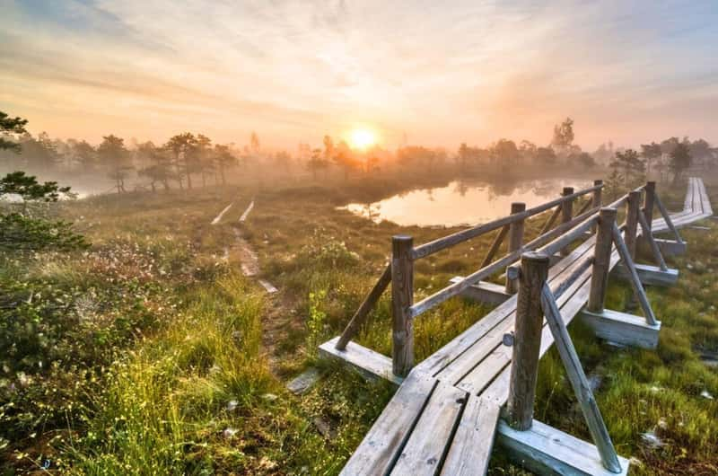
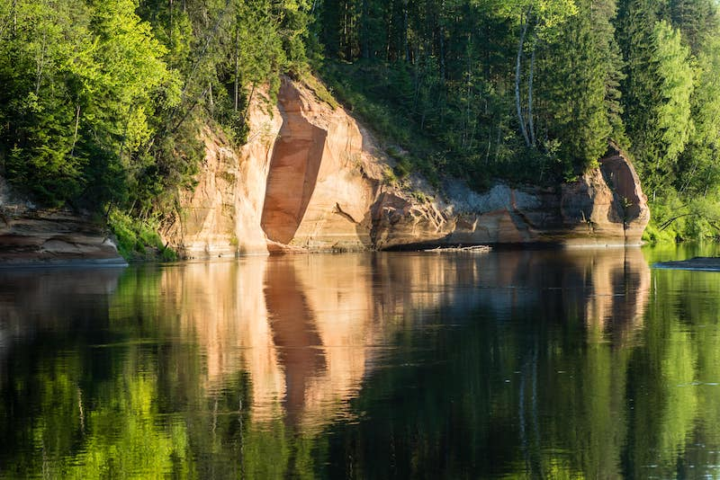
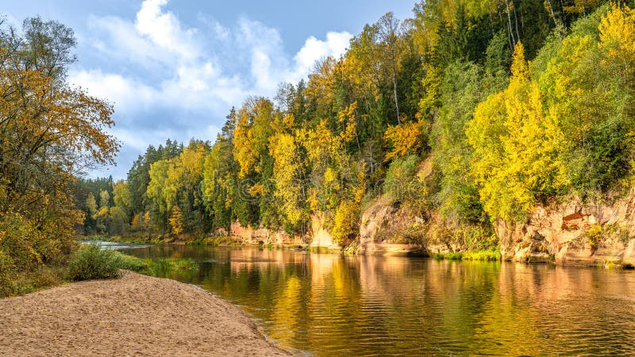
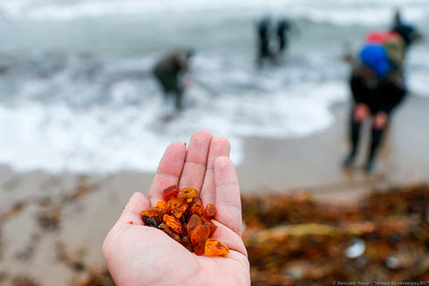

# Nature — Latvia

Latvia’s nature is a mosaic of hemiboreal forests, raised bogs, sandy coasts, and ancient river valleys. Over half the country is forested, sheltering elusive lynx and wolves, raptor-filled skies, and orchids tucked into meadows and fens. From Devonian sandstone cliffs in Gauja National Park to sulfur-scented bogs in Ķemeri, Latvia’s landscapes are shaped by ice-age legacies and the gentle pulse of the Baltic Sea. Long summer twilights, storm-thrown amber, and autumn mushroom flushes make the seasons here unmistakable.

## Flora

### Dominant Trees of the Hemiboreal Forest

- **Scots Pine (Pinus sylvestris, parastā priede)**  
Tall, straight-trunked conifer, often 25–35 m tall (max ~40 m), with orange-tinged upper bark plates and long, paired needles (4–7 cm). Cones are ovoid (3–7 cm), maturing to gray-brown. Forms light, resin-scented stands on sandy soils and dunes. Provides key habitat for capercaillie and crossbills. Where/When: Widely across Latvia; notable on coastal dunes (Jūrmala–Saulkrasti) and dry inland soils year-round; best color contrast in low winter light.

- **Norway Spruce (Picea abies, parastā egle)**  
Dark-green spire reaching 30–45 m, drooping branchlets, and long pendulous cones (10–18 cm). Dense shade fosters moss carpets and fungal diversity. In windthrows, uprooted “mound-and-pit” microtopography supports saplings and ferns. Where/When: Common in cooler, moister stands; Gauja NP and Vidzeme highlands. Winter highlights silhouettes and cones; spring shows fresh, pale-green flush.

- **Silver Birch (Betula pendula, āra bērzs/parastais bērzs)**  
White, peeling bark with black fissures; delicate, triangular leaves; catkins in spring. Fast pioneer of clearings, nurturing a rich ground layer of bilberry and lichens. Autumn brings golden canopies. Where/When: Widespread; photogenic groves in Zemgale and around lakes. Best in May (catkins) and late Sept–Oct (foliage).

- **Pedunculate Oak (Quercus robur, parastais ozols)**  
Massive, buttressed trunks (diameter often 1–2 m), lobed leaves, and long-stalked acorns. A keystone for biodiversity—hosts hundreds of invertebrate species and cavity-nesting birds. Ancient specimens occur in manor parks and remnant lowland forests. Where/When: Tērvete area and historical parks; visit year-round; spring leaf-out is vivid; winter silhouettes reveal age.

- **Small-leaved Lime (Tilia cordata, parastā liepa)**  
Heart-shaped leaves, fragrant late-summer flowers rich in nectar for bees. Forms noble groves on fertile soils; basswood cavities shelter bats and owls. Where/When: Mixed forests and old alleys; bloom July; listen for intense bee activity on warm afternoons.

- **Common Juniper (Juniperus communis, parastais kadiķis)**  
Needle-leaved evergreen shrub/tree, blue-black aromatic “berries” (cones) taking two years to ripen. Occurs on dry heaths and dunes, stabilizing sandy soils. Where/When: Coastal dunes and inland heaths; best seen in spring for fresh growth; berries ripen autumn.

### Bog, Meadow, and Coastal Plants

  

- **Marsh Labrador Tea (Rhododendron tomentosum, purva vaivariņš)**  
Evergreen shrub with narrow, revolute leaves, undersides rusty-woolly; heady resinous scent. White flower clusters in late spring. Traditional use as moth-repellent; leaves contain terpenes—do not ingest. Where/When: Raised bogs (Ķemeri, Teiči); peak bloom May–June; best early mornings when aroma is strongest.

- **Bog Rosemary (Andromeda polifolia, purva rozmarīns)**  
Low shrub with narrow blue-green leaves; graceful pink, nodding, urn-shaped flowers. Attractive but toxic (grayanotoxins). Where/When: Floating mats and bog hollows in raised bogs; bloom May–June.

- **Common Heather (Calluna vulgaris, virši)**  
Hardy dwarf shrub of dry heaths and bog margins; tiny scale-like leaves; purple blooms from late July–September. Supports heathland pollinators and autumn nectar flow. Where/When: Coastal pine heaths, sandy inland areas; best color in August.

- **Sea Buckthorn (Hippophae rhamnoides, smiltsērkšķis)**  
Silver-green, thorny shrub with vivid orange berries clustered on branches. Nitrogen-fixer stabilizing dunes; berries rich in vitamin C; tart taste. Where/When: Western Baltic dunes and foredunes; fruit September–November; observe from paths—thorns are sharp.

- **Marsh Helleborine (Epipactis palustris, purva dzegužkurpīte)**  
Slender orchid with arching spikes of intricate white-purple flowers, often in calcareous fens and seepage meadows. Where/When: Engure Lake meadows, Gauja NP calcareous seeps; bloom June–July; tread carefully—soils are delicate.

- **Lady’s-slipper Orchid (Cypripedium calceolus, dzeltenā dzegužkurpīte)**  
Large, yellow “slipper” lip with maroon petals; Europe’s most charismatic orchid. Requires old, semi-open woods with limestone influence. Strictly protected—look, don’t touch. Where/When: Patchy in older forests of Vidzeme and Latgale; bloom late May–June.

### Wild Berries (Foraging Guide)

- **Bilberry (Vaccinium myrtillus, mellene/mellenes)**  
Low shrub carpeting forest floors; blue-black berries with strongly pigmented pulp (stains fingers). Sweet-tart flavor; leaves green on both sides. Where/When: Pine and spruce forests; July–August peak.

- **Lingonberry/Cowberry (Vaccinium vitis-idaea, brūklene)**  
Evergreen with thick, shiny leaves (pale-dotted underside); bright red berries in late summer-autumn. Tart; used in jams. Where/When: Dry pine forests and heaths; August–October.

- **Cranberry (Vaccinium oxycoccos, purva dzērvene)**  
Creeping bog plant with tiny leaves; pink reflexed flowers; dark red berries that persist into winter and after frosts. Where/When: Raised bog hollows (Ķemeri boardwalk views); September–November, and even early spring post-thaw.

Berry identification and lookalikes (exercise caution; never eat unidentified plants):
| Berry | Key ID features | Habitat | Edibility | Dangerous lookalikes (Latvia) |
|---|---|---|---|---|
| Bilberry (Vaccinium myrtillus) | Blue skin and blue flesh; solitary berries; leaves thin | Conifer/birch forest | Edible | Herb-paris (Paris quadrifolia) single black berry on four leaves—poisonous |
| Lingonberry (V. vitis-idaea) | Evergreen, shiny leaves; red clusters | Dry pine heaths | Edible | Lily-of-the-valley (Convallaria majalis) red berries in pairs—poisonous |
| Cranberry (V. oxycoccos) | Creeping stems; tiny leaves with rolled margins; tart | Raised bogs | Edible (raw/sauced) | Mezereon (Daphne mezereum) bright red berries on woody stems in forest—poisonous |

Practical tips: Forage only where permitted; use a field guide; avoid roadside picking; wash berries. Autumn mornings after cool nights concentrate sugars.

### Mushrooms (Foraging Guide)

- **Chanterelle (Cantharellus cibarius, gailene)**  
Golden-yellow funnel cap with wavy margin; blunt, forked ridges instead of true gills; fruity apricot aroma; firm flesh. Mycorrhizal with birch, pine, spruce; appears after warm summer rains. Where/When: Mossy conifer-birch woods nationwide; June–October, with peak July–September.

- **Porcini/King Bolete (Boletus edulis, baravika)**  
Brown, bun-like cap; thick white stipe with fine reticulation near apex; pores white to greenish; nutty aroma. A premier edible; often under spruce, pine, birch. Where/When: Mixed forests; July–October; early mornings after rain yield best finds.

- **Birch Bolete (Leccinum scabrum, bērzu beka)**  
Gray-brown cap; long stipe with dark scabers; white pores turning grayish. Edible when cooked well. Where/When: Under birch, often forest edges; July–September.

- **Fly Agaric (Amanita muscaria, sarkanā mušmire)**  
Iconic red cap with white warts; white gills and skirt ring; bulbous base with volva. Toxic hallucinogen—do not consume. Where/When: Common under birch and pine; August–October; striking photo subject only.

- **Death Cap (Amanita phalloides, zaļā mušmire)**  
Greenish to olive cap; white gills and ring; sack-like volva at base; deadly amatoxins. Where/When: Broadleaf woods with oak/lime; August–October; educate children about its danger.

Mushroom identification table and lookalikes:
| Species | Cap/gills/pores | Smell | Spore print | Edibility | Lookalikes (risk) |
|---|---|---|---|---|---|
| Chanterelle (Cantharellus cibarius) | Wavy funnel; blunt ridges (not true gills) | Fruity, apricot | Pale yellow | Choice edible | False chanterelle (Hygrophoropsis aurantiaca) has true, thin gills; poorer edible; avoid if unsure |
| Porcini (Boletus edulis) | Brown cap; pores white→olive; reticulate stipe | Pleasant, nutty | Olive-brown | Choice edible | Bitter bolete (Tylopilus felleus) has strong netting and very bitter flesh; red-pored boletes can cause GI upset—avoid red-pored species |
| Birch Bolete (Leccinum scabrum) | Gray cap; scabered stipe; white pores | Mild | Brownish | Good edible (well cooked) | Some Leccinum cause GI upset if undercooked |
| Fly agaric (Amanita muscaria) | Red cap with white warts; white gills; volva | Faint mushroomy | White | Toxic | Panther cap (A. pantherina) similar but brown—also toxic |
| Death cap (Amanita phalloides) | Greenish cap; white gills; volva; ring | Sweetish | White | Deadly | Young specimens resemble edible parasols or russulas—never pick white-gilled Amanita-like mushrooms |

Safety: Use a reliable guide; avoid white-gilled, ringed mushrooms with a volva; when in doubt, leave it. Collect in clean baskets; cook thoroughly; respect protected areas.

## Fauna

### Large Mammals and Carnivores

- **Eurasian Lynx (Lynx lynx, lūsis)**  
Medium-sized wildcat with tufted ears (2–3 cm tufts), short black-tipped tail, long legs, and spotted tawny coat. Solitary, crepuscular, silent stalker of roe deer and hares. Tracks show large round prints without claw marks. Status: IUCN Least Concern; protected regionally. Where/When: Dense forests of Vidzeme and Latgale; most active dusk/dawn, winter tracking in fresh snow is best.

- **Gray Wolf (Canis lupus, vilks)**  
Powerful canid with broad head, grizzled gray-brown coat, and long legs; packs maintain territories across forest-mire mosaics. Howls at dusk carry far in still air. Key ecological role controlling ungulates. Status: IUCN Least Concern; managed with quotas in Latvia. Where/When: Remote forests throughout; winter snow for tracking; dawn/dusk encounters along forest roads.

- **Moose/Elk (Alces alces, alnis)**  
Largest deer; shoulder height up to 2 m; bulls with broad palmate antlers (up to 1.5 m span). Prefers wetlands, young regenerating clearcuts for browsing. Bulls rut in September–October with loud grunts. Status: IUCN Least Concern. Where/When: Swamps and clearings (Ķemeri margins, Teiči surroundings); dawn/dusk drives.

- **Red Deer (Cervus elaphus, staltbriedis)**  
Reddish-brown in summer, grayer in winter; stags grow branching antlers. Autumn rutting roars echo in river valleys. Where/When: Mixed forests with meadows (Gauja NP); September–October evenings for rut spectacle.

- **Roe Deer (Capreolus capreolus, stirna)**  
Small, graceful deer with short antlers in bucks; white rump patch. Common edge species. Where/When: Field-forest ecotones nationwide; active dawn/dusk year-round.

- **Wild Boar (Sus scrofa, mežacūka)**  
Stocky, dark bristled; formidable tusks in males. Nocturnal rooting shapes forest floor; populations fluctuate with mast and disease (e.g., African swine fever). Where/When: Edge habitats and wetlands; night sightings along quiet roads.

- **European Bison (Bison bonasus, Eiropas bizons/zubr)**  
Massive bovine with pronounced shoulder hump; herds graze openings and young forest. Reintroduced; small, growing numbers in eastern Latvia under active management. Status: IUCN Near Threatened. Where/When: Managed enclosures and select free-ranging areas in Latgale; visits via local guides, winter tracking on snow.

- **European Beaver (Castor fiber, bebrs)**  
Robust rodent, glossy brown, paddle tail; fells trees, builds dams and lodges. Ecosystem engineer creating wetlands for amphibians and birds. Gnawed trunks show neat chisel marks. Status: IUCN Least Concern; widespread. Where/When: Lowland rivers and ponds (Gauja backwaters, Daugava oxbows); dusk canoe trips best.

- **Eurasian Otter (Lutra lutra, ūdris)**  
Sleek, chocolate-brown fur; long body, tapered tail; webbed feet. Hunts fish and crayfish; playful slides on snowy riverbanks. Status: IUCN Near Threatened; a quality-of-water indicator. Where/When: Clean rivers and lakes (Gauja, Salaca, Engure environs); dawn/dusk, look for spraints on rocks.

### Birds of Rivers, Forests, and Coasts

- **Black Stork (Ciconia nigra, melnais stārķis)**  
Elegant, black-green iridescent plumage with white belly; red bill and legs; shyer than White Stork. Nests on old-growth trees above secluded wetlands. Sensitive to disturbance. Status: IUCN Least Concern globally; declining in parts of Europe. Where/When: Gauja NP floodplains, Teiči; April–August; observe quietly from distance.

- **Lesser Spotted Eagle (Clanga pomarina, mazais ērglis)**  
Medium eagle; brown with pale nape and often white wing spots. Soars over meadows hunting voles. Status: IUCN Least Concern; strongholds in Baltics. Where/When: Mixed farmland–forest mosaics; April–September; best on warm, thermally active days.

- **White-tailed Eagle (Haliaeetus albicilla, jūras ērglis)**  
Imposing sea eagle; 2.0–2.4 m wingspan; wedge tail (white in adults), heavy yellow bill. Nests near large waters; feeds on fish and waterfowl. Conservation success story in Baltics. Where/When: Coasts, large lakes (Engure, Pape), Daugava; year-round; winter congregations near open water.

- **Corncrake (Crex crex, grieze)**  
Elusive rail; buffy-brown with barred flanks; loud “crex-crex” call at night from tall meadows. Indicator of traditional hay meadows. Status: IUCN Least Concern; conservation-dependent. Where/When: Floodplain and hay meadows (Gauja, Daugava); May–July nights.

- **Black Grouse (Lyrurus tetrix, rubeņi)**  
Males with lyre-shaped tail, glossy blue-black plumage and red combs; lekking displays at dawn in spring. Where/When: Peatland edges and pine heaths; March–April dawn leks (from hides).

- **Western Capercaillie (Tetrao urogallus, mednis)**  
Large forest grouse; males dark with white shoulder spots; iconic clicking and wheezing display in spring. Sensitive to disturbance. Where/When: Mature pine-spruce forests in Vidzeme; April–May dawn with licensed guides only.

- **Common Crane (Grus grus, dzērve)**  
Tall, gray, with black-and-white neck pattern and red crown patch; bugling calls; forms huge autumn flocks. Where/When: Bogs and stubble fields; August–October migration staging around Pape.

- **Common Kingfisher (Alcedo atthis, zivju dzenītis)**  
Tiny, electric blue and orange; rapid low flight over streams. Where/When: Clear, slow streams (Gauja tributaries, Salaca); year-round where water stays open.

- **Long-tailed Duck (Clangula hyemalis, garastīte)**  
Arctic breeder wintering on the Baltic; males with long tail streamers and yodeling calls. Where/When: Offshore waters and inlets; November–March; scope from piers and headlands (Kolka).

- **Baltic Grey Seal (Halichoerus grypus balticus, pelēkais ronis)**  
Large seal with long “Roman-nosed” profile; mottled gray. Hauls out on islets and sandbars; pups born with white lanugo in winter. Status: IUCN LC (species); Baltic subspecies monitored. Where/When: Irbe Strait, Cape Kolka offshore; boat trips and coastal vantage points; autumn–winter storms push them closer.

- **Harbour Seal (Phoca vitulina, parastais ronis)**  
Smaller than grey seal; rounded head, V-shaped nostrils. Rare along Latvian coast; more frequent in western Baltic. Where/When: Occasional sightings off Kurzeme; scan quiet bays.

### Amphibians, Reptiles, and Notable Insects
- **European Tree Frog (Hyla arborea, kokvardīte)**  
Brilliant green, sticky toe pads, loud chorus in warm evenings. Where/When: Western Latvia wetlands (Engure area); May–June breeding nights.

- **Fire-bellied Toad (Bombina bombina, sarkankvēles krupis)**  
Warty olive back; bright orange-red belly with black marbling; defensive “unkenreflex.” Where/When: Shallow ponds in south/west; May–August.

- **Grass Snake (Natrix natrix, zalktis)**  
Olive snake with yellow collar; harmless; excellent swimmer. Where/When: Wetlands and rivers; April–October sunny banks.

- **Pond Bat (Myotis dasycneme, dīķa sikspārnis)**  
Medium bat foraging over water, fast low flights; roosts in buildings/bridges. Conservation-sensitive. Where/When: Daugava and Gauja bridges; May–September dusk.

- **Large Copper (Lycaena dispar, lielais varaķirmis)**  
Brilliant copper-orange butterfly of fens and wet meadows; tied to Rumex host plants. EU-protected. Where/When: Calcareous fens (Engure meadows); June–August sunny days.

Traveler tips: Use binoculars and spotting scopes; spring (April–May) and autumn (Aug–Oct) migrations are peak birding; observe large mammals at dawn/dusk; keep respectful distances, especially near nests and leks; consider local guides for capercaillie and bison.

## Geology

### Devonian Sandstones of the Gauja Valley

- The Gauja River carves through ~350–370 million-year-old Devonian sandstones and dolomites, exposing rust-red, ochre, and white cliffs. Soft, cross-bedded sands record ancient rivers and estuaries that predate the Baltic Sea by hundreds of millions of years.  
- Sietiņiezis Cliff near Valmiera is Latvia’s largest white sandstone outcrop (up to ~15 m high, ~500 m long), etched with honeycomb weathering and fir-framed viewpoints.  
- Erosion forms alcoves, “windows,” and rock shelters; please avoid climbing fragile faces—foot traffic accelerates crumbling.

  

  

### Caves and Springs

- Gutmanis Cave (Sigulda) is the largest in the Baltics: ~10 m high, ~12 m wide, ~19 m deep. Its walls bear inscriptions dating to 1668, recording travelers and local legends. Constant 5–7°C temperature and seepage-fed springs create a humid microclimate with mosses and liverworts.  
- Lesser sandstone caves and niches punctuate Gauja’s bends; some house overwintering bats—winter entry is restricted for conservation.

### The Baltic Coast: Dunes, Cliffs, and Amber

- Latvia’s 496 km Baltic shoreline alternates sandy beaches, cobble stretches, and low cliffs. The White Dune (Balta kāpa) at Saulkrasti rises ~15 m, a wind-sculpted wall of pale quartz sand overlooking pine-fringed shore.  
- Vidzeme’s rocky coast (e.g., Veczemju klintis) displays wave-cut sandstone ledges and shallow sea caves; autumn storms dramatize surf against stone.  
- Amber (fossilized resin, ~40–50 million years old, mainly Eocene) washes ashore after strong onshore winds. Small honey to cherry-red nodules often trap ancient insects and plant fragments, time capsules of vanished forests.

  

### Glacial Legacy: Ozes, Drumlins, and Kettle Lakes
- Latvia’s terrain was molded by the last ice age: streamlined drumlins align with ice flow, while sinuous ozes (eskers) mark subglacial rivers—gravelly ridges now forested. Kettle lakes formed where ice blocks melted in outwash plains (e.g., Teiči bog lakes).  
- Fertile tills support mixed hardwoods; sandur plains host pine heaths and dry meadows. Reading the landform patterns enhances hiking along Gauja, Daugava, and Salaca valleys.

Traveler tips: Best geology vistas in Gauja NP (Sigulda–Cēsis), Saulkrasti’s White Dune, and Vidzeme’s rocky coast. Wear grippy footwear on sandy and wet rock surfaces; respect cliff-edge barriers; never chip amber or rock—collect only loose beach-found amber where legal.

## Natural Phenomena

### White Nights
- At ~57°N, midsummer (around June 21) brings ~18.5 hours of daylight, and nautical twilight lingers all night. Birdsong continues past midnight; photographers enjoy extended golden and blue hours. Urban glare is minimal away from Riga—seek coastal or bog boardwalk horizons for pastel skies.

### Amber After Storms
- Strong westerly storms stir submerged amber from ancient seabeds. Search at low tide along wrack lines of seaweed and driftwood; amber feels warm, light, and sometimes floats in saltier pockets. Carry a small flashlight for translucent glow on overcast days; respect beach rules and private property.

### Bog Mists and Will-o’-the-Wisp
- Cool dawns over warm peatlands create low, ethereal fog. Methane from anaerobic bogs can ignite sporadically in folklore accounts (“will-o’-the-wisp”); you won’t see flames, but dancing light illusions and muffled acoustics make dawn on Ķemeri boardwalk otherworldly.

### Autumn Mushroom Flush
- Late August to October, alternating rain and warmth triggers explosive fungal fruiting. Forest aromas intensify, and porcini, chanterelles, russulas, and milkcaps crowd moss carpets. Foragers should carry baskets and knives; learn toxic lookalikes; harvest sustainably.

### Sea Ice and Hummocks
- In colder winters, shore-fast ice forms on the Gulf of Riga. Wind and currents pile slabs into hummocks—mini ice ridges catching sunrise oranges and blues. Safety first: never step onto sea ice without local advice and proper gear.

### Migratory Skies
- The Baltic flyway pulses in April–May and August–October. Cape Kolka funnels raptors, geese, and passerines along the cusp of the open sea; after cold fronts, visible migration can number thousands per hour. Calm mornings post-storm are prime.

## Ecosystems

### Hemiboreal Mixed Forests

- Composition: Pine–spruce matrix enriched with birch, aspen, oak, and lime; deadwood levels in older stands support saproxylic beetles, woodpeckers (black, three-toed), and fungi.  
- Processes: Windthrows create light gaps; beaver activity nearby elevates groundwater; mycorrhizal networks link trees and mushrooms.  
- Key species: Lynx, wolf, capercaillie, hazel dormouse, bilberry, porcini.  
- Best places: Gauja NP, North Vidzeme Biosphere Reserve, Slītere NP interiors.  
- Tips: Move quietly at dawn; use tick protection (May–October); stay on paths in reserves.

### Raised Bogs and Fens

- Composition: Deep peat domes with Sphagnum carpets, dwarf pines, pools; at edges transition to minerotrophic fens with sedges, orchids (marsh helleborine), and carnivorous sundews.  
- Processes: Ombrotrophic (rain-fed) nutrient-poor systems; peat accumulates millimeters per year; fire and hydrology shifts shape vegetation patterns.  
- Key species: Cranberry, bog rosemary, Labrador tea; common crane; black grouse; dragonflies.  
- Best places: Ķemeri NP (Great Bog Boardwalk), Teiči Nature Reserve (guided access).  
- Tips: Boardwalks protect fragile peat—do not step off; mosquitoes peak June–July; dawn light and calm winds yield mirror-like pool reflections.

### Coastal Dunes and Pine Heaths

- Composition: Embryo dunes with marram grass, foredunes with sea buckthorn and juniper, transitioning to lichen-heather pine forests.  
- Processes: Wind and wave action build and erode dunes; storms can breach foredunes, reshaping profiles.  
- Key species: Sea buckthorn, juniper, heather; natterjack toad (localized), shorebirds.  
- Best places: Saulkrasti–Jūrmala dunes, Slītere NP seashore, Piejūra Nature Park.  
- Tips: Stick to marked dune paths; thorny vegetation—wear long sleeves; avoid trampling marram roots.

### River Valleys and Floodplain Meadows

- Composition: Meandering channels, alder carr, oxbows, and seasonally flooded hay meadows rich in sedges and wildflowers (great burnet, orchids).  
- Processes: Spring floods deposit silt, maintain open meadows; traditional late haying benefits corncrake and butterflies.  
- Key species: Beaver, otter; corncrake; white stork; mayflies and kingfishers.  
- Best places: Gauja NP floodplain zones, Daugava oxbows, Salaca lower reaches.  
- Tips: Spring flood season can cut trails—check conditions; bring rubber boots; dawn birding is superb.

### Lakes, Marshes, and Coastal Lagoons

- Composition: Shallow eutrophic lakes with reedbeds (Phragmites), floating mats, sedge belts, and lagoon-like systems behind dunes (Engure, Pape).  
- Processes: Reed encroachment managed by conservation grazing; nutrient dynamics drive bird and fish populations.  
- Key species: White-tailed eagle, terns, grebes; tree frog; rare fen orchids; odonates.  
- Best places: Lake Engure Nature Park (bird towers, orchid meadows), Pape Nature Park (autumn crane staging, coastal lagoon).  
- Tips: Climb towers for scope views; spring and autumn migrations peak; bring insect repellent; respect seasonal closures.

### Meadows, Farmland Mosaics, and Rural Wooded Pastures
- Composition: Traditional hay meadows, hedgerows, field edges, and scattered veteran trees.  
- Processes: Low-intensity mowing and grazing sustain floral diversity; abandonment leads to scrub encroachment.  
- Key species: Lesser spotted eagle; red-backed shrike; butterflies (large copper); wildflowers (campion, scabious).  
- Best places: Zemgale lowlands, Vidzeme rural landscapes, Lake Engure pasture mosaics.  
- Tips: Seek out community-managed meadows in June–July; ask permission near private lands; carry binoculars for raptors.

### Rocky and Sandy Baltic Shore

- Composition: Quartz sand beaches, cobble stretches, erratic boulders, and low sandstone cliffs.  
- Processes: Longshore drift moves sediments; storms carve scarps and expose amber-bearing layers.  
- Key species: Ringed plover; sanderling (migrant); grey seal offshore; sea rocket and beach pea.  
- Best places: Cape Kolka (migration and surf), Veczemju cliffs (scenic), Liepāja–Pāvilosta sands.  
- Tips: After storms, hunt amber along wrack lines; use windproof layers; respect bird nesting zones March–July.

Traveler safety and ethics across ecosystems: Dress in layers; carry map/GPS (mobile reception can be patchy); in spring check for ticks; in bogs and dunes stay on boardwalks and marked trails; maintain quiet near nests and leks; pack out all waste; consider local guides for sensitive species and off-the-beaten-path wetlands.

Fonti e Riferimenti: Latvian Nature Conservation Agency (DAP), Gauja National Park resources, Ķemeri National Park materials, North Vidzeme Biosphere Reserve data, IUCN Red List, Baltic Sea hydrographic notes, regional botany and mycology field guides.