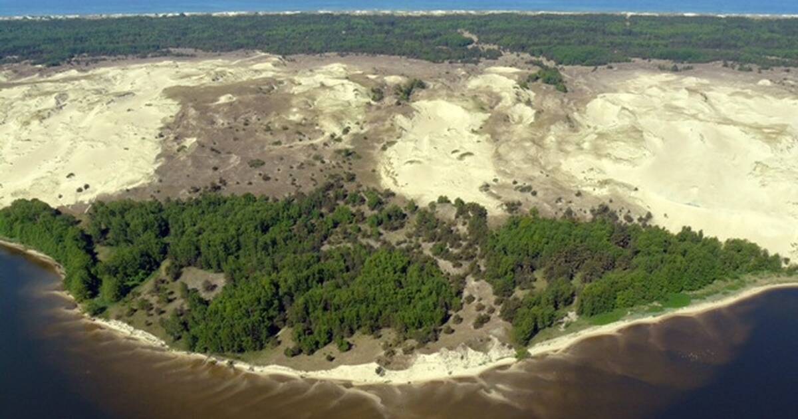
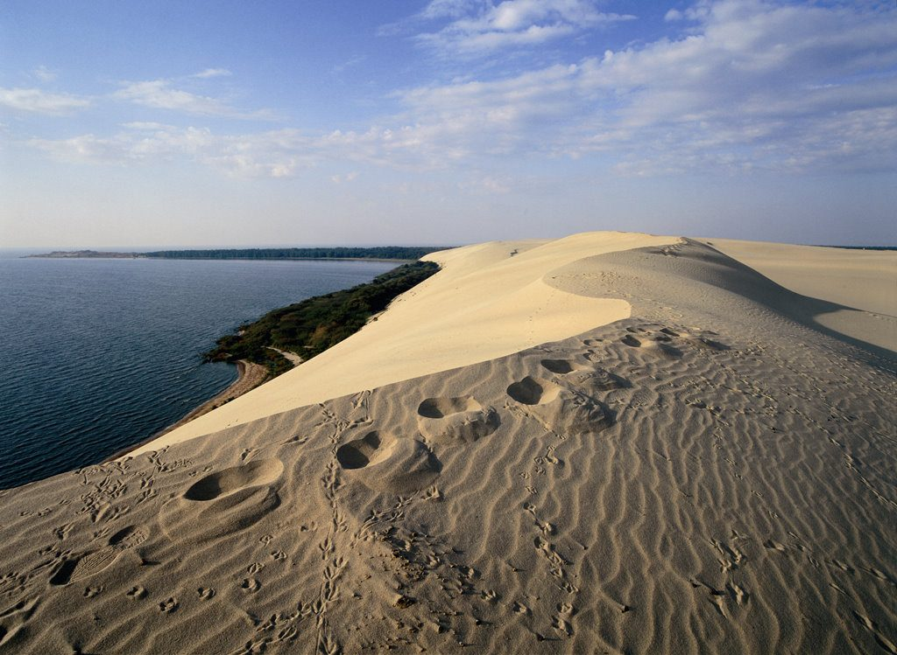
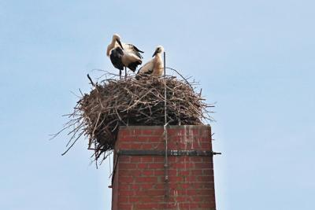
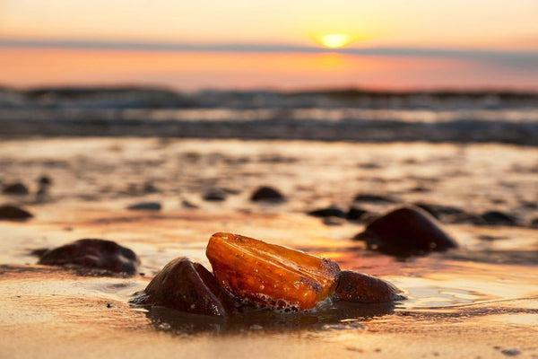

# Natura — Lituania
La Lituania è un mosaico di ecosistemi emiboreali e baltici: foreste che coprono circa il 33% del territorio, dune mobili patrimonio UNESCO sul Neringa (Curonian Spit), vaste torbiere e una delle più giovani aree deltizie d’Europa, il delta del Nemunas. Questo paesaggio pianeggiante, scolpito da ghiacciai e modellato dal vento e dal mare, ospita una fauna ricca — dal simbolico cicogna bianca alle acquile di mare — e una flora caratteristica delle sabbie costiere, dei boschi misti e delle paludi acide. Le tradizioni di raccolta di funghi e bacche, specialmente in Dzūkija, sono parte integrante dell’identità locale, mentre i fenomeni naturali — dalle “notti bianche” estive alle mareggiate che riportano l’ambra a riva — scandiscono il ritmo stagionale della natura lituana.

## Flora

### Alberi e arbusti delle foreste emiboreali
- **Pino silvestre (Pinus sylvestris, paprastoji pušis)**
  Conifera dominante su suoli sabbiosi e poveri, tronco diritto con chioma irregolare da adulta; corteccia aranciata-ramata nella parte alta, grigio-bruna in basso; aghi appaiati lunghi 4–7 cm, leggermente ritorti. Pigne ovoidali 3–7 cm. Forma pinete luminose con sottobosco di ericacee. Si osserva ovunque, specialmente lungo le creste sabbiose interne e costiere. Miglior periodo: tutto l’anno; in primavera diffonde profumi resinosi dopo la pioggia. Sicurezza: substrati sabbiosi instabili vicino alle dune — restare sui sentieri.

- **Abete rosso (Picea abies, paprastoji eglė)**
  Portamento conico fino a 35 m; aghi singoli, appuntiti, verde scuro; pigne pendule 10–18 cm. Predilige suoli più freschi rispetto al pino, forma boschi più ombrosi. Dove vederlo: Aukštaitija e Samogizia interna. Inverno scenografico con brina. Notare il tappeto di aghi sottochioma, habitat per micoflora e piccoli invertebrati.

- **Betulla verrucosa (Betula pendula, karpotasis beržas)**
  Tronco bianco con lenticelle e placche nere; chioma leggera; foglie romboidali dentate. Specie pioniera che colonizza aree disturbate e margini di torbiere. Primavera: amenti penduli; autunno: giallo brillante. Facilmente visibile nei mosaici forestali misti di tutto il Paese.

- **Quercia farnia (Quercus robur, paprastasis ąžuolas)**
  Colosso a crescita lenta con chioma ampia e corteccia profondamente solcata; foglie lobate con picciolo corto; ghiande in tazze emisferiche. Vetuste querce ospitano ricca fauna saproxilica. Dove vederla: parchi rurali e boschi antichi, margini di campagna della Lituania centrale. Periodo: primavera per la fioritura discreta, autunno per le ghiande e la fauna che ne si nutre.

- **Pioppo tremulo (Populus tremula, drebulė)**
  Riconoscibile per la vibrazione costante delle foglie tondeggianti su piccioli appiattiti; corteccia liscia verdastra poi grigio-scura. Importante per picchi e insetti xilofagi. Presente in aree umide e chiarie.

- **Tiglio selvatico (Tilia cordata, mažalapė liepa)**
  Chioma densa, foglie cordate con pagina inferiore leggermente tomentosa; fiori profumati in estate, nettariferi. Pianta mellifera cruciale per api e impollinatori. Dove vederlo: filari rurali, boschi misti dell’ovest e del centro.

### Piante delle dune del Neringa (Curonian Spit)

- **Ammofila delle spiagge (Ammophila arenaria, nome locale: tradiz. “ammofila”)**
  Graminacea cespitosa con foglie rigide arrotolate, glauco-verdi, radici rizomatose che fissano efficacemente la sabbia; spighe dense 10–25 cm. In prima linea sulle dune embrionali (“dune bianche”). Dove vederla: lungo tutto il Neringa; migliore osservazione nella zona tra Juodkrantė e Nida. Evitare il calpestio fuori sentiero: la sua integrità è fondamentale per la stabilità delle dune.

  

  

- **Pino mugo (Pinus mugo, kalninė pušis)**
  Arbusto/piccola conifera prostrata, aghi in fascetti di 2, scuri; coni legnosi persistenti. Introdotto storicamente per stabilizzare le dune mobili nel XIX secolo; oggi forma barriere verdi sulle creste. Facile da vedere lungo i percorsi segnalati sopra Nida.

- **Rosa rugosa (Rosa rugosa, raukšlėtalapė rožė)**
  Arbusto spinoso con foglie rugose, fiori rosa-porpora profumati; cinorrodi sferici arancio-rossi. Adattata alla salsedine; in alcune aree è invasiva e si gestisce per contenere la diffusione. Fiori da giugno ad agosto lungo retrodune e margini.

### Torbiere, brughiere e piante specialistiche

- **Rosolida comune (Drosera rotundifolia, rasažolė apvali)**
  Piccola pianta carnivora con foglie rotonde su esili piccioli ricoperte di ghiandole vischiose rossastre che intrappolano insetti; fiori bianchi minuti. Habitat: torbiere alte acide con Sphagnum. Dove vederla: Žuvintas e torbiere della Dzūkija su passerelle. Periodo: giugno–agosto. Non toccare le piante; estremamente delicate.

- **Erica tetralice (Erica tetralix, keturlapė šilauogė)**
  Arbuscello con foglie aghiformi in verticilli e campanelle rosa; indica suoli molto acidi e umidi. Fiori in estate; colonizza margini di torbiere e brughiera umida.

- **Muschio di torba (Sphagnum spp., sfagnas)**
  Tappeti spugnosi igrofili che regolano l’acqua e l’acidità; strato vivo sopra, accumulo torboso sotto. Osservabile tutto l’anno nelle torbiere rialzate. Camminare solo su passerelle: rischio di sprofondamento.

- **Scarpetta di Venere (Cypripedium calceolus, plačialapė klumpaitė)**
  Orchidea rara con labello giallo “a pantofola” e sepali/petali bruno-porpora; foglie ellittiche ampie. Grow in boschi calcarei chiari. Dove e quando: maggio–giugno in siti protetti (non divulgati), talvolta in Aukštaitija. Protezione rigorosa: vietata la raccolta.

### Funghi della tradizione lituana (Dzūkija e oltre)

- **Porcino (Boletus edulis, baravykas)**
  Cappello bruno 7–25 cm, emisferico poi convesso; pori bianchi→gialli→olivastri; gambo tozzo con reticolo chiaro; carne bianca immutabile, profumo di nocciola. Habitat: pinete e faggete di collina; in Lituania soprattutto sotto pino e betulla, da agosto a ottobre. Dove: foreste di Dzūkija e Aukštaitija. Consiglio: tagliare alla base e coprire la ferita col tappeto di aghi.

- **Gallinaccio (Cantharellus cibarius, voveraitė)**
  Cappello imbutiforme giallo uovo, margine ondulato; pseudolamelle spesse e forcate; odore fruttato (albicocca). Habitat: boschi di conifere e misti, giugno–settembre. Molto comune dopo piogge estive.

- **Lattario delizioso (Lactarius deliciosus, skanusis piengrybis)**
  Cappello arancio con zonature, latice arancio che vira al verde; lamelle fitte. Sotto pino su sabbie acide. Ottobre ottimale. Da cuocere bene.

- **Porcinello grigio (Leccinum scabrum, beržinis raudonviršis)**
  Cappello bruno-grigio; gambo con scaglie nerastre; carne biancastra talvolta rossastra. Sotto betulle; da luglio a ottobre.

Tabella di identificazione — Porcino e sosia
| Carattere | Commestibile: Boletus edulis | Sosia: Tylopilus felleus (falso porcino, amaro) | Sosia: Rubroboletus luridus (tossico crudo) |
|---|---|---|---|
| Cappello | Bruno-nocciola, vellutato | Bruno con tonalità rosate | Brunastro-oliva |
| Pori | Bianchi→olivastri, NON rosati | Rosati già da giovane | Gialli→arancio, bluificano |
| Gambo | Tozzo, reticolo bianco fine | Reticolo bruno marcato | Spesso arancio alla base |
| Carne | Bianca, odore di nocciola | Bianca, gusto estremamente amaro | Gialla, arrossa/bluifica |
| Nota | Ottimo commestibile | Non tossico ma immangiabile | Tossico da crudo; cuocere non sempre sicuro |

Tabella di identificazione — Gallinaccio e sosia
| Carattere | Commestibile: Cantharellus cibarius | Sosia: Hygrophoropsis aurantiaca (falso gallinaccio) |
|---|---|---|
| Lamelle | Pieghe spesse, decorrenti e forcate | Lamelle vere, sottili e fitte |
| Odore | Fruttato (albicocca) | Debole o fungino |
| Carne | Soda, elastica | Fragile |
| Colore | Giallo uniforme | Arancio più scuro al centro |
| Habitat | Boschi ariosi, suolo acido | Legno marcescente, lettiera ricca |

Avvertenze raccomandate: raccogliere solo ciò che si identifica al 100%; evitare esemplari vecchi; usare cestino aerato; rispettare limiti nelle aree protette.

### Bacche di bosco e di torbiera

- **Mirtillo nero (Vaccinium myrtillus, mėlynė)**
  Arbustello 10–50 cm; foglie ovate fini, seghettate; bacche blu-violacee che macchiano le dita di viola. Habitat: sottobosco acido di pinete e abetine. Periodo: luglio–agosto. Ottimo fresco o in marmellata.

- **Mirtillo rosso/lingonberry (Vaccinium vitis-idaea, bruknė)**
  Arbuscello sempreverde 10–40 cm; foglie coriacee con puntinature scure inferiori; bacche rosso vivo acidule. Habitat: sabbie e brughiere. Raccolta: agosto–settembre.

- **Mirtillo di palude/cranberry europeo (Vaccinium oxycoccos, spanguolė)**
  Rami sottili striscianti; foglie minute, bordi arrotolati; bacche rosso scuro lucide. Habitat: torbiere alte. Raccolta: settembre–ottobre, spesso dopo le prime gelate.

Tabella rapida — Bacche e possibili confusione
| Specie | Habitat | Frutto | Foglie | Periodo | Sosia pericolosi | Note |
|---|---|---|---|---|---|---|
| Vaccinium myrtillus | Boschi acidi | Blu-violaceo, succo viola | Tenere, decidue | Lug–Ago | Daphne mezereum (bacche rosse tossiche) | Le bacche di mirtillo crescono singole su rami verdi spigolosi |
| V. vitis-idaea | Pinete, brughiere | Rosso vivo, in gruppi | Sempreverdi, lucide | Ago–Set | Arbutus uva-ursi (non pericolosa ma coriacea) | Sapore acidulo, foglie con punti scuri sotto |
| V. oxycoccos | Torbiere | Rosso scuro, lucide | Piccole, margine arrotolato | Set–Ott | Bacche di Solanum dulcamara (tossiche) sui bordi umidi | Raccogliere solo sulle torbiere con passerelle |

Consigli sicurezza: evitare bacche sconosciute; non entrare nelle torbiere senza guida; attenzione a zecche nei boschi (repellenti e controllo post-escursione).

## Fauna

### Uccelli emblematici e migrazione
- **Cicogna bianca (Ciconia ciconia, baltasis gandras)**
  Grande trampoliere bianco con remiganti nere, becco e zampe rosse; apertura alare 195–215 cm. Specie nazionale, con circa 13.000 coppie nidificanti (tra le popolazioni più grandi dell’UE). Nidi voluminosi su pali elettrici, tetti e alberi. Alimentazione: insetti, anfibi, piccoli roditori, nei prati e campi. Dove: densità massime nella Lituania occidentale (fino a ~160 nidi/100 km²), Nemunas Delta, campagne di Šilutė e Šakiai. Periodo: arrivo marzo–aprile, partenza agosto–settembre; spettacolare pre-migrazione in gruppi ad agosto. Consiglio: mantenere distanza dal nido; molti villaggi installano piattaforme per la sicurezza.

  

- **Aquile di mare codabianca (Haliaeetus albicilla, jūrinis erelis)**
  Rapace massiccio (A.A. fino a 240 cm), coda corta bianca negli adulti, becco giallo poderoso. Habitat: coste, lagune e grandi laghi; caccia pesci e uccelli acquatici. Dove: Curonian Lagoon, Nemunas Delta, laghi di Aukštaitija. Tutto l’anno; più visibili in inverno quando si concentrano dove l’acqua resta libera dal ghiaccio.

- **Cormorano comune (Phalacrocorax carbo, didysis kormoranas)**
  Uccello acquatico nero lucido, collo sinuoso; colonie numerose sugli isolotti della Laguna dei Curlandesi; nidi arborei che sbiancano la vegetazione. Dove: Juodkrantė ospita colonie spettacolari. Periodo: primavera-estate, massimi tra aprile e luglio. Tenere conto dell’odore pungente e del disturbo: piattaforme di osservazione dedicate.

- **Gru cenerina (Grus grus, pilkoji gervė)**
  Grande uccello grigio con corona rossa; richiami trombettanti. Sosta in massa nelle praterie allagate del delta durante la migrazione autunnale (settembre-ottobre), al tramonto si osservano voli in V.

- **Osprey (Pandion haliaetus, žuvininkas)**
  Rapace pescatore con maschera scura; tuffi spettacolari nei laghi. Nidifica su piattaforme artificiali. Migliore osservazione: parchi lacustri dell’est, da aprile a settembre.

### Mammiferi di foreste e zone umide

- **Alce (Alces alces, briedis)**
  Il più grande cervide europeo: maschi con ampie palchi palmati, spalla alta (1,8–2,1 m), profilo nasale convesso; manto bruno scuro. Solitario o in piccoli gruppi; predilige paludi, torbiere e foreste giovani ricche di betulle e salici. Dove: Dzūkija, Samogizia interna, zone umide ai margini del Nemunas. Periodo: tutto l’anno; al crepuscolo più attivo. Sicurezza: mantenere distanza, specialmente con femmine accompagnate da piccoli.

- **Capriolo (Capreolus capreolus, stirna)**
  Cervide agile 20–30 kg; mantello estivo rossiccio, invernale grigio-bruno; maschi con palchi corti. Comune in mosaici agricoli e margini boschivi. Osservabile all’alba e al tramonto tutto l’anno.

- **Cinghiale (Sus scrofa, šernas)**
  Corpo tozzo, mantello scuro, zanne nei maschi; gruppi matriarcali (sounder). Frequenti nelle foreste e campi; scava il suolo. Attività: crepuscolare-notturna. Avvertenza: non avvicinare femmine con piccoli; attenzione alla peste suina africana — non lasciare scarti alimentari.

- **Castoro europeo (Castor fiber, bebras)**
  Roditore ingegnere; coda appiattita, incisivi arancioni; costruisce dighe che creano stagni e meandri morti. Tra i più comuni d’Europa in Lituania. Dove: rogge, fiumi lenti e bordi della Curonian Lagoon. Migliore orario: crepuscolo. Indizi: alberi rosicchiati a “matita” e tane semisommerse.

- **Lupo (Canis lupus, vilkas)**
  Canide sociale in piccoli branchi; mantello grigio-bruno, lunghe zampe adattate alla foresta. Popolazione stimata attorno a ~250 individui. Elusivo, attivo soprattutto di notte. Habitat: grandi complessi forestali della Dzūkija e nord-est. Sicurezza: rarissimo l’avvicinamento; tenere cani al guinzaglio.

- **Lontra europea (Lutra lutra, ūdra)**
  Mustelide acquatico con corpo affusolato e pelliccia impermeabile; segni: scivoli fangosi sulle rive e feci profumate di pesce. Dove: acque pulite di laghi e fiumi, specialmente in parchi nazionali. Orari: notturno-crepuscolare.

### Anfibi e rettili notevoli
- **Ululone dal ventre rosso (Bombina bombina, raudonpilvė kūmutė)**
  Rospo piccolo, dorso verrucoso bruno, ventre nero a macchie arancio vivo come segnale aposematico; richiamo caratteristico “bu–u”. Habitat: pozze soleggiate, paludi basse del delta e bacini agricoli. Periodo: canto in tarda primavera-estate.

- **Testuggine palustre europea (Emys orbicularis, balinis vėžlys)**
  Carapace scuro macchiettato di giallo; specie localmente rara e protetta nelle paludi meridionali. Osservazione: calda primavera su tronchi emersi; non disturbare né toccare.

### Pesci e vita acquatica
- **Sandre/zander (Sander lucioperca, sterkai)**
  Pesce predatore delle acque torbide della Laguna dei Curlandesi e grandi fiumi; corpo allungato, pinne spinose, strie scure sui fianchi. Pesca e osservazione dal molo al crepuscolo.

- **Sperlano (Osmerus eperlanus, stinta)**
  Specie invernale iconica del Baltico; odore di cetriolo fresco. Pesca sul ghiaccio quando la Laguna ghiaccia. Sicurezza: consultare le autorità locali per lo spessore del ghiaccio.

## Geologia

### Origine glaciale e rilievi morenici
Il paesaggio lituano è il risultato degli ultimi cicli glaciali del Pleistocene: morene di fondo e di spinta, collinette di kames e crinali di eskers si alternano a pianure limoso-sabbiose. Numerosi laghi di “kettle” occupano depressioni da blocchi di ghiaccio fusi, specialmente in Aukštaitija. I suoli variano da sabbiosi acidi delle pinete a limi fertili nelle pianure alluvionali.

### Il Neringa (Curonian Spit) — penisola di dune UNESCO
Una barra sabbiosa lunga circa 98 km separa il Mar Baltico dalla Laguna dei Curlandesi, con un sistema di dune mobili alte fino a ~60 m (es. Duna di Parnidis, Nida). Formata dall’azione combinata di deriva litoranea, apporto di sabbia fluviale (Nemunas) e venti prevalenti da ovest, la penisola è dinamica: le “dune bianche” sabbiose si spostano, mentre le “dune grigie” stabilizzate ospitano licheni e pino mugo. Storicamente, riforestazioni con pino mugo e palizzate vegetali hanno frenato l’erosione nel XIX secolo. Oggi i sentieri sopraelevati proteggono superfici fragili dall’impatto dei visitatori.

### Il giovane Delta del Nemunas
Il delta, vecchio solo 1.000–1.100 anni, è un labirinto di rami fluviali, canali e polders, in lenta accrezione verso la Laguna. Le alluvioni primaverili depositano sedimenti fini, costruendo praterie allagate biodiverse. La subsidenza locale e l’azione del vento creano micro rilievi con canneti, bassi fondali e isolotti, essenziali per la sosta degli uccelli migratori.

### Ambra baltica

L’ambra baltica (succinite), resina fossile dell’Eocene (~44 milioni di anni), è abbondante nelle sabbie costiere e trascinata a riva da tempeste invernali e primaverili. Colori: dal miele al cognac, fino al giallo lattiginoso; talvolta con inclusioni di insetti e piante. Dove cercarla: spiagge tra Palanga e Juodkrantė, soprattutto dopo mareggiate con alghe e legnami spiaggiati. Sicurezza fondamentale: possibile presenza di fosforo bianco residuato, simile all’ambra ma infiammabile — non raccogliere pezzi cerosi che odorano di zolfo o che lasciano traccia untuosa; test in soluzione salina (ambra galleggia) e non scaldare in tasca. Rispettare i divieti di raccolta nelle aree protette.

  

## Fenomeni Naturali
### Notti bianche e luce nordica
Alla latitudine 55–56°N, intorno al solstizio d’estate la Lituania gode di 17–18 ore di luce e un crepuscolo che sfuma nella notte senza mai diventare completamente buio (soprattutto lungo la costa). Ottimale per birdwatching serale e fotografia paesaggistica.

### Migrazioni e raduni spettacolari
- Agosto: cicogne bianche in grandi dormitori pre-migratori sui campi mietuti e nei polders del delta.
- Settembre–ottobre: onde di oche e gru in formazione nel Nemunas Delta; cieli sonori al tramonto.
- Primavera: ritorno dei passeriformi, fioriture di ericacee e attività dei castori.

### Ghiaccio, nebbie e neve costiera
La Laguna dei Curlandesi può ghiacciare d’inverno, creando creste di pressione e superfici lucide; pescatori praticano la pesca alla “stinta” sul ghiaccio. Le nebbie mattutine comuni nelle praterie allagate creano scenari eterei. In costa, nevicate da effetto mare sono possibili con venti freddi da NE.

### Mareggiate d’ambra
Dopo tempeste, il moto ondoso sospinge frammenti d’ambra mescolati a posidonia e legni; miglior ricerca all’alba con luce radente. Portare guanti e rispettare le regole locali.

## Ecosistemi

### Foreste emiboreali miste
- Struttura: mosaici di pino silvestre, abete rosso, betulla, pioppo tremulo, con quercia e tiglio nelle aree più fertili.
- Sottobosco: mirtilli, eriche, muschi; legno morto essenziale per coleotteri saproxilici e funghi lignicoli.
- Fauna tipica: caprioli, picchi neri, civette; in aree remote lupo e lince. 
- Consigli: primavera per i canti degli uccelli; autunno per funghi e foliage. Attenzione a zecche e terreni irregolari radicati.

### Dune e litorale del Neringa
- Zone: spiaggia e dune embrionali (ammofila), dune bianche mobili, dune grigie stabilizzate (licheni, pino mugo), retrodune boschive.
- Fragilità: il calpestio distrugge la vegetazione di fissaggio; restare su passerelle e sentieri segnalati.
- Avifauna: sterne, gabbiani, passeriformi costieri; in migrazione rapaci che sfruttano le correnti lungo la costa.
- Punti top: Duna di Parnidis (Nida) per panorami; Juodkrantė per colonie di cormorani (vista da piattaforme dedicate).

### Zone umide e Delta del Nemunas
- Habitat: praterie soggette ad allagamenti stagionali, canneti di Phragmites, canali e bacini aperti, isolotti sabbiosi.
- Biodiversità: siti chiave per sosta migratoria e nidificazione di anatre, limicoli e ardeidi; mammiferi semiacquatici (lontra, visone europeo residuale).
- Esperienza: birdwatching primaverile e autunnale dagli argini; gite in barca a basso disturbo. Portare binocolo 8–10x e protezione anti-insetti; rispettare le zone di riserva integrale.

### Torbiere e brughiere
- Composizione: tappeti di Sphagnum, pozze oligotrofe, ericacee (mirtilli, erica, rosolida); betulla nana locale sporadica.
- Servizi ecosistemici: stoccaggio di carbonio, regolazione idrica, habitat per specie specializzate.
- Accesso: passerelle e torri di osservazione (es. Žuvintas). Sicurezza: bordi instabili, rischio di sprofondare fuori sentiero.

### Laghi glaciali e paesaggi a mosaico di Aukštaitija
- Reti lacustri con sponde boscate, ninfee, canneti litorali; corridoi blu-verdi importanti per pesci e odonati.
- Fauna: svassi, strolaghe occasionali in migrazione, ospreys pescatori.
- Attività: canoa silenziosa al mattino presto per avvistare lontra e uccelli; evitare il disturbo nelle baie di nidificazione.

### Riserve di biosfera — Žuvintas
- Unicità: vasta palude con lago poco profondo, canneti e prati umidi; designazione di Riserva della Biosfera.
- Valori: nidificazioni di ardeidi, limicoli e anatre; piante rare di palude e praterie umide.
- Visita: centro visitatori, torri di birdwatching, sentieri su passerelle. Miglior periodo: aprile–maggio e agosto–ottobre. Regole: silenzio, cani al guinzaglio, niente droni.

### Consigli pratici per il viaggiatore naturalista
- Periodi top: aprile–maggio (migrazione primaverile), agosto–ottobre (funghi, bacche, migrazione autunnale), fine giugno (notti bianche).
- Attrezzatura: strati antivento per la costa, stivali impermeabili per delta e torbiere, repellenti per insetti, binocolo e guida da campo locale.
- Sicurezza ambientale: seguire i sentieri nelle dune e torbiere; rispettare i periodi di nidificazione (chiusure stagionali). 
- Etica: non raccogliere piante protette; funghi e bacche con moderazione; riportare i rifiuti; non disturbare i nidi.
- Trasporti dolci: preferire bici nel Neringa (piste ciclabili tra le pinete) e visite con guide locali nel delta.

Fonti e Riferimenti: Servizio Forestale Statale Lituano; Parco Nazionale del Neringa (UNESCO); Parco Regionale del Delta del Nemunas; Riserva della Biosfera di Žuvintas; BirdLife Lituania; letteratura geologica baltica e dati su ambra baltica; osservazioni naturalistiche locali.