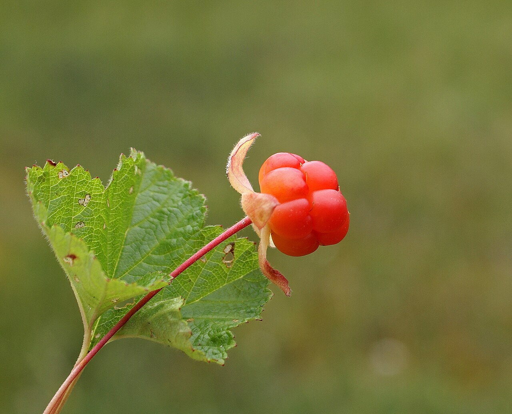
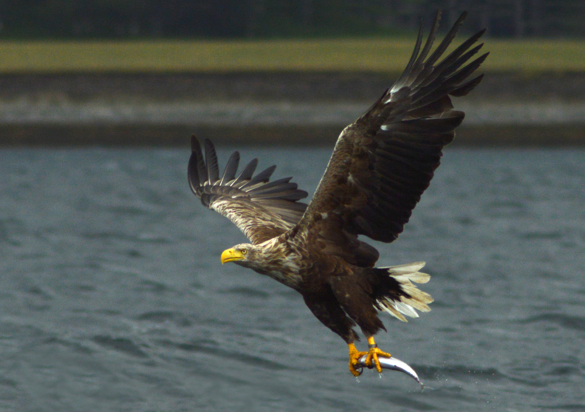
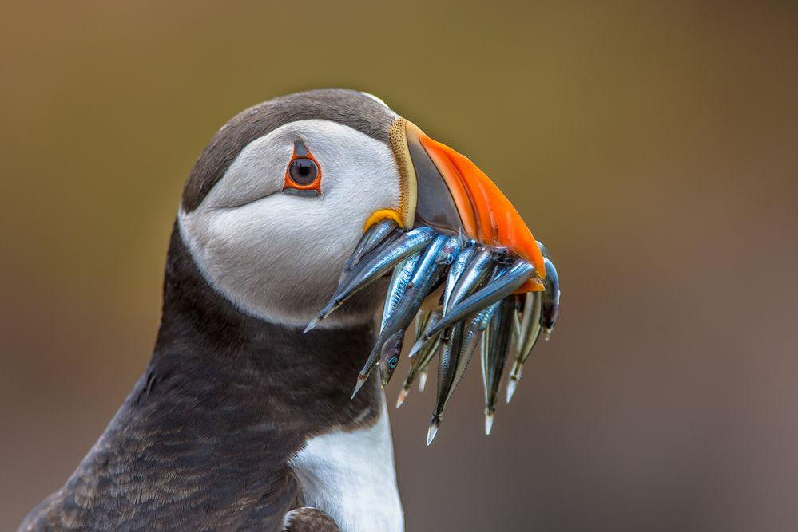
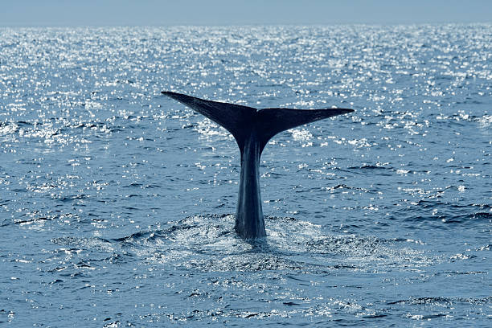
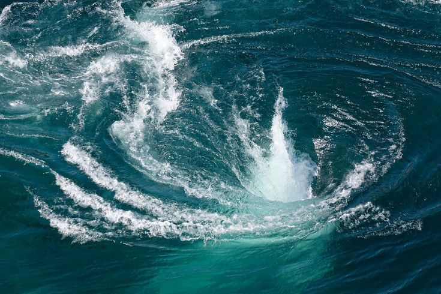
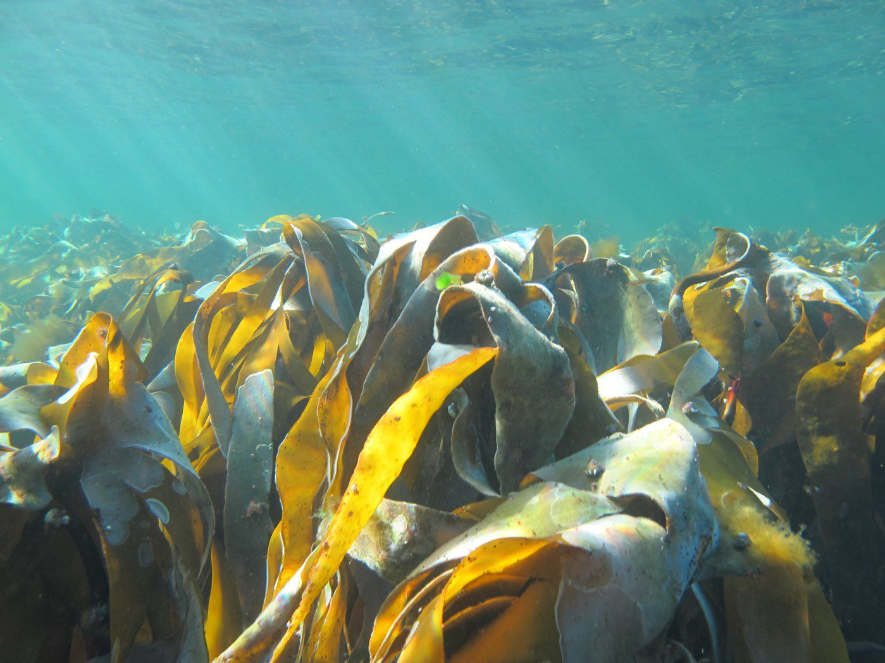
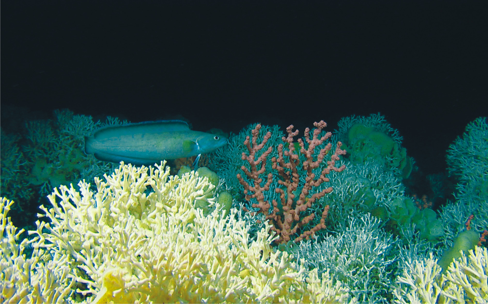

## 🌿 Naturaleza y fauna: Noruega
*Guía enciclopédica de la naturaleza noruega — la espectacular biodiversidad ártica, los fiordos milenarios, las Lofoten y los ecosistemas marinos.*

Noruega ofrece uno de los paisajes naturales más dramáticos e intactos del planeta. Desde las profundidades abisales de los fiordos hasta las cumbres escarpadas de las Lofoten, la corriente del Golfo modera un clima que de otro modo sería inhóspito, permitiendo la existencia de ecosistemas únicos y una fauna ártica y subártica muy rica.
## 🌲 Flora: Desde el Bosque Boreal hasta la Tundra Ártica

La vegetación noruega está fuertemente influenciada por la altitud y la latitud. Debido al clima riguroso, sólo el 3% del territorio es cultivable, mientras que el resto se divide entre bosques, montañas y tundra.

### Las Especies Arbóreas Dominantes

Como en gran parte de Escandinavia, el bosque boreal cubre las zonas interiores, pero la costa y la meseta presentan adaptaciones únicas.

- **Abedul peludo y Abedul montano (*Betula pubescens*, en noruego: *dunbjørk* / *fjellbjørk*)**  
  El abedul es el árbol caducifolio más común. La subespecie montana (*fjellbjørk*) forma el límite superior de los árboles en las montañas escandinavas. A diferencia de los abedules rectos de las llanuras, estos adoptan formas retorcidas, nudosas y bajas para resistir los vientos fríos y el peso de la nieve. Su follaje verde brillante en verano se vuelve de un espectacular amarillo dorado en otoño.
  
- **Pino silvestre (*Pinus sylvestris*, *furu*)**  
  Árbol majestuoso que domina los bosques más secos y rocosos. En los valles interiores, los pinos pueden alcanzar los 30 metros de altura y vivir durante siglos. Su madera resinosa, naturalmente resistente a la putrefacción, ha sido utilizada durante milenios para construir las famosas *Stavkirke* (iglesias de madera) y los barcos vikingos.

- **Abeto rojo (*Picea abies*, *gran*)**  
  Domina los terrenos húmedos y fértiles del interior. Forma bosques densos y oscuros, el hábitat clásico de los trolls en los cuentos noruegos. No es autóctono de la costa occidental (la zona de los fiordos), donde ha sido ampliamente plantado sólo en el último siglo para la industria maderera.

### El Tesoro de la Tundra y el Sotobosque

El derecho de libre acceso a la naturaleza (*Allemannsretten*) permite la recolección de frutos silvestres, una actividad arraigada en la cultura noruega.

- **Camemoro o Zarzamora ártica (*Rubus chamaemorus*, *multe*)**  
    
  Llamada "el oro del Ártico", es la baya más valiosa y buscada de Noruega. Crece exclusivamente en turberas húmedas y pantanosas. La flor blanca se transforma en un fruto similar a una frambuesa que pasa del rojo vivo al naranja dorado cuando está maduro (julio-agosto). Muy rica en vitamina C, tiene un sabor ácido y mielado. Tradicionalmente se sirve en Navidad como *multekrem* (con crema batida).

- **Arándano rojo (*Vaccinium vitis-idaea*, *tyttebær*)**  
  Pequeñas bayas rojas que crecen en densas alfombras siempreverdes en los bosques de pinos. Al ser naturalmente ricas en ácido benzoico (un conservante natural), pueden conservarse durante meses simplemente aplastadas en su propio jugo. La mermelada de *tyttebær* es el acompañamiento imprescindible para albóndigas y caza.

- **Hongo Rebozuelo o Gallinita (*Cantharellus cibarius*, *kantarell*)**  
    
  El hongo más querido por los recolectores noruegos. Aparece entre agosto y septiembre en bosques mixtos, a menudo cerca de abedules y abetos. Su inconfundible color amarillo y su aroma afrutado lo hacen fácil de identificar (ver tabla de identificación en la sección Finlandia).
## 🦌 Fauna: Los Gigantes del Norte y los Señores del Cielo

Noruega alberga algunas de las poblaciones silvestres más espectaculares de Europa, con una clara división entre la fauna terrestre del interior y la riquísima vida marina de la costa.

### Mamíferos Terrestres

- **Buey Almizclero (*Ovibos moschatus*, *moskus*)**  
  Una reliquia viviente de la era glacial. Aunque se extinguió en Europa hace miles de años, fue reintroducido con éxito en el Parque Nacional de Dovrefjell en los años 30. Pesa hasta 400 kg y posee un pelaje de doble capa excepcionalmente aislante (el *qiviut*). A pesar de su corpulencia, puede embestir a 60 km/h. Observarlo requiere precaución: se debe mantener al menos 200 metros de distancia.

- **Alce (*Alces alces*, *elg*)**  
  El "Re del bosque". Es el cérvido más grande del mundo, con machos que superan los 700 kg y poseen astas en forma de pala de hasta 2 metros de ancho. En Noruega hay alrededor de 100.000 alces. Son animales solitarios que prefieren bosques pantanosos y bosques jóvenes de abedules. Precaución al conducir al amanecer y al atardecer: los accidentes de tráfico con alces son un peligro real.

- **Reno (*Rangifer tarandus*, *reinsdyr*)**  
  En las regiones árticas (Finnmark, Troms y parte de Nordland), los renos son semi-domésticos, propiedad de las poblaciones indígenas Sámi. Viven libres vagando entre los pastos invernales (interior) y estivales (costa e islas). En el archipiélago de Svalbard vive una subespecie endémica más pequeña y robusta, el reno de Svalbard.

### La Riqueza del Mar y los Cielos

- **Águila Marina de Cola Blanca (*Haliaeetus albicilla*, *havørn*)**  
    
  El ave rapaz más grande del norte de Europa, con una envergadura que puede alcanzar los 2,45 metros. Las islas Lofoten albergan la mayor densidad de águilas marinas del mundo. Se pueden ver planeando majestuosas sobre los fiordos, aprovechando las corrientes ascendentes antes de lanzarse a capturar peces en la superficie con sus poderosas garras.

- **Frailecillo Atlántico (*Fratercula arctica*, *lundefugl*)**  
    
  El "payaso del mar", reconocible por su pico triangular y colorido. Pasa el invierno en mar abierto y regresa a tierra en verano sólo para anidar. La isla de Røst, en el extremo sur de las Lofoten, alberga la colonia más grande de Noruega (alrededor del 25% de toda la población nacional). Lamentablemente, la especie está en declive debido al calentamiento de las aguas que aleja a los pequeños peces de los que se alimentan.

- **Cachalote (*Physeter macrocephalus*, *spermasetthval*)**  
    
  El mayor depredador dentado de la Tierra. Los machos adultos, de hasta 20 metros de longitud, se reúnen frente a Andenes (Vesterålen) durante todo el año. Esta área es única porque la plataforma continental desciende bruscamente cerca de la costa, creando el hábitat perfecto para los calamares gigantes de los que se alimenta el cachalote, sumergiéndose hasta 2.000 metros de profundidad durante más de una hora.

- **Orca (*Orcinus orca*, *spekkhogger*)**  
  Cada invierno (de noviembre a febrero), cientos de orcas y jorobadas siguen los enormes bancos de arenques en los fiordos del norte (a menudo cerca de Tromsø y las Lofoten). Cazan en grupo usando una técnica llamada "carrusel": rodean a los arenques, los empujan hacia la superficie y los aturden con potentes golpes de cola.
## 🪨 Geología: La Cuna de los Fiordos

El paisaje noruego es un libro abierto de historia geológica, esculpido por la violencia de los hielos y el levantamiento de la corteza terrestre.

### El Cratón Báltico y las Rocas Más Antiguas de Europa
Noruega descansa en gran parte sobre el Cratón Báltico (o Escudo Báltico), un fragmento primordial de la corteza terrestre. En las islas Lofoten y Vesterålen, la roca aflorante (gneis y granito) tiene una edad asombrosa de **unos 3 mil millones de años**, convirtiéndola en una de las formaciones rocosas más antiguas de Europa. Esta estabilidad cortical ha permitido que las rocas sobrevivan a innumerables eras geológicas.

### La Formación de los Fiordos
Los fiordos no fueron excavados por ríos, sino por glaciares. Durante las últimas eras glaciares, toda Escandinavia estaba cubierta por una capa de hielo de hasta 3 km de espesor.
1. El peso y el movimiento de los glaciares excavaron profundos valles en forma de "U" en la roca dura.
2. Debido a que el hielo sólido puede excavar incluso por debajo del nivel del mar, estos valles fueron erosionados a profundidades increíbles (el Sognefjord tiene una profundidad de 1.308 metros).
3. Cuando los glaciares se retiraron (hace unos 10.000 años), el agua del mar inundó los valles.
4. Una característica típica es el "umbral" en la boca del fiordo: el fondo es más bajo donde el fiordo se encuentra con el mar abierto, porque allí el glaciar flotaba y dejaba de erosionar el fondo, depositando los detritos (morrenas).

### La Orogénesis Caledoniana
Hace aproximadamente 425 millones de años, la placa continental de Groenlandia/Norteamérica chocó contra Europa. El impacto titánico levantó la Cadena Caledoniana, montañas que en ese entonces eran tan altas como el actual Himalaya (hasta 10.000 metros). La erosión de cientos de millones de años las ha reducido a las actuales Alpes Escandinavos (cuya cima máxima, el Galdhøpiggen, alcanza hoy los 2.469 metros).
## 🌌 Fenómenos Naturales: Luces Extremas

Al estar atravesada por el Círculo Polar Ártico (66°33' N), Noruega experimenta extremos luminosos que marcan los ritmos de la naturaleza y del ser humano.

### El Sol de Medianoche
Al norte del Círculo Polar, en verano, la inclinación del eje terrestre hace que el sol nunca se ponga completamente. En las islas Lofoten (68° N), el sol permanece constantemente sobre el horizonte **del 26 de mayo al 17 de julio** (aproximadamente 52 días consecutivos). Este fenómeno estimula un crecimiento vegetal explosivo y permite a las aves marinas cazar las 24 horas para alimentar a los polluelos.

### El Maelstrom (Moskstraumen)
Uno de los fenómenos de marea más potentes y peligrosos del mundo. Ocurre entre el extremo sur de las Lofoten (Moskenesøya) y el islote aislado de Mosken. A diferencia de la mayoría de los remolinos que se forman en canales estrechos, el Moskstraumen se forma en mar abierto. Es causado por la enorme masa de agua que las mareas empujan adelante y atrás entre el Vestfjord y el Mar de Noruega, chocando contra una compleja topografía submarina. Inspiró a Edgar Allan Poe y Jules Verne.
## 🌳 Ecosistemas: Los Bosques Invisibles

  

Bajo la superficie helada de los fiordos y a lo largo de la costa escarpada se esconden ecosistemas tan ricos como los terrestres.

### Los Bosques de Kelp (Laminaria)
Las frías aguas costeras noruegas albergan vastos "bosques" submarinos de algas pardas gigantes (kelp). Estos bosques son uno de los ecosistemas más productivos de la Tierra y sirven como vivero vital para innumerables especies de peces, incluido el famoso bacalao ártico noruego (*Skrei*). En los años 70, un desequilibrio ecológico (posiblemente relacionado con la sobrepesca de depredadores) provocó una explosión demográfica de erizos de mar verdes, que devoraron y destruyeron más de 2.000 km² de bosques de kelp. Hoy en día, proyectos de restauración masivos están devolviendo lentamente la vida a este hábitat crucial.

  

### Arrecifes de Coral de Agua Fría
No todos los corales viven en los trópicos. Los fiordos noruegos y la plataforma continental albergan algunos de los arrecifes de coral de agua fría más grandes del mundo, formados principalmente por la especie *Lophelia pertusa*. Crecen en completa oscuridad, entre 40 y 1.000 metros de profundidad, alimentándose del plancton transportado por fuertes corrientes. El **Røst Reef**, situado frente a las Lofoten, es el arrecife de coral de aguas profundas más grande conocido en el mundo: con 43 km de largo y casi 7 km de ancho.

  

---
*Fuentes: Norsk Polarinstitutt, Institute of Marine Research (HI), Visit Norway, Geological Survey of Norway (NGU).*