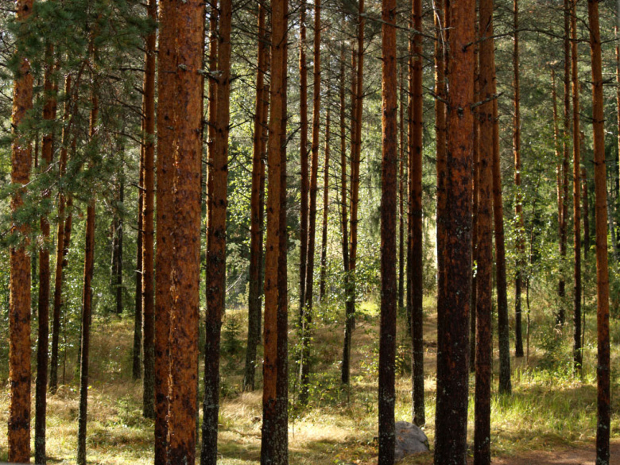
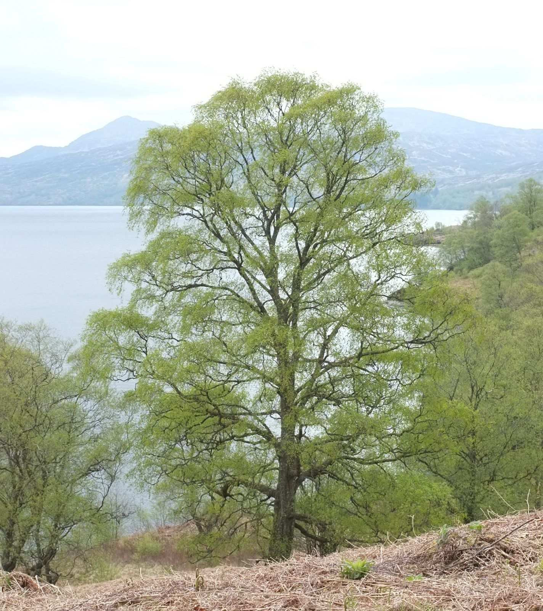
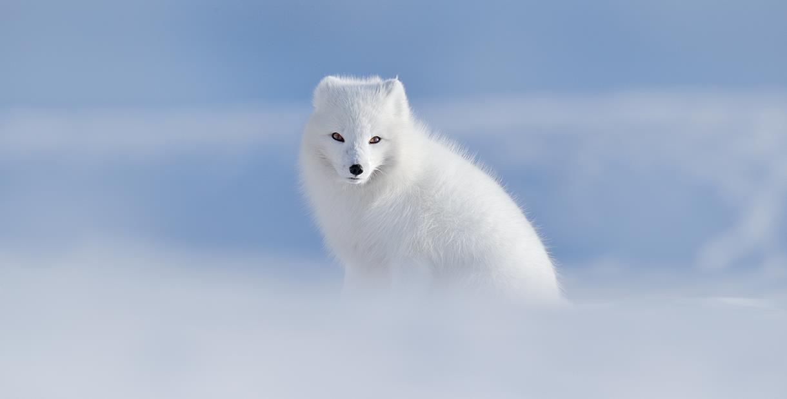
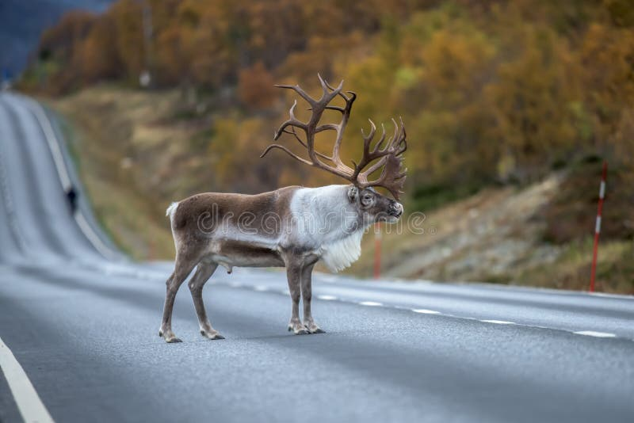
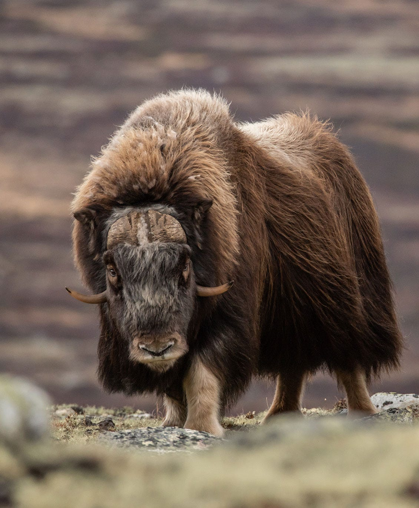
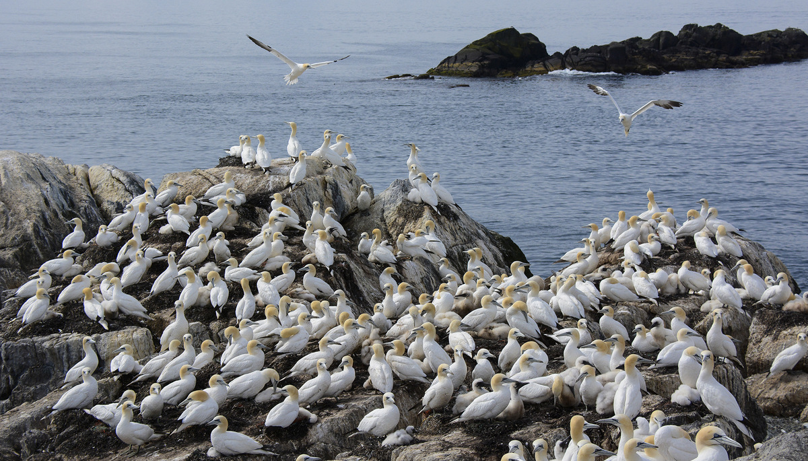
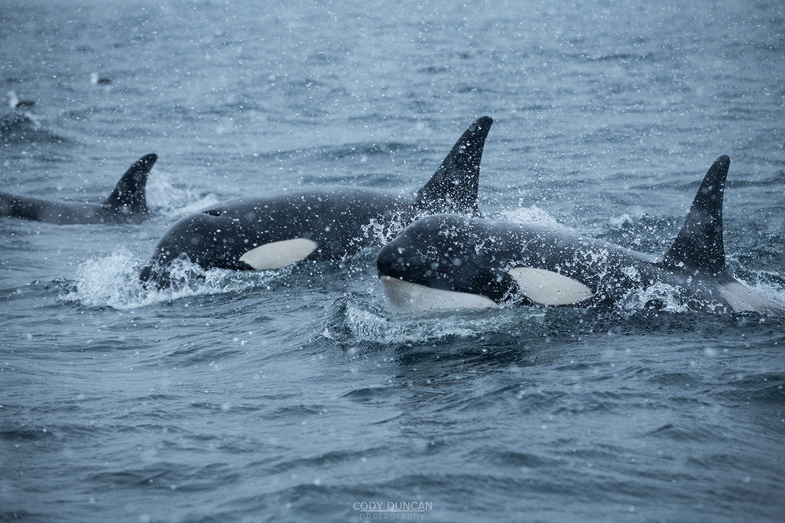
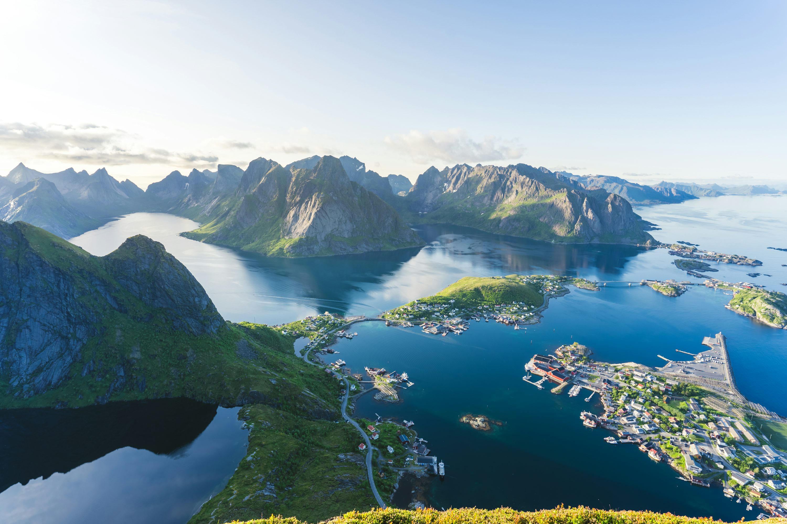
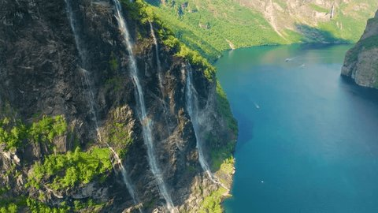
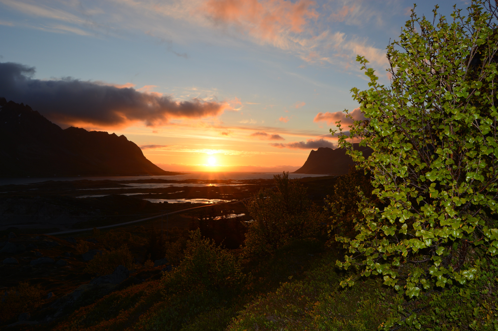

## 🌿 Natura e fauna: Norvegia
*Guida enciclopedica alla natura norvegese — la spettacolare biodiversità artica, i fiordi millenari, le Lofoten e gli ecosistemi marini.*

La Norvegia offre uno dei paesaggi naturali più drammatici e incontaminati del pianeta. Dalle profondità abissali dei fiordi alle vette frastagliate delle Lofoten, la corrente del Golfo mitiga un clima che altrimenti sarebbe inospitale, permettendo l'esistenza di ecosistemi unici e di una ricchissima fauna artica e subartica.

## 🌲 Flora: Dalla Foresta Boreale alla Tundra Artica

La vegetazione norvegese è fortemente influenzata dall'altitudine e dalla latitudine. A causa del clima rigido, solo il 3% del territorio è coltivabile, mentre il resto è diviso tra foreste, montagne e tundra.

### Le Specie Arboree Dominanti

  

  

Come in gran parte della Scandinavia, la foresta boreale copre le zone interne, ma la costa e l'altopiano presentano adattamenti unici.

- **Betulla pelosa e Betulla montana (*Betula pubescens*, in norvegese: *dunbjørk* / *fjellbjørk*)**
  La betulla è l'albero deciduo più diffuso. La sottospecie montana (*fjellbjørk*) forma il limite superiore degli alberi sulle montagne scandinave. A differenza delle betulle dritte di pianura, queste assumono forme contorte, nodose e basse per resistere ai venti gelidi e al peso della neve. Il loro fogliame verde brillante in estate diventa di un giallo dorato spettacolare in autunno.
  
- **Pino silvestre (*Pinus sylvestris*, *furu*)**
  Albero maestoso che domina le foreste più secche e rocciose. Nelle valli interne, i pini possono raggiungere i 30 metri di altezza e vivere per secoli. Il loro legno resinoso, naturalmente resistente alla marcescenza, è stato utilizzato per millenni per costruire le famose *Stavkirke* (chiese in legno) e le navi vichinghe.

- **Abete rosso (*Picea abies*, *gran*)**
  Domina i terreni umidi e fertili dell'entroterra. Forma foreste dense e scure, il classico habitat dei troll nelle fiabe norvegesi. Non è autoctono della costa occidentale (la zona dei fiordi), dove è stato ampiamente piantato solo nell'ultimo secolo per l'industria del legname.

### Il Tesoro della Tundra e del Sottobosco

Il diritto di libero accesso alla natura (*Allemannsretten*) permette la raccolta di frutti spontanei, un'attività radicata nella cultura norvegese.

- **Camemoro o Rovo artico (*Rubus chamaemorus*, *multe*)**
  
  Chiamato "l'oro dell'Artico", è la bacca più preziosa e ricercata della Norvegia. Cresce esclusivamente in torbiere umide e acquitrinose. Il fiore bianco si trasforma in un frutto simile a un lampone che passa dal rosso vivo all'arancione dorato quando è maturo (luglio-agosto). Ricchissimo di vitamina C, ha un sapore aspro e mielato. Tradizionalmente viene servito a Natale come *multekrem* (con panna montata).

- **Mirtillo rosso (*Vaccinium vitis-idaea*, *tyttebær*)**
  Piccole bacche rosse che crescono in fitti tappeti sempreverdi nelle foreste di pini. Essendo naturalmente ricche di acido benzoico (un conservante naturale), possono essere conservate per mesi semplicemente schiacciate nel loro succo. La marmellata di *tyttebær* è l'accompagnamento immancabile per polpette e selvaggina.

- **Fungo Finferlo o Gallinaccio (*Cantharellus cibarius*, *kantarell*)**
  
  Il fungo più amato dai raccoglitori norvegesi. Spunta tra agosto e settembre nei boschi misti, spesso vicino a betulle e abeti. Il suo inconfondibile colore giallo tuorlo e il profumo fruttato lo rendono facile da identificare (vedi tabella identificazione nella sezione Finlandia).

## 🦌 Fauna: I Giganti del Nord e i Signori del Cielo

La Norvegia ospita alcune delle popolazioni selvatiche più spettacolari d'Europa, con una netta divisione tra la fauna terrestre dell'entroterra e la ricchissima vita marina della costa.

### Mammiferi Terrestri

  

  

  

- **Bue Muschiato (*Ovibos moschatus*, *moskus*)**
  Una reliquia vivente dell'era glaciale. Sebbene si sia estinto in Europa migliaia di anni fa, è stato reintrodotto con successo nel Parco Nazionale di Dovrefjell negli anni '30. Pesa fino a 400 kg e possiede un mantello a doppio strato eccezionalmente isolante (il *qiviut*). Nonostante la mole tozza, può caricare a 60 km/h. Osservarlo richiede cautela: bisogna mantenere almeno 200 metri di distanza.

- **Alce (*Alces alces*, *elg*)**
  Il "Re della foresta". È il cervide più grande del mondo, con i maschi che superano i 700 kg e possiedono palchi a pala larghi fino a 2 metri. In Norvegia ci sono circa 100.000 alci. Sono animali solitari che prediligono foreste paludose e giovani boschi di betulle. Attenzione alla guida all'alba e al tramonto: gli incidenti stradali con gli alci sono un pericolo reale.

- **Renna (*Rangifer tarandus*, *reinsdyr*)**
  Nelle regioni artiche (Finnmark, Troms e parte del Nordland), le renne sono semi-domestiche, di proprietà delle popolazioni indigene Sámi. Vivono libere vagando tra i pascoli invernali (entroterra) ed estivi (costa e isole). Sull'arcipelago delle Svalbard vive una sottospecie endemica più piccola e tozza, la renna delle Svalbard.

### La Ricchezza del Mare e dei Cieli

  

  

- **Aquila di Mare Coda Bianca (*Haliaeetus albicilla*, *havørn*)**
  
  L'uccello rapace più grande del Nord Europa, con un'apertura alare che può raggiungere i 2,45 metri. Le isole Lofoten ospitano la più alta densità di aquile di mare al mondo. Le si può vedere planare maestosamente sopra i fiordi, sfruttando le correnti ascensionali prima di tuffarsi a ghermire pesci in superficie con i loro potenti artigli.

- **Pulcinella di Mare (*Fratercula arctica*, *lundefugl*)**
  
  Il "clown del mare", riconoscibile dal becco triangolare e coloratissimo. Passa l'inverno in mare aperto e torna a terra in estate solo per nidificare. L'isola di Røst, all'estremità meridionale delle Lofoten, ospita la colonia più grande della Norvegia (circa il 25% dell'intera popolazione nazionale). Purtroppo, la specie è in declino a causa del riscaldamento delle acque che allontana i piccoli pesci di cui si nutrono.

- **Capodoglio (*Physeter macrocephalus*, *spermasetthval*)**
  
  Il più grande predatore dentato della Terra. I maschi adulti, lunghi fino a 20 metri, si radunano al largo di Andenes (Vesterålen) tutto l'anno. Quest'area è unica perché la piattaforma continentale sprofonda bruscamente vicino alla costa, creando l'habitat perfetto per i calamari giganti di cui il capodoglio si nutre, immergendosi fino a 2.000 metri di profondità per oltre un'ora.

- **Orca (*Orcinus orca*, *spekkhogger*)**
  Ogni inverno (da novembre a febbraio), centinaia di orche e megattere seguono gli immensi banchi di aringhe nei fiordi settentrionali (spesso vicino a Tromsø e alle Lofoten). Cacciano in gruppo usando una tecnica chiamata "carosello": circondano le aringhe, le spingono verso la superficie e le stordiscono con potenti colpi di coda.

## 🪨 Geologia: La Culla dei Fiordi

  

  

Il paesaggio norvegese è un libro di storia geologica aperto, scolpito dalla violenza dei ghiacci e dal sollevamento della crosta terrestre.

### Il Cratone Baltico e le Rocce Più Antiche d'Europa
La Norvegia poggia in gran parte sul Cratone Baltico (o Scudo Baltico), un pezzo di crosta terrestre primordiale. Nelle isole Lofoten e Vesterålen, la roccia affiorante (gneiss e granito) ha un'età sbalorditiva di **circa 3 miliardi di anni**, rendendola una delle formazioni rocciose più antiche d'Europa. Questa stabilità crostale ha permesso alle rocce di sopravvivere a innumerevoli ere geologiche.

### La Formazione dei Fiordi
I fiordi non sono stati scavati dai fiumi, ma dai ghiacciai. Durante le ultime ere glaciali, l'intera Scandinavia era coperta da una calotta di ghiaccio spessa fino a 3 km.
1. Il peso e il movimento dei ghiacciai hanno scavato profonde valli a forma di "U" nella roccia dura.
2. Poiché il ghiaccio solido può scavare anche al di sotto del livello del mare, queste valli sono state erose a profondità incredibili (il Sognefjord è profondo 1.308 metri).
3. Quando i ghiacciai si sono ritirati (circa 10.000 anni fa), l'acqua del mare ha invaso le valli.
4. Una caratteristica tipica è la "soglia" alla foce del fiordo: il fondale è più basso dove il fiordo incontra il mare aperto, perché lì il ghiacciaio galleggiava e smetteva di erodere il fondale, depositando i detriti (morene).

### L'Orogenesi Caledoniana
Circa 425 milioni di anni fa, la placca continentale della Groenlandia/Nord America si è schiantata contro l'Europa. L'impatto titanico ha sollevato la Catena Caledoniana, montagne che all'epoca erano alte come l'odierno Himalaya (fino a 10.000 metri). L'erosione di centinaia di milioni di anni le ha ridotte alle attuali Alpi Scandinave (la cui vetta massima, il Galdhøpiggen, tocca oggi i 2.469 metri).

## 🌌 Fenomeni Naturali: Luci Estreme

Essendo attraversata dal Circolo Polare Artico (66°33' N), la Norvegia sperimenta estremi luminosi che dettano i ritmi della natura e dell'uomo.

### Il Sole di Mezzanotte
A nord del Circolo Polare, in estate, l'inclinazione dell'asse terrestre fa sì che il sole non tramonti mai completamente. Alle isole Lofoten (68° N), il sole rimane costantemente sopra l'orizzonte **dal 26 maggio al 17 luglio** (circa 52 giorni consecutivi). Questo fenomeno stimola una crescita vegetale esplosiva e permette agli uccelli marini di cacciare 24 ore su 24 per nutrire i pulcini.

  

### Il Maelstrom (Moskstraumen)
Uno dei fenomeni di marea più potenti e pericolosi al mondo. Si verifica tra la punta meridionale delle Lofoten (Moskenesøya) e l'isolotto isolato di Mosken. A differenza della maggior parte dei gorghi che si formano in stretti canali, il Moskstraumen si forma in mare aperto. È causato dall'enorme massa d'acqua che le maree spingono avanti e indietro tra il Vestfjord e il Mare di Norvegia, scontrandosi con una complessa topografia sottomarina. Ha ispirato Edgar Allan Poe e Jules Verne.

  

## 🌳 Ecosistemi: Le Foreste Invisibili

Sotto la superficie gelida dei fiordi e lungo la costa frastagliata si nascondono ecosistemi tanto ricchi quanto quelli terrestri.

### Le Foreste di Kelp (Laminaria)
Le fredde acque costiere norvegesi ospitano vaste "foreste" sottomarine di alghe brune giganti (kelp). Queste foreste sono tra gli ecosistemi più produttivi della Terra e fungono da vivaio vitale per innumerevoli specie ittiche, tra cui il famoso merluzzo artico norvegese (*Skrei*). Negli anni '70, uno squilibrio ecologico (forse legato alla pesca eccessiva dei predatori) ha causato un'esplosione demografica di ricci di mare verdi, che hanno divorato e distrutto oltre 2.000 km² di foreste di kelp. Oggi, progetti di ripristino massicci stanno lentamente riportando in vita questo habitat cruciale.

  

### Barriere Coralline di Acqua Fredda
Non tutti i coralli vivono ai tropici. I fiordi norvegesi e la piattaforma continentale ospitano alcune delle più grandi barriere coralline di acqua fredda del mondo, formate principalmente dalla specie *Lophelia pertusa*. Crescono nella totale oscurità, tra i 40 e i 1.000 metri di profondità, nutrendosi del plancton trasportato dalle forti correnti. Il **Røst Reef**, situato al largo delle Lofoten, è la più grande barriera corallina di acque profonde conosciuta al mondo: lunga 43 km e larga quasi 7 km.

  

---
*Fonti: Norsk Polarinstitutt, Institute of Marine Research (HI), Visit Norway, Geological Survey of Norway (NGU).*
