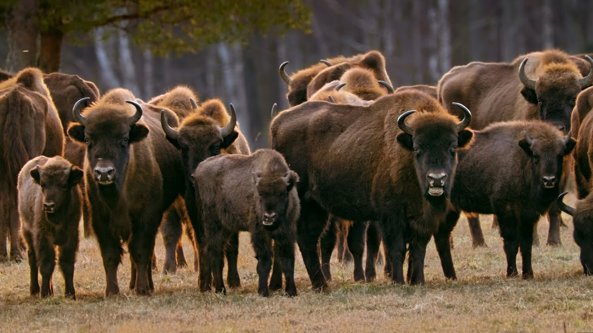
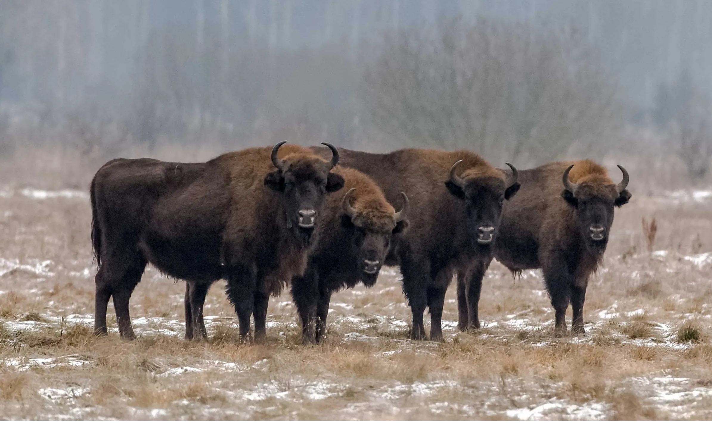
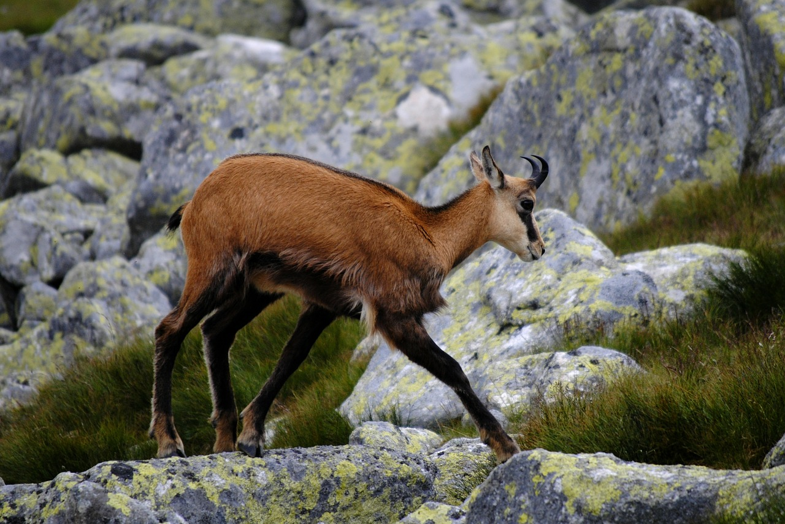
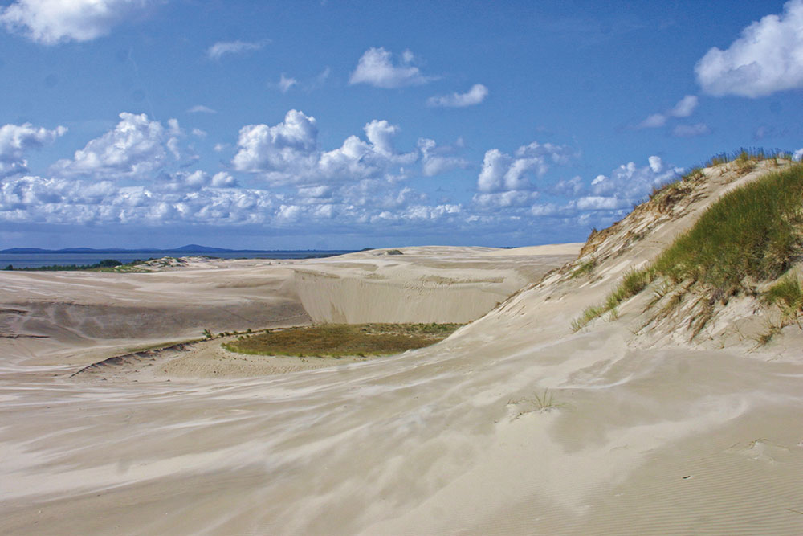
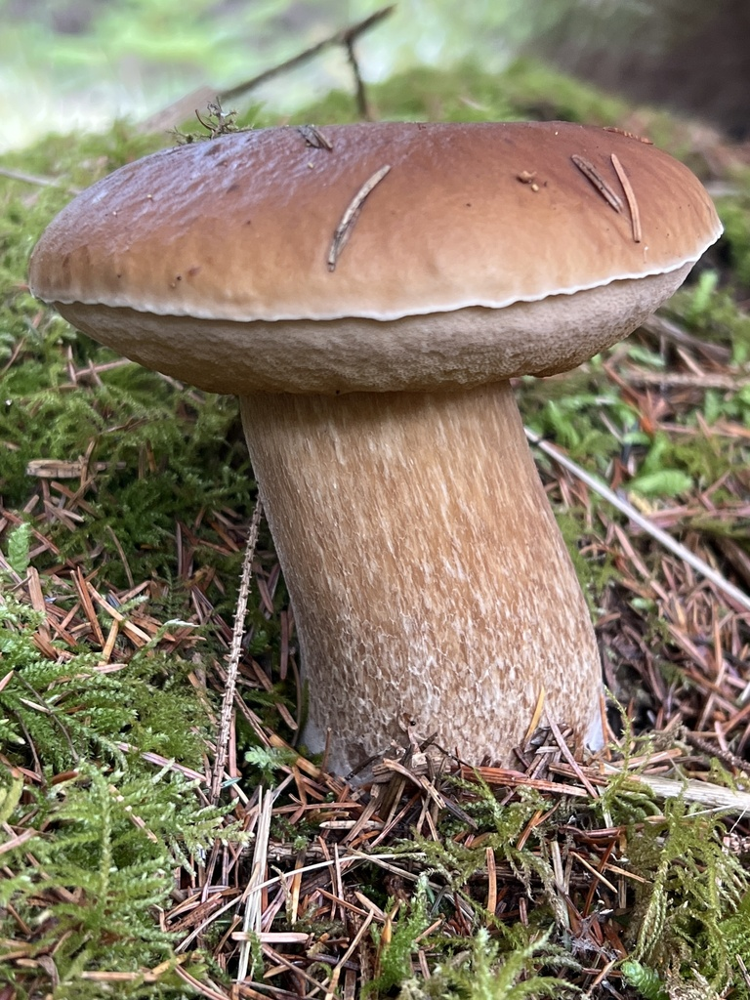

# Natura — Polonia
La Polonia è un mosaico naturale sorprendentemente vario, dove il 30% del territorio è ancora coperto da foreste.
Dalla foresta primordiale di Białowieża alle creste alpine dei Tatra, dai pantani sconfinati della Biebrza alle dune mobili del Baltico, il Paese ospita oltre mille specie di piante vascolari e più di dodicimila specie animali.
È anche una terra di grandi migrazioni: le cicogne bianche affollano i cieli estivi, le gru si radunano in palude e i bisonti europei dominano le radure con l’arrivo dell’autunno.
Per il viaggiatore naturalista, la Polonia offre stagioni scandite da spettacoli naturali unici, reti di sentieri ben segnalati e una ricca tradizione di tutela ambientale.
Di seguito, una guida enciclopedica estremamente dettagliata per comprendere, osservare e rispettare questi ambienti.

## Flora

### Foreste primordiali di Białowieża e piane centro-orientali
La foresta di Białowieża, al confine con la Bielorussia, è l’ultima grande foresta primigenia di pianura in Europa.
Qui convivono querce plurisecolari (500+ anni), tigli, carpini e abeti rossi su suoli antichi poco disturbati, ricchi di legno morto e microhabitat.
Primavere esplosive di fioriture effimere (anemoni, aglio orsino) cedono il posto a un sottobosco estivo ombroso, abitato da felci e muschi igrofili.
I tronchi marcescenti ospitano funghi lignicoli e licheni rari, indicatori di continuità forestale.

  

  

- **Quercia farnia (*Quercus robur*, dąb szypułkowy)**  
  Albero maestoso con tronco che può superare i 1,5-2 m di diametro e chioma espansa; foglie lobate con picciolo corto, ghiande peduncolate.  
  Specie habitat-former: le cavità nei tronchi vetusti ospitano chirotteri e insetti saproxilici; radure con querce monumentali sono punti d’osservazione privilegiati per i picchi.  
  Dove/Quando: Białowieża e foreste miste di pianura; tutto l’anno, al meglio in primavera per fioriture del sottobosco e in autunno per frutti e fauna associata.

- **Tiglio nostrano (*Tilia cordata*, lipa drobnolistna)**  
  Corteccia grigio-brunastra, foglie cordiformi piccole con pagina inferiore più chiara, fiori profumati nettariferi in giugno-luglio.  
  Attira impollinatori (api, sirfidi); fondamentale per il miele di tiglio polacco; fornisce ombra densa essenziale in microclimi forestali.  
  Dove/Quando: pianure e basse colline; in fiore a inizio estate, ottimo per ascoltare il ronzio degli impollinatori.

- **Carpino bianco (*Carpinus betulus*, grab zwyczajny)**  
  Tronco fusiforme con corteccia liscia grigiastra e fusti scanalati; foglie ellittiche a margine doppiamente seghettato; frutti con brattee trilobate.  
  Tollerante all’ombra, struttura la fascia sub-canopy; il legno duro sostiene cavità per uccelli.  
  Dove/Quando: comune in Białowieża e colline della Masovia; visibile tutto l’anno, riconoscibile d’inverno per i semi persistenti.

- **Abete rosso (*Picea abies*, świerk pospolity)**  
  Conifera slanciata con rami penduli e coni bruno-rossastri; aghi acuti ben inseriti; corteccia sfaldata in placche.  
  Fornisce siti di nidificazione a rapaci e corvidi; sensibile al bostrico, che modella dinamiche di mortalità naturale.  
  Dove/Quando: piane umide e altitudini più elevate; inverno ideale per tracciare fauna su letti di aghi.

- **Frassino maggiore (*Fraxinus excelsior*, jesion wyniosły)**  
  Albero alto con gemme nere opposte, foglie composte; chiome eleganti su suoli freschi.  
  Minacciato da patologie (chalarosi); fondamentale ripristinare eterogeneità genetica locale.  
  Dove/Quando: valli fluviali e margini umidi; primavera per foglie emergenti e uccelli canori associati.

### Flora alpina e subalpina dei Tatra

Le cime dei Tatra segnano il tetto della Polonia con piani altitudinali ben distinti.
Sotto la linea delle creste, la fascia di pino mugo protegge i suoli dall’erosione, mentre prati alpini fioriscono brevemente tra nevai residui e rocce.

  

- **Stella alpina dei Carpazi (*Leontopodium alpinum*, szarotka alpejska)**  
  Piccola perenne con capolini bianchi-pelosi, brattee tomentose a stella; cresce su rupi calcaree e prati aridi.  
  Simbolo della flora alpina, rara e protetta; impollinata da lepidotteri di quota.  
  Dove/Quando: Tatra Occidentali su affioramenti calcarei; giugno-agosto con accesso solo su sentieri segnati.

- **Genziana acaule (*Gentiana acaulis*, goryczka bezłodygowa)**  
  Trombe blu intenso appoggiate al suolo, calice verde, corolla con macchiettature; foglie basali spatolate.  
  Fiorisce al disgelo, importante per bombi di alta quota.  
  Dove/Quando: prati e cenge subalpine 1.500–2.000 m; fine maggio-luglio, nelle mattine soleggiate.

- **Papavero dei Tatra (*Papaver alpinum* subsp. *tatricum*, mak tatrzański)**  
  Petali giallo-oro, steli gracili, capsule allungate; adattato a suoli poveri e venti forti.  
  Endemismo tatrico, indicatore di habitat prioritari.  
  Dove/Quando: ghiaioni calcarei e detriti; giugno-agosto.

- **Pino mugo (*Pinus mugo*, kosodrzewina)**  
  Arbusto contorto, aghi in coppie, rami prostrati che intrappolano neve e sedimenti.  
  Chiave contro valanghe e deflussi; rifugio per galliformi di montagna.  
  Dove/Quando: fascia subalpina 1.500–1.800 m; tutto l’anno, con fioritura discreta a tarda primavera.

### Coste baltiche, dune e retrodune

Le dune di Słowiński (alte fino a 40+ m) migrano 3–10 m/anno spinte dai venti, creando un deserto effimero tra mare e foreste costiere.
La vegetazione psammofila stabilizza i versanti sottovento, mentre il rokitnik colora d’arancio le retrodune in autunno.

  

- **Sparto delle sabbie (*Ammophila arenaria*, piaskownica zwyczajna)**  
  Graminacea con foglie arrotolate, rizomi profondi, colonizza sabbie mobili.  
  Pioniere essenziale nella fissazione dunale; tollera salinità e secchezza estrema.  
  Dove/Quando: tutto l’anno, massima evidenza nelle creste attive di Słowiński e Hel.

- **Olivello spinoso (*Hippophae rhamnoides*, rokitnik zwyczajny)**  
  Arbusto spinoso con bacche arancioni ricche di vitamina C; foglie argentee.  
  Cibo invernale per uccelli; utile contro l’erosione.  
  Dove/Quando: retrodune e scarpate, fruttifica agosto-dicembre.

- **Pino silvestre (*Pinus sylvestris*, sosna zwyczajna)**  
  Chioma aperta, corteccia arancio-rossastra in alto; aghi azzurro-verdi; specie dominante nelle foreste costiere e sabbiose interne.  
  Fornisce semi a crocieri e scoiattoli; resiliente al vento salmastro.  
  Dove/Quando: tutto l’anno; ottimi scorci al tramonto sulle dune.

- **Cardo marittimo (*Eryngium maritimum*, mikołajek nadmorski)**  
  Emblema delle spiagge selvagge: foglie coriacee blu-verdi, infiorescenze spinose azzurre.  
  Minacciato dal calpestio; strettamente protetto.  
  Dove/Quando: cordoni dunali maturi; estate.

### Funghi e licheni delle foreste mature

- **Porcino (*Boletus edulis*, borowik szlachetny)**  
  Cappello bruno, pori bianchi poi olivastri, gambo tozzo con reticolo chiaro, carne bianca immutabile e odore di nocciola.  
  Micorrizico con faggi, querce, abeti; stagionalità luglio-ottobre, specialmente dopo piogge calde.  
  Dove/Quando: foreste miste di tutta la Polonia; mattine umide.  

Tabella di identificazione — Porcino e sosia
| Carattere | Porcino (edulis) | Sosia: Fungo di fiele (Tylopilus felleus) | Sosia: Porcino del diavolo (Rubroboletus satanas) |
|---|---|---|---|
| Pori | Bianchi→oliva, non blu | Rosa sporale, gusto amarissimo | Gialli→rossi, spesso blu alla pressione |
| Gambo | Reticolo chiaro fine | Reticolo scuro marcato | Massiccio con tinte rosse |
| Carne | Bianca, non vira | Bianca, amara | Spesso vira al blu |
| Edibilità | Eccellente | Non commestibile (amaro) | Velenoso |

- **Finferlo (*Cantharellus cibarius*, kurka/pieprznik jadalny)**  
  Cappello imbutiforme giallo uovo, pieghe anastomosate al posto di lamelle, odore fruttato d’albicocca, carne elastica.  
  Fruttifica giugno-ottobre, in pinete e faggete ariose.  
  Dove/Quando: Pomorze, Masuria, Carpazi; dopo piogge estive.  

Tabella di identificazione — Finferlo e sosia
| Carattere | Finferlo (Cantharellus) | Sosia: Falso finferlo (Hygrophoropsis aurantiaca) |
|---|---|---|
| Lamelle | Pieghe smussate, decorrenti | Vere lamelle sottili e fitte |
| Odore | Fruttato (albicocca) | Debole o fungino |
| Colore | Giallo uniforme | Arancio più acceso, cappello spesso vellutato |
| Edibilità | Commestibile | Sconsigliato (disturbi GI) |

- **Lattario delizioso (*Lactarius deliciosus*, rydz)**  
  Cappello arancio con zonature concentriche, latticello arancio che vira al verde, lamelle decorrenti.  
  Associazioni con pino; eccellente commestibile tradizionale.  
  Dove/Quando: pinete sabbiose; settembre-ottobre.  

Tabella di identificazione — Rydz e sosia
| Carattere | L. deliciosus | Sosia: L. torminosus (mleczaj wełnianka) |
|---|---|---|
| Lattice | Arancio→verde | Bianco acre |
| Superficie cappello | Liscia, zonata | Vellutata, pelosa ai margini |
| Sapore | Dolce, resinoso | Acre, irritante |
| Edibilità | Commestibile | Non commestibile (irritante) |

- **Amanita muscaria (*Amanita muscaria*, muchomor czerwony)**  
  Iconico cappello rosso con verruche bianche, anello e volva; tossico neuroattivo.  
  Habitat: betulle e conifere; foto straordinarie in settembre-ottobre.  
  Dove/Quando: diffuso; da non consumare.

- **Lichene “barba d’albero” (*Usnea* spp., brodaczka)**  
  Fruticoso, grigio-verde, pioniere su rami in aria pulita; indicatore di qualità dell’aria.  
  Dove/Quando: boschi antichi e coste ventose; tutto l’anno.

Consigli di sicurezza funghi: raccogliere solo specie identificate con certezza, evitare esemplari vecchi o prossimi a strade, usare guide locali e rispettare i limiti delle aree protette.

## Fauna

### Mammiferi iconici e grandi carnivori
- **Bisonte europeo (*Bison bonasus*, żubr)**  
  Il più grande mammifero terrestre europeo: maschi 600–900 kg, femmine 400–600 kg, spalla alta con gibbosità, mantello bruno scuro.  
  Comportamento gregario in branchi matrilineari; la stagione degli amori (agosto-settembre) porta a scontri tra maschi.  
  Stato di conservazione: Quasi Minacciato; in Polonia >2.000 individui con >800 a Białowieża (circa 25% della popolazione mondiale).  
  Dove/Quando: Radure e margini forestali di Białowieża; in inverno si avvicinano ai punti di foraggiamento, visibilità ottima al mattino.

- **Orso bruno (*Ursus arctos*, niedźwiedź brunatny)**  
  Maschi 150–350 kg, femmine più piccole; pelliccia bruna variabile; tracce con impronte plantigrade e graffi su alberi.  
  In Polonia ~200 individui, concentrati nei Tatra e nei Beskidi; onnivoro, pratica iperfagia in autunno e tana invernale.  
  Dove/Quando: Tatra, sentieri meno battuti; alba/crepuscolo in tarda estate-autunno. Mantenere distanza, custodire il cibo.

- **Lupo grigio (*Canis lupus*, wilk szary)**  
  Branchi familiari, ululati territoriali; impronte allungate; preda principale cervi e cinghiali.  
  Popolazione in aumento (circa 2.000 individui), specie protetta dal 1998.  
  Dove/Quando: Białowieża, Bieszczady, Note: tracce invernali su neve, osservazioni rare ma possibili con guide.

- **Lince eurasiatica (*Lynx lynx*, ryś)**  
  Felino elusivo con orecchie a pennello, coda corta maculata; solitaria, attiva al crepuscolo.  
  In Polonia 150–300 individui, preferisce foreste mature con abbondanza di caprioli.  
  Dove/Quando: Carpazi, Pomerania; osservazione difficile, cercare segni e fototrappole in tour guidati.

- **Alce/Elk europeo (*Alces alces*, łoś)**  
  Cervide massiccio con palchi palmati nei maschi, muso allungato e gibbosità al garrese; eccellente nuotatore.  
  Predilige torbiere e foreste umide di pianura; popolazione nazionale nell’ordine delle decine di migliaia.  
  Dove/Quando: Biebrza e Polesie; alba autunnale (settembre-ottobre, periodo di bramito) per incontri silenziosi.

- **Castoro europeo (*Castor fiber*, bóbr europejski)**  
  Ingegnere ecosistemico: costruisce dighe e tane, incisivi arancioni, coda appiattita.  
  Popolazione fortemente in crescita (>100.000), crea zone umide che aumentano biodiversità.  
  Dove/Quando: Lenti corsi d’acqua e laghi (Masuria, Vistola); al tramonto, tracce di rosicchiature coniche.

- **Camoscio dei Tatra (*Rupicapra rupicapra tatrica*, kozica tatrzańska)**  
  Sottospecie endemica, corporatura agile, corna ad uncino in entrambi i sessi; muta invernale scura.  
  Totale transfrontaliero ~1.500 individui, in Polonia 300–400.  
  Dove/Quando: creste rocciose e pendii erbosi >1.700 m; mattine limpide d’estate e autunno.

- **Marmotta dei Tatra (*Marmota marmota latirostris*, świstak tatrzański)**  
  Roditore sociale con fischi di allarme, iberna 6–7 mesi; scava complesse tane.  
  Reintrodotta con successo; colonie visibili ai margini dei prati alpini.  
  Dove/Quando: Tatra alti, giornate soleggiate di luglio-agosto.

- **Cinghiale (*Sus scrofa*, dzik)**  
  Greggi matriarcali, striature giovanili; onnivoro, scava il suolo cercando bulbi e larve.  
  Diffusissimo; osservabile in radure serali, con prudenza.

- **Cervo nobile (*Cervus elaphus*, jeleń szlachetny)**  
  Maschi con maestosi palchi; bramito potente in settembre-ottobre.  
  Ampi boschi e radure di tutta la Polonia; appostamenti all’alba/crepuscolo.

### Uccelli delle pianure, paludi e montagne

- **Cicogna bianca (*Ciconia ciconia*, bocian biały)**  
  52.000+ coppie nidificanti, prima popolazione UE; nidi su pali e tetti dei “villaggi delle cicogne”.  
  Insetti, anfibi e piccoli roditori come dieta; migrazione agosto-settembre via la “rotta orientale”.  
  Dove/Quando: campi e prati di Warmia-Masuria e Podlachia; migliori osservazioni in giugno-luglio con pulli al nido.

- **Aquila di mare codabianca (*Haliaeetus albicilla*, bielik)**  
  Apertura alare 200–240 cm, becco giallo imponente, coda bianca negli adulti.  
  In ripresa con ~1.500 coppie; caccia pesci e anatre in laghi e coste baltiche.  
  Dove/Quando: laghi masuri, delta Vistola, Pomerania; inverno per posatoi su ghiaccio.

- **Forapaglie acquatico (*Acrocephalus paludicola*, wodniczka)**  
  Passeriforme globalmente minacciato, striature fini e canto vibrante; nidifica in canneti e carici bassi.  
  La Biebrza ospita una quota significativa della popolazione mondiale riproduttiva.  
  Dove/Quando: fine maggio-luglio nelle paludi sfalciate tradizionalmente.

- **Re di quaglie (*Crex crex*, derkacz)**  
  Corpo tozzo, striature brune, canto “crex-crex” notturno; specie legata a prati sfalciati tardivamente.  
  Dove/Quando: piane alluvionali e prati di Biebrza, Narew; maggio-luglio, ascolto notturno.

- **Aquila reale (*Aquila chrysaetos*, orzeł przedni)**  
  Rara, poche decine di coppie nei Carpazi; predilige pareti rocciose e praterie alpine.  
  Dove/Quando: Tatra e Beskidi; voli nuziali in febbraio-marzo.

- **Gallo forcello (*Lyrurus tetrix*, cietrzew)**  
  Maschi neri con sopraccoda bianchi e “forcelle” caudali; lek primaverili spettacolari.  
  Habitat: torbiere e brughiere; in declino, protezione rigorosa.  
  Dove/Quando: Podlasia e Carpazi; aprile all’alba con guide autorizzate.

- **Gallo cedrone (*Tetrao urogallus*, głuszec)**  
  Grande tetraonide forestale, parate nuziali rumorose; necessita di foreste mature con mirtilli.  
  Dove/Quando: Beskidi e Bieszczady; osservazione solo tramite programmi di conservazione.

- **Gru cenerina (*Grus grus*, żuraw)**  
  Altezza fino a 120 cm, trombettate cavernose; grandi raduni migratori su pantani e stoppie.  
  Dove/Quando: Biebrza e valle della Varta; agosto-ottobre per concentrazioni serali.

- **Aquila minore/Orlik (*Clanga pomarina*, orlik krzykliwy)**  
  Rapace di medie dimensioni, predilige mosaici di boschi e prati umidi.  
  Dove/Quando: Polonia orientale; aprile-settembre.

### Rettili e anfibi
- **Vipera comune (*Vipera berus*, żmija zygzakowata)**  
  Corpo tozzo 50–70 cm, disegno dorsale a zig-zag; velenosa ma schiva.  
  Habitat: brughiere, margini forestali, torbiere; attiva in giornate soleggiate primaverili.  
  Sicurezza: stivali alti, non maneggiare; morsi rari.

- **Natrice dal collare (*Natrix natrix*, zaskroniec zwyczajny)**  
  Serpente non velenoso, collare giallo chiaro, ottima nuotatrice; si nutre di anfibi.  
  Dove/Quando: zone umide di pianura; primavera-estate.

- **Testuggine palustre europea (*Emys orbicularis*, żółw błotny)**  
  Rara, carapace scuro macchiettato, abita stagni soleggiati e torbiere.  
  Dove/Quando: Polesie e Biebrza; maggio-luglio su tronchi emersi.

- **Ululone dal ventre rosso (*Bombina bombina*, kumak nizinny)**  
  Chiamata inconfondibile, ventre arancio-nero; indica acque pulite basse.  
  Dove/Quando: stagni e fossi soleggiati; tarda primavera-estate.

### Invertebrati notevoli
- **Cervo volante (*Lucanus cervus*, jelonek rogacz)**  
  Maschio con mandibole “a palco”, adulto al crepuscolo; larve saproxiliche in querce vetuste.  
  Dove/Quando: boschi di latifoglie antichi; giugno-luglio.

- **Apollo (*Parnassius apollo*, niepylak apollo)**  
  Farfalla bianca con ocelli rossi; popolazione reintrodotta nei Pieniny.  
  Dove/Quando: pendii calcarei fioriti; luglio-agosto.

- **Rosalia alpina (*Rosalia alpina*, nadobnica alpejska)**  
  Cerambicide grigio-azzurro con macchie nere; legato a faggi morti in piedi.  
  Dove/Quando: faggete dei Carpazi; estate calda.

Consigli pratici fauna: binocoli 8–10x, vestiario mimetico e silenzio.
Attenzione a zecche (Borreliosi/ENCE): pantaloni lunghi, repellenti e controllo al rientro.
Uso di capanni autorizzati in paludi e rispetto delle distanze minime dai nidi.

## Geologia

### Tatra e Carpazi: graniti, calcari e ghiacciai fossili
Il massiccio dei Tatra, culmine dei Carpazi in Polonia, presenta un nucleo di graniti e gneiss sormontato da coltri calcaree e dolomitiche.
L’azione glaciale quaternaria ha scolpito circhi, morene e valli a U, con laghi turchesi come Morskie Oko e Czarny Staw.
Processi carsici nel calcare hanno creato grotte celebri (Mroźna, Mylna, Bielska sul lato slovacco).
Le faglie e i gradienti altitudinali favoriscono frane e colamenti detritici, con coltri di blocchi stabilizzate dalla kosodrzewina.

### Pianure glaciali e Paese dei Mille Laghi (Masuria)
Le pianure polacche derivano da alternanze di avanzate glaciali e ritiri, con colline moreniche, drumlin, eskers e kame.
I laghi della Masuria (oltre 2.000 bacini) occupano cavità di ghiaccio morto, circondati da torbiere e foreste.
Massi erratici di granito scandinavo punteggiano i paesaggi come reliquie del trasporto glaciale.

### Costa baltica, dune mobili e ambra
Le coste sabbiose sono alimentate dal trasporto litoraneo e dai fiumi.
A Słowiński, dune vive alte >40 m migrano sotto l’azione dei venti occidentali, seppellendo gradualmente foreste e rivelando tronchi subfossili.
Il Baltico deposita ambra (succinite eocenica) dopo mareggiate: frammenti si accumulano su spiagge e battigia.
Falesie sabbioso-argillose e tratti lagunari (ślady di “mierzeja”) disegnano un litorale dinamico.

### Miniere di sale: Wieliczka e Bochnia
Sotto Cracovia, spessi letti di evaporiti mioceniche (alite e gesso) furono scavati per secoli creando cattedrali sotterranee.
Camere scolpite nel sale, gallerie ventilate e un microclima stabile ospitano laghi salini ipersaturi.
Il patrimonio geologico-culturale si integra con fenomeni speleogenetici secondari (stalattiti saline).

### Altopiano di Cracovia-Częstochowa e Pieniny: la “Jura” polacca
Affioramenti di calcari giurassici formano torri, archi e doline; ricchezza di grotte (Łokietka, Ciemna).
Nei Pieniny, gole come la Dunajec Canyon incidono calcari mesozoici creando versanti soleggiati per l’Apollo e pino nero relitto.

## Fenomeni Naturali

### Migrazioni e grandi raduni
Ad agosto-settembre le cicogne bianche si radunano in grandi “sejmiki” prima di partire lungo la rotta orientale.
Le gru concentrano migliaia di individui nelle paludi della Biebrza e nelle valli fluviali.
Anatre e oche sostano in massa nei laghi masuri durante le rotte autunnali e primaverili.

### Stagioni del bramito e della “rut”
A settembre-ottobre echeggia il bramito dei cervi nei boschi collinari.
Ad agosto-settembre i maschi di bisonte si confrontano per l’accesso alle vacche.
Gli alci entrano in attività tra fine settembre e ottobre, con incontri all’alba nelle torbiere.

### Venti di föhn dei Tatra: l’Halny
Il vento caldo e secco “halny” provoca repentini aumenti termici, essiccamenti e raffiche impetuose in autunno-primavera.
Attenzione a improvvisi cambi di meteo in quota, con temporali rapidi e grandinate.

### Piene primaverili, nebbie e l’inverno baltico
La Biebrza vive spettacolari alluvioni primaverili che trasformano la valle in un “mare interno”.
Nebbie mattutine persistenti creano scenari fotografici; inverni rigidi gelano laghi e canali, attirando aquile e cigni su aperture d’acqua.
Sulla costa, dopo le mareggiate invernali, la ricerca dell’ambra è più fruttuosa.

### Dune in movimento e “Złota Polska Jesień”
Le dune di Słowiński cambiano profilo ogni stagione, con fianchi sottovento increspati da ripple marks.
L’autunno regala la “dorata autunnale polacca”: betulle e aceri infiammano i boschi tra fine settembre e ottobre.

Consigli pratici fenomeni: usare app meteo locali (IMGW), prepararsi a repentine variazioni di quota e vento, portare ramponcini invernali e bastoncini in palude durante le piene.

## Ecosistemi

### Foresta primordiale di Białowieża
Struttura multilivello con alberi vetusti, legno morto abbondante (fino a >150 m³/ha), radure dinamiche e microhabitat di continuità.
Catene trofiche complesse: picchi (nero, tridattilo) perforano il legno, coleotteri saproxilici (es. Rosalia alpina) decompongono tronchi, funghi lignicoli riciclano nutrienti.
Presenza di grandi mammiferi (żubr, lupo, lince) testimonia l’integrità ecologica.
Minacce/gestione: dibattiti sul bostrico e gestione del legno morto; aree core rigorosamente protette.
Visita: sentieri marcati, visite guidate nelle zone di massima protezione, migliori luci all’alba; inverno per tracce su neve.

### Zone umide della Biebrza e del Narew
Il più grande complesso di torbiere e paludi dell’Europa centrale, con fen, raised bog e canali tortuosi.
Specie chiave: forapaglie acquatico, alce, aquile minori, castoro.
Servizi ecosistemici: stoccaggio di carbonio nei depositi torbosi, laminazione delle piene, rifugio per migratori.
Minacce/gestione: drenaggi storici, incendi torbosi; gestione attraverso sfalcio tradizionale e ripristino idraulico.
Visita: passerelle e torri d’osservazione, stivali alti in primavera, zanzariere in estate, silenzio per ascolto del derkacz notturno.

### Ambienti alpini e subalpini dei Tatra
Zonazione altitudinale dalla foresta montana (abete rosso, faggio) alla fascia di pino mugo e ai prati alpini.
Fauna specializzata: camoscio dei Tatra, marmotta, aquila reale; flora con endemismi (papavero tatrico).
Rischi naturali: valanghe, temporali rapidi, albedo della neve in primavera.
Visita: sentieri ben segnalati TPN, partire presto, monitor valanghe, bastoncini e strati tecnici; rispettare la fauna lasciando distanze >100 m.

### Dune costiere e retrodune di Słowiński
Successione psammofila: battigia (salicornie e alghe spiaggiate), dune embrionali (Ammophila), dune grigie stabilizzate (licheni e Armeria), retrodune con rokitnik e pinete.  
Fauna: limicoli, sterne, talvolta foche grigie (Halichoerus grypus) avvistate lungo la costa.  
Dinamica: dune migrate annualmente, sentieri variabili; aree chiuse in nidificazione per proteggere uccelli costieri.  
Visita: accessi da Łeba e Czołpino, acqua e protezioni UV, evitare il calpestio dei versanti mobili; migliore luce al mattino o tardo pomeriggio.

### Piane alluvionali di Vistola (Wisła) e Oder (Odra)
Reti di canali secondari, isole sabbiose, saliceti e boschi igrofili (ontani, pioppi neri).
Specie: sterne, gabbiani, castori, martin pescatore; corridoi migratori est-ovest.  
Minacce: rettificazioni e arginature; opportunità di rinaturazione e gestione adattativa dei livelli idrici.  
Visita: tratti naturali presso Varsavia, Toruń e Kazimierz Dolny; canoe e birdwatching da rive sabbiose con rispetto delle zone di nidificazione.

### Laghi e foreste della Masuria
Mosaico di laghi oligotrofici e mesotrofici con canneti e ninfee; boschi misti su morene.  
Pesci: luccio, persico, coregoni; rapaci ittiofagi come falco pescatore (Pandion haliaetus).  
Pressioni turistiche estive gestite con corridoi di navigazione e aree di quiete.  
Visita: tempi migliori maggio-giugno per uccelli in canto, settembre per cieli limpidi e quiete; kayak e vela responsabili.

Consigli generali per il viaggiatore naturalista:  
- Stagionalità: primavera per canti e fioriture, estate per ricchezza di insetti e funghi precoci, autunno per colori e ruti, inverno per tracce e rapaci.  
- Sicurezza: meteo variabile, mappa offline, acqua e strati termici; in montagna informare del percorso e controllare bollettini valanghe.  
- Etica: restare sui sentieri, minimizzare il disturbo, non dare cibo alla fauna, raccolta funghi solo dove consentito e in quantità regolamentate.  
- Salute: protezione da zecche e sole, calzature impermeabili per paludi, bastoncini su terreni mobili/dunali.

Fonti e Riferimenti: Parco Nazionale di Białowieża, Parco Nazionale Biebrzański, Tatrzański Park Narodowy, Słowiński Park Narodowy, Lasy Państwowe (Foreste di Stato Polacche), IMGW-PIB (Istituto Meteorologico e Idrologico), IUCN Red List, letteratura scientifica e banche dati floristiche/faunistiche nazionali.