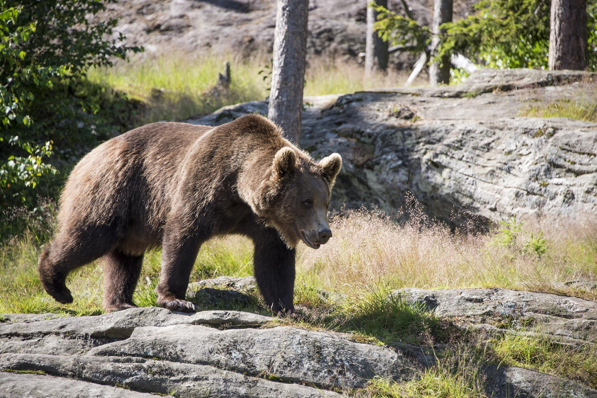
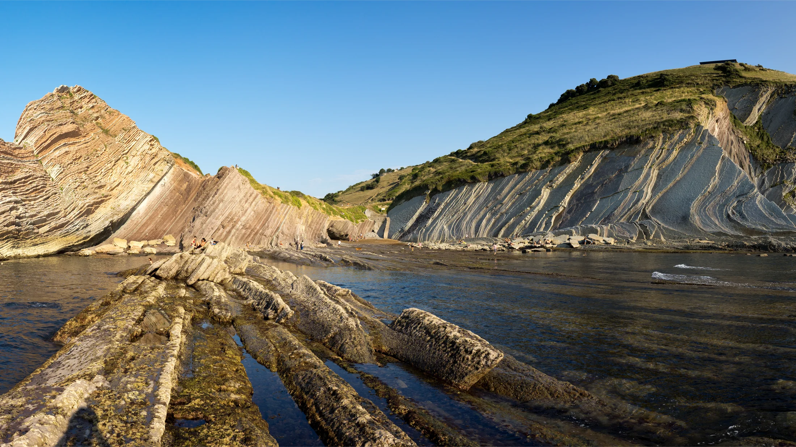

# Natura — Spagna
La “España Verde” cantabrica (Paesi Baschi, Cantabria, Asturie e León atlantica) è un mosaico sorprendente di foreste temperate umide, pendii calcarei scoscesi, praterie alpine, falesie stratificate e canyon sottomarini. Qui il clima oceanico alimenta boschi di faggio e quercia coperti di muschi, mentre in quota i Picos de Europa, massiccio calcareo frastagliato, ospitano endemismi botanici e il rebeco cantabrico. Lungo la costa, i flysch del litorale basco aprono pagine di 60 milioni di anni della storia della Terra, e nel Golfo di Biscaglia canyon profondi attirano balene e zifi. Pioggia fine (orbayu), nebbie costiere, tempeste atlantiche e tramonti con “green flash” modellano i ritmi di questa striscia verde, così diversa dal resto della Penisola Iberica.

## Flora

### Foreste atlantiche cantabriche (faggete e querceti “verdi”)
- - - 
- - **Faggio europeo (Fagus sylvatica, “haya”, basco: “pagoa”)**
  Aspetto: albero fino a 35-40 m, tronco grigio liscio, chioma densa a cupola; foglie ellittiche 6-10 cm, margine leggermente ondulato, verde lucido che vira a rame-oro in autunno. Corteccia sottile, sensibile a incisioni e gelo tardivo.
  Ecologia e comportamento: forma boschi ombrosi con suolo acido ricco di lettiera; in atmosfera umida sviluppa cortine di muschi, felci e licheni (Lobaria pulmonaria come indicatore d’aria pulita). In Cantabria e Asturie occupa dorsali tra 600-1.600 m, spesso mescolato a acebo (Ilex aquifolium).
  Dove e quando: faggete mature a Redes, Somiedo, Saja-Besaya, Monte Deva; foliage di picco tra metà ottobre e inizio novembre; primavera (maggio) con foglie “traslucide”.
  Consigli: sentieri fangosi—scarponi impermeabili; in orbayu portare guscio traspirante.
- **Rovere sessile (Quercus petraea, “roble albar”, asturiano: “carbayu albar”)**
  Aspetto: 25-35 m, tronco massiccio, corteccia grigio-bruna fessurata; foglie obovate a lobi poco profondi, picciolo distinto; ghiande sessili in coppie. Legno duro impiegato storicamente in botti e travature.
  Ecologia: predilige suoli acidi ben drenati, spesso in mosaico con faggio e betulla su creste fresche; supporta ricche comunità micorriziche (porcini, lattari).
  Dove e quando: dorsali interne di Picos de Europa (versanti umidi), valle del Nalón, Cuera; migliore lettura della chioma a inizio giugno.
- **Castagno europeo (Castanea sativa, “castaño”, asturiano: “castañu”)**
  Aspetto: fino a 30 m, tronco grande con “castañares” vetusti, foglie lanceolate seghettate, frutti in ricci spinosi. Fiori maschili a spiga profumati in giugno.
  Ecologia: coltivato e inselvatichito; fornisce cavità per mustelidi e rapaci; sensibile a malattie (cancro corticale, inchiostro). Produzione di castagne utile a fauna (orsi in iperfagia).
  Dove e quando: Somiedo, Oscos, Allande; fioritura giugno-luglio, raccolta castagne ottobre.
- **Betulla pubescente (Betula pubescens, “abedul”)**
  Aspetto: corteccia bianca con lenticelle, rami sottili; foglie triangolari 4-7 cm; specie pioniera su suoli acidi e torbosi, spesso ai margini di torbiere e ruscelli.
  Ecologia: colonizza schiarite post-tempesta; ospita funghi corticioidi e cianobatteri epifiti che arricchiscono il suolo.
  Dove e quando: altipiani umidi della cordigliera cantabrica; splendida in controluce invernale.
- **Agrifoglio (Ilex aquifolium, “acebo”)**
  Aspetto: sempreverde 5-15 m, foglie coriacee lucide con spine, bacche rosse in inverno (tossiche per l’uomo, vitali per tordi e merli).
  Ecologia: specie ombrofila nei sottoboschi di faggio e quercia; rifugio invernale per passeriformi.
  Dove e quando: riserve di Muniellos (permessi limitati), Redes; massima visibilità dicembre-febbraio.

  

### Macchia costiera e leccete su calcare
- **Leccio (Quercus ilex subsp. ilex, “encina cantábrica”)**
  Aspetto: sempreverde 10-20 m, foglie variabili (spinose da giovani, intere da adulte), ghiande ovali; corteccia scura rugosa.
  Ecologia: forma “encinares” su falesie e pendii calcarei esposti a salsedine; tollera venti marini, crea microclimi caldi in cui crescono liane (Hedera helix) e sclerofille (Phillyrea latifolia).
  Dove e quando: falesie di Deba-Zumaia, Urdaibai (zone interne calcaree), costa di Castro Urdiales; sempreverde: fronde belle anche in inverno.
- **Ginestrone spinoso (Ulex europaeus, “tojo/argoma”)**
  Aspetto: arbusto spinoso 1-2 m, fiori giallo vivo invernali-primaverili; rami fitti che fissano azoto.
  Ecologia: domina praterie cespugliate costiere; rifugio per l’averla piccola; rischio incendio in estati secche.
  Dove e quando: scogliere ventose basche e cantabriche; massima fioritura marzo-aprile.
- **Brugo cantabrico (Erica vagans, “brezo”)**
  Aspetto: 20-60 cm, fiori rosati in pannocchie tardo-estive; foglie aghiformi.
  Ecologia: acidofila, ama suoli poveri esposti al vento; attrae impollinatori tardivi.
  Dove e quando: alture litoranee tra Getaria e Lekeitio; agosto-settembre.

### Relitti di laurisilva cantabrica (forre umide)
- **Alloro (Laurus nobilis, “laurel”)**
  Aspetto: sempreverde, foglie aromatiche 6-12 cm; fiori giallastri discreti, bacche nere lucide.
  Ecologia: in forre riparie umide, insieme a Prunus lusitanica e Osmunda regalis; microclima oceanico favorisce la persistenza “relictuale” di comunità laurofile.
  Dove e quando: gole ombrose in valle del Sella e del Deva; tutto l’anno, massima fragranza in primavera.
- **Lauro portoghese (Prunus lusitanica, “laurel portugués”)**
  Aspetto: sempreverde 4-10 m, foglie ovali lucide, pannocchie di fiori bianchi profumati.
  Ecologia: raro, indicatore di forre integre e umide; bacche per uccelli.
  Dove e quando: sponde ombrose del Narcea e del Sella; tarda primavera in fiore.

### Praterie e rupi alpine dei Picos de Europa
- **Narciso asturiano (Narcissus asturiensis, “narciso enano”)**
  Aspetto: perenne bulbosa 8-15 cm; fiore giallo intenso con corona prominente, spunta tra la neve tardiva.
  Ecologia: endemico della Cordigliera Cantabrica nord-occidentale; fiorisce in tappeti su praterie innevate in fusione.
  Dove e quando: altipiani tra Lagos de Covadonga e Vega de Ario; marzo-aprile.
- **Genzianella primaticcia (Gentiana verna subsp. cantabrica, “genciana”)**
  Aspetto: rosette basali, fiori stellati blu cobalto 1,5-2,5 cm.
  Ecologia: pascoli alpini calcarei, indicatrice di suoli poveri non concimati.
  Dove e quando: cornici di calcare di Peña Santa; maggio-giugno.
- **Ginepro nano (Juniperus communis subsp. alpina, “enebro rastrero”)**
  Aspetto: prostrato, aghi pungenti, gàlbuli blu-neri aromatici.
  Ecologia: consolidatore di pendii pietrosi, rifugio per passeriformi alpini.
  Dove e quando: creste ventose sopra 1.800 m; tutto l’anno.

### Specie alloctone e piantagioni
- **Eucalipto azzurro (Eucalyptus globulus, “eucalipto”)**
  Aspetto: albero alto 40-60 m, foglie giovanili opposte bluastre, adulte falciformi; corteccia che si sfoglia in placche.
  Ecologia: piantagioni per cellulosa lungo la costa astur-gallega; crescita rapida, aumenta rischio d’incendio e riduce biodiversità rispetto ai boschi autoctoni.
  Dove e quando: dorsali costiere tra Avilés e Navia; visibile tutto l’anno.
  Nota gestione: contestato a livello locale; aree protette favoriscono rimozione a favore di querce e faggi.

### Funghi dei boschi umidi (identificazione e sosia)
- **Porcino (Boletus edulis, “hongo/cep”)**
  Descrizione: cappello bruno nocciola 7-20(25) cm, carnoso; tubuli bianchi poi verdastri; pori fini; gambo tozzo reticolato biancastro; odore di nocciola; commestibile eccellente.
  Habitat e stagione: micorrizico con faggio, rovere e castagno; fine estate-autunno (agosto-novembre) dopo piogge di orbayu.
  Dove: Somiedo, Muniellos (raccolta regolamentata), Saja.
  Tabella di identificazione:
  | Carattere | Boletus edulis | Sosia commestibile | Sosia pericoloso/tossico |
  |---|---|---|---|
  | Cappello | Bruno nocciola, margine chiaro | Boletus reticulatus: più chiaro e reticolato evidente | Rubroboletus satanas: cappello pallido, pori rossi |
  | Pori | Bianchi→oliva, non virano al tocco | Tylopilus felleus: pori rosa, gusto amarissimo | Rubroboletus rhodoxanthus: pori rossi, vira al blu |
  | Gambo | Tozzo, reticolo chiaro all’apice | B. reticulatus: reticolo più scuro e diffuso | R. satanas: pancia bulbosa, colori vivaci |
  | Odore/sapore | Nocciolato, dolce | Simile | Talora fruttato sgradevole (tossici) |
  | Habitat | Faggete/querceti umidi | Simile | Termofili calcarei, più mediterranei |
- **Finferlo/Gallinaccio (Cantharellus cibarius, “rebozuelo”)**
  Descrizione: cappello giallo uovo 3-8 cm, margine lobato, pieghe anastomizzate (non veri lamelle), odore di albicocca; gambo pieno concolore; commestibile pregiato.
  Habitat e stagione: faggete e querceti, suoli acidi; giugno-ottobre dopo piogge.
  Dove: Redes, Parque Natural de las Ubiñas.
  Tabella di sicurezza:
  | Carattere | C. cibarius (commestibile) | Sosia: Hygrophoropsis aurantiaca (falso finferlo, mediamente tossico) | Sosia: Omphalotus olearius (tossico) |
  |---|---|---|---|
  | Lamelle/pieghe | Pieghe spesse, biforcate, scendono sul gambo | Lamelle fitte, sottili, vere | Lamelle fitte, bioluminescenti debolmente |
  | Colore | Giallo uniforme | Arancio più acceso con cappello più sottile | Arancio vivo | 
  | Carne | Soda, profumo d’albicocca | Fragile, odore debole | Fibrosa, cresce su ceppaie |
  | Habitat | Suolo forestale | Lettiera conifere/latifoglie | Ceppaie/ulivi, legno |

### Bacche dei sottoboschi (attenzione ai sosia)
- **Mirtillo europeo (Vaccinium myrtillus, “arándano”)**
  Descrizione: arbusto 10-40 cm, fusti verdi angolosi; foglie ovali finemente seghettate; bacche singole blu-viola che macchiano dita e lingua di viola.
  Ecologia: acidofilo in faggete e brughiera; alimento chiave per orso e uccelli frugivori.
  Dove e quando: sottoboschi di faggio tra 800-1.500 m; giugno-agosto.
  Tabella di identificazione rapida:
  | Carattere | Vaccinium myrtillus (edule) | Atropa belladonna (tossica) | Ligustrum vulgare (tossico) | Daphne mezereum (tossico) |
  |---|---|---|---|---|
  | Portamento | Arbustino basso, foglie sottili | Pianta più alta, foglie grandi intere | Arbusto ramoso, foglie opposte | Arbusto, fiori rosa primaverili |
  | Bacca | Singola, blu che macchia | Nera lucida, non macchia | Nere in grappoli | Rosse lucide |
  | Habitat | Suolo acido in bosco | Radure/strade | Siepi | Boschi umidi |
  | Gusto | Dolce-acidulo | Evitare | Amaro | Evitare |

## Fauna

### Grandi mammiferi cantabrici
- **Orso bruno cantabrico (Ursus arctos arctos, “oso pardo cantábrico”; basco: “hartz”)**
  Aspetto: 80-200 kg (femmine 80-120, maschi 130-200), pelliccia bruno-scura con sfumature mielate; spalle potenti, testa massiccia, andatura plantigrada.
  Ecologia e comportamento: onnivoro opportunista (frutti, bacche di mirtillo, castagne, insetti, carogne); invernamento flessibile (torpore variabile). Riproduzione in tarda primavera, 1-2 cuccioli nati in tana invernale.
  Stato e numeri: popolazione in ripresa ~350 individui (da ~70 negli anni ’90); crescita annua 4-5%; minacce: frammentazione, bracconaggio, collisioni stradali.
  Dove e quando: migliori avvistamenti etici a distanza in Somiedo, Teverga, Proaza (Asturie) e valle de Liébana (Cantabria). Periodi: maggio-giugno (femmine con cuccioli su pendii a mirtillo), settembre-ottobre (iperfagia).
  Consigli: osservare con cannocchiale da 300-1.000 m; mai seguire tracce fresche; restare su sentieri; evitare albe con vento a valle (odore umano in tana).
  
- **Lupo iberico (Canis lupus signatus, “lobo ibérico”; basco: “otso”)**
  Aspetto: 25-40 kg, mantello grigio-bruno con segni scuri su spalle e zampe (“signatus”), maschera facciale chiara; coda nera all’apice.
  Ecologia: branchi di 4-8 individui; dieta da ungulati (caprioli, cinghiali) a carogne; ulula per coesione territoriale.
  Stato e numeri: ~300 in NW spagnolo (nuclei cantabrici), gestione controversa; corridoi ecologici cruciali.
  Dove e quando: Picos de Europa (versanti periferici), Ubiñas-La Mesa; migliori chance all’alba/inverno con neve per tracce; osservazione indiretta (orme, ululati guidati).
  Consigli: usare guide locali; evitare playback; mantenere silenzio e distanza elevata.
- **Rebeco cantabrico (Rupicapra pyrenaica parva, “rebeco”; asturiano: “rebecu”)**
  Aspetto: 20-30 kg, mantello fulvo estivo, invernale scuro; maschi e femmine con corna uncinate 15-25 cm; maschera facciale nera-bianca.
  Ecologia: gregario in branchi; agile su cenge calcaree; bruca graminacee e cuscinetti alpini.
  Stato: popolazioni robuste nei Picos; predazione naturale da lupo e aquila reale su giovani.
  Dove e quando: Ruta del Cares, Vega de Liordes, ampie praterie d’alta quota; mattino presto primavera-estate.

### Rapaci e necrofagi delle rupi
- **Avvoltoio grifone (Gyps fulvus, “buitre leonado”; basco: “sai arrea”)**
  Aspetto: apertura alare 2,4-2,8 m; testa e collo biancastri piumosi, corpo bruno; volo in termiche con ali rigide a “V” bassa.
  Ecologia: necrofago sociale; colonie su falesie calcaree; pulizia ecosistemi rapida su carcasse di ungulati.
  Stato: in espansione nella fascia cantabrica; minacce: collisioni e veleni illegali.
  Dove e quando: Desfiladero de la Hermida, Liébana, Valdeón; voli maestosi nelle ore centrali soleggiate.
- **Capovaccaio (Neophron percnopterus, “alimoche”; basco: “sai zuri”)**
  Aspetto: 1,6-1,7 m di apertura; piumaggio bianco con remiganti nere; volto nudo giallo; usa strumenti (sassi) per rompere uova.
  Stato: in declino; ritorna dall’Africa in marzo, nidifica fino a luglio.
  Dove e quando: valli calcaree di Picos, Sierra del Sueve; osservazioni primaverili-estive.
- **Aquila reale (Aquila chrysaetos, “águila real”; basco: “arrano beltza”)**
  Aspetto: 1,9-2,3 m di apertura; dorso bruno dorato, coda lunga; giovani con macchie bianche alare/caudale.
  Ecologia: territoriale su dorsali e rupi; preda mammiferi medi e uccelli.
  Dove e quando: conche interne dei Picos, dorsali sopra Fuente Dé; voli orografici mattino-tardo pomeriggio.
- **Gallo cedrone cantabrico (Tetrao urogallus cantabricus, “urogallo cantábrico”)**
  Aspetto: maschio grande 3-4,5 kg, iridescenze verdi sul petto, coda a ventaglio; femmina bruna criptica.
  Stato: in pericolo critico (<500 individui); habitat: vecchie faggete con mirtillo e legno morto.
  Dove e quando: aree protette con accesso limitato (Redes, Alto Nalón); stagione dei “lek” aprile-maggio—osservazione vietata o solo con programmi scientifici.
  Consiglio: non entrare nelle aree di canto; disturbo fatale al successo riproduttivo.

### Fauna marina del Golfo di Biscaglia
- **Balenottera comune (Balaenoptera physalus, “rorcual común”; basco: “balea arrunta”)**
  Aspetto: 18-22 m, corpo slanciato bicolore asimmetrico alla mandibola (destra chiara); soffi alti 6 m.
  Ecologia: migrazioni stagionali; si alimenta di krill e piccoli pesci su fronti oceanici e canyon.
  Dove e quando: passaggi primaverili e autunnali al largo di Capo Peñas, Gijón, Getxo; uscite whale-watching con mare calmo (giugno-ottobre).
- **Capodoglio (Physeter macrocephalus, “cachalote”)**
  Aspetto: 12-16 m (maschi anche 18 m), testa cuboide, soffio obliquo sinistro.
  Ecologia: immersioni profonde (500-1.500 m) su canyon (Avilés); dieta di calamari; socialità in gruppi matrilineari.
  Dove e quando: acque profonde off Asturie; estate-inizio autunno, meteo stabile.
- **Zifio di Cuvier (Ziphius cavirostris, “zifio de Cuvier”)**
  Aspetto: 6-7 m, corpo siluriforme, maschi con cicatrici; becco corto; pinna dorsale arretrata.
  Ecologia: record di immersioni >2.000 m; sensibile a sonar; frequenta bordi di scarpata.
  Dove e quando: canyon di Avilés e pendii esterni; avvistamenti sporadici con operatori specializzati.
- **Delfino comune (Delphinus delphis, “delfín común”)**
  Aspetto: 1,8-2,3 m, livrea a “V” e mantello a clessidra giallo-crema.
  Ecologia: branchi di 20-200; spesso bow-riding sulle prue.
  Dove e quando: tutto l’anno; picchi in tarda estate con acque produttive.
  Etica whale-watching: distanza >60 m, mai tagliare la rotta; max 30 min; evitare avvistamenti con mare forza >3.

## Geologia

### Picos de Europa: calcare, carsismo e gole
Massiccio triassico-giurassico di calcari compatti, sollevato e inciso da glaciazioni quaternarie e corsi torrentizi.
- Fenomeni carsici: doline, campi carreggiati, inghiottitoi e oltre 300 grotte esplorate (abisso Trave >1.400 m di profondità cumulata).
- Gola del Cares: incisione spettacolare con pareti che superano 1.000 m tra Cain e Poncebos; “Ruta del Cares” scavata nella roccia all’inizio del ’900 per canale idrico.
- Sicurezza: casco consigliato in tratti esposti ventosi; evitare giorni di pioggia intensa per caduta sassi.

### Flysch basco di Zumaia–Deba–Mutriku
Sequenze ritmiche di marne e calcari deposti tra Cretaceo superiore ed Eocene (ca. 100–50 Ma). A Itzurun (Zumaia) affiora il limite K–Pg (66 Ma) con livelli ricchi in iridio e microtektiti, testimonianza dell’impatto che sigillò l’estinzione dei dinosauri non aviani.
- Lettura stratigrafica: alternanza chiara/scura = cicli climatici (Milanković).
- Dove: georuta del Geoparque de la Costa Vasca, marea bassa per camminare sui “lastoni”.
- Sicurezza: consultare tavole di marea; onde di riflesso possono sorprendere.

  

### Carsismo e arte rupestre
- Grotte calcaree: concrezioni (stalattiti/stalagmiti), fiumi sotterranei; testimonianze paleoclimatiche negli speleotemi.
- Altamira (Cantabria): bisonti policromi paleolitici; accesso alla “Neocueva” replica per conservazione.
- Tito Bustillo (Asturie): arte parietale e gallerie; visite guidate prenotate, umidità elevata—indossare strati.

### Costa Giurassica delle Asturie
Scogliere e piattaforme wave-cut con orme di dinosauri (La Griega, Tereñes, Ribadesella), datate tra 155–190 Ma.
- Consigli: recarsi con bassa marea e luce radente per evidenziare impronte; non calpestare i calchi.

### Paleozoico e bacini carboniferi
Nelle valli interne (Mieres, Langreo) affiorano flysch paleozoici e livelli carboniferi con storica estrazione di carbone; pieghe e faglie visibili nelle gole fluviali.

## Fenomeni Naturali

### Orbayu/Orballo: la pioggia fine cantabrica
- Micro-drizzle persistente da nubi basse con venti da N–NW; mantiene verde la regione tutto l’anno e alimenta epifite e felci.
- Effetti sul viaggiatore: visibilità ridotta, superfici scivolose; equipaggiamento: guscio impermeabile, coprizaino, bastoncini da trekking.

### Tempeste atlantiche e mareggiate
- Autunno-inverno: depressioni atlantiche spingono swell lunghi e venti forti; mareggiate spettacolari su promenades e falesie (Santoña, Cabo Vidio).
- Sicurezza: non superare barriere; onde anomale; consultare allerta meteo.

### Green Flash sul Golfo di Biscaglia
- Breve lampo verde al tramonto con orizzonte nitido e inversione termica.
- Punti d’osservazione: Cabo Peñas, San Juan de Gaztelugatxe, Getaria; usare binocolo stabilizzato, mai guardare il sole alto.

### Risveglio degli orsi
- Marzo–aprile: prime uscite da tane; maschi precoci, femmine con neonati più tardi.
- Etica: osservazione distante; cani al guinzaglio; evitare cibo lasciato.

### Foliage e fioriture
- Faggete dorate tra metà ottobre–primi novembre.
- Fioriture alpine (Narcissus asturiensis, Gentiana) tra marzo–giugno a seconda della quota.

## Ecosistemi

### Foresta temperata atlantica
- Struttura: canopy di faggio/rovere, strato intermedio (acebo, sorbo), sottobosco di felci (Athyrium, Osmunda), mirtilli e muschi profondi.
- Indicatori: Salamandra salamandra (salamandra pezzata), chiocciole endemiche, licheni sensibili (Lobaria, Usnea).
- Fauna chiave: picchi (Dendrocopos major), allocco, martora; in aree remote il gallo cedrone.
- Minacce: frammentazione, eucalittizzazione; soluzioni: corridoi, gestione del legno morto.
- Dove: Parco Naturale de Redes, Saja-Besaya, Muniellos (accessi contingentati).
- Consigli: camminare su sentieri per non compattare suoli torbosi; dopo piogge, attenzione a sanguisughe terrestri (raro, ma possibile su anfibi).

### Monti Cantabrici e praterie calcaree d’alta quota
- Struttura: fasce di faggeta fino a ~1.600 m; sopra, praterie e lastre calcaree con ginepro nano e cuscinetti.
- Fauna chiave: rebeco, gracchio corallino, aquila reale; presenza di lupo su creste.
- Dinamica: innevamento variabile; permafrost assente ma gelivazione intensa.
- Minacce: sovrapascolo locale, erosione sentieri, disturbo da droni.
- Dove: Picos de Europa (Covadonga, Fuente Dé, Valdeón).
- Consigli: portare strati, vento freddo anche in estate; mappa e GPS, nebbie improvvise.

### Estuari (rías) e paludi salmastre
- Struttura: gradienti di salinità con canneti (Phragmites), spartine (Spartina), salicornie; piane di marea fangose ricche di invertebrati.
- Fauna: trampolieri e limicoli (pivieri, piovanelli), spatola (Platalea leucorodia), avocetta; anatre svernanti; pesci giovanili (nursery).
- Siti chiave: Ría de Villaviciosa (Riserva Naturale), Marismas de Santoña, Urdaibai (Biosfera UNESCO).
- Minacce: inquinamento diffuso, rettificazioni arginali; soluzioni: zone di espansione di marea, fitodepurazione.
- Consigli: telescopio 20–60x, app maree; evitare disturbo in alta marea quando gli uccelli riposano su argini.

### Canyon sottomarini del Golfo di Biscaglia
- Geomorfologia: canyon di Avilés scende a >4.000 m a poche decine di km dalla costa; forti risalite (upwelling) locali concentrano nutrienti.
- Fauna: balenottere, capodogli, zifi, delfini comuni e stenelle; megafauna associata a fronti termici e aggregazioni di pesce azzurro.
- Minacce: rumore subacqueo, reti pelagiche; mitigazioni: rotte di navigazione sensibili, limiti sonar.
- Dove: uscite da Gijón/Avilés; giornate calme post-anticiclone.

### Laghi glaciali dei Picos (Lagos de Covadonga)
- Origine: circhi glaciali con depositi morenici che sbarrano bacini (Enol 1.070 m, Ercina 1.108 m).
- Ecologia: acque oligotrofiche; anfibi (Triturus marmoratus), libellule; praterie umide con carici.
- Pressioni: turismo estivo intenso; regolazione accessi con bus navetta.
- Consigli: arrivare all’alba per quiete e fauna; non dare cibo alle vacche al pascolo.

### Falesie e praterie costiere basche
- Struttura: scarpate a flysch e piattaforme; praterie ventose con Armeria maritima subsp. euscadiensis e Silene uniflora; macchie di ginestrone e eriche.
- Fauna: marangone dal ciuffo (Phalacrocorax aristotelis), berte in migrazione, gheppio in caccia al vento.
- Minacce: calpestio, cani liberi, erosione accelerata.
- Dove: Geoparque di Deba–Zumaia–Mutriku, Capo Matxitxako.
- Consigli: restare sui sentieri segnalati; tenere i cani al guinzaglio per proteggere nidi a terra.

Fonti e Riferimenti: Instituto Geológico y Minero de España (IGME); Geoparque de la Costa Vasca; Parques Naturales de Asturias (Somiedo, Redes, Ubiñas-La Mesa); Parque Nacional de los Picos de Europa; SEO/BirdLife España (censimenti rapaci e zone umide); Ministerio para la Transición Ecológica (datos osos y lobos); Museu del Jurásico de Asturias (MUJA); pubblicazioni su Golfo di Biscaglia (IFREMER/IEO) e canyon di Avilés.